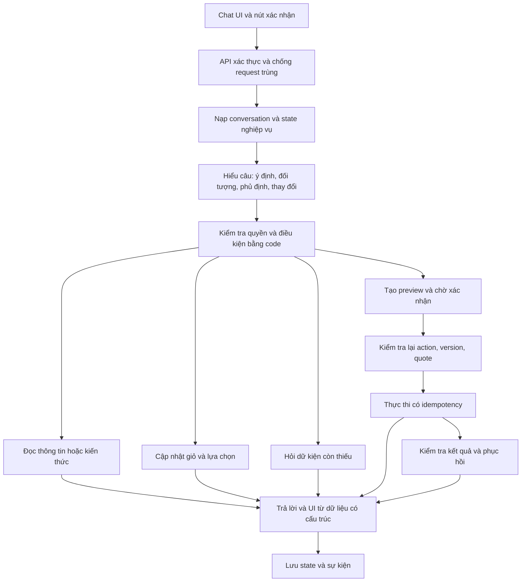

# PLAN V2 — Chat AI hiểu nghiệp vụ Avengers Coffee

> Phạm vi: thiết kế cải tiến, dựa trên đọc code hiện tại ngày 23/09/2026. Chưa triển khai runtime, chưa chạy hội thoại thực nghiệm, chưa xác nhận dữ liệu DB/deployment. Các lỗi bên dưới là kết luận từ code hoặc rủi ro có căn cứ; không phải log test đã chạy.
>
> Tài liệu đi kèm: [bằng chứng và điểm cần sửa](docs/ai-chat/SYSTEM_AUDIT.md), [kịch bản và điều kiện nghiệm thu](docs/ai-chat/CONVERSATION_TEST_PLAN.md).

## 1. Kết quả cần đạt

Bot phải hiểu khách đang hỏi, đang chọn, đang sửa hay đang xác nhận; biết đang nói về giỏ chưa đặt hay đơn đã tạo; nhớ các lựa chọn còn hiệu lực; dùng đúng dữ liệu của hệ thống; và biết phải dừng ở đâu khi thiếu thông tin hoặc thao tác thất bại.

Ví dụ đích:

> Khách: “Cho mình trả tiền mặt, giao về nhà, có món nào ít ngọt không?”
>
> Bot: “Mình ghi nhận thanh toán tiền mặt và giao tận nơi cho đơn này. Bạn thích cà phê hay trà? Mình sẽ tìm món có tùy chọn giảm đường phù hợp.”
>
> Bot đã lưu lựa chọn, chưa tạo đơn, và chỉ gợi ý món/tùy chọn có dữ liệu thật. Khi khách chọn món xong, bot tiếp tục hỏi địa chỉ còn thiếu, không hỏi lại thanh toán.

**Tiền mặt là phạm vi kiểm thử E2E đợt đầu.** Không tự coi đó là lựa chọn của tất cả khách. `payment_method=null` khi chưa chọn; sở thích từ lịch sử chỉ là gợi ý. Có thể preselect COD trên UI nếu chính sách sản phẩm yêu cầu, nhưng phải thể hiện rõ trong bản tóm tắt và không ghi đè lựa chọn khách đã nói.

“Hiểu toàn hệ thống” được triển khai thành ba lớp: hiểu các khái niệm nghiệp vụ; biết nguồn dữ liệu và chức năng nào đang hoạt động; biết quyền và điều kiện để thực hiện. Không nhét toàn bộ source code, DB hoặc tất cả dữ liệu admin vào prompt khách hàng.

## 2. Những vấn đề ưu tiên từ code

| Ưu tiên | Vấn đề hiện tại | Hành vi cần thay thế |
|---|---|---|
| P0 | Keyword “xác nhận” được dùng chung cho chốt/sửa/hủy; nhánh chốt đứng trước nhánh hủy | Xác nhận gắn với `action_id`, loại thao tác, đối tượng và phiên bản |
| P0 | Tool giá/tồn trả `in_stock=True` cố định; giá được LLM truyền lại khi thêm giỏ | Backend tra giá/tồn thật, kiểm tra tùy chọn và tự tính giá |
| P0 | Giỏ AI và giỏ web tách biệt; xóa ở AI chưa xóa giỏ chính | Một giỏ chuẩn, truy cập bằng `cart_id` và `line_id` |
| P0 | Checkout đọc lại địa chỉ mặc định, không nhận địa chỉ vừa được khách xác nhận | Snapshot lưu chính xác địa chỉ của đơn và dùng xuyên suốt |
| P0 | API tạo đơn trực tiếp có thể lưu tên phương thức VNPay nhưng trạng thái COD | Luồng thanh toán chọn theo phương thức thực tế, với điều kiện và response riêng |
| P0 | Nút xác nhận UI gửi cứng `DELIVERY`, thiếu kiểm tra kết quả nghiệp vụ | Xác nhận snapshot; hiển thị thành công khi có kết quả thành công hợp lệ |
| P0 | Hàm kiểm tra session mới kiểm tra định dạng UUID | Danh tính từ xác thực server, kiểm tra quyền sở hữu trên từng tài nguyên |
| P1 | State checkout chỉ lưu một phần vào DB; frontend chỉ gửi 8 messages | State bền vững, server giữ lịch sử, ngân sách context theo tokens |
| P1 | Luật sửa/hủy và kiến thức RAG không đồng nhất với backend | Backend trả khả năng được phép; chính sách có nguồn và phiên bản |
| P1 | Chat chưa có adapter voucher/quote/địa chỉ giao hàng/shipper đầy đủ | Khai báo rõ mức hỗ trợ; thêm các adapter có contract |

Xem bằng chứng theo file/hàm trong [SYSTEM_AUDIT.md](docs/ai-chat/SYSTEM_AUDIT.md). Các điểm P0 phải được xử lý trước khi đánh giá bot là “đặt hàng đúng”.

## 3. Bản đồ hệ thống mà bot cần hiểu

| Miền nghiệp vụ | Nguồn hiện có | Chat hiện tại | Thiết kế đích |
|---|---|---|---|
| Catalog, tên món, danh mục, trạng thái bán | Menu service, `menu.san_pham`, `danh_muc` | Tìm tên qua SQL, có chọn kết quả đầu | Tìm nhiều ứng viên, trả ID; hỏi phân biệt khi mơ hồ |
| Size, đá, đường, topping, loại sữa | `bien_the_san_pham`, `thuoc_tinh`; cart có trường tùy chọn | Options có đọc DB, nhiều tùy chọn bị gom vào note | Tùy chọn có ID/giá/ràng buộc; ghi chú tự do là trường riêng |
| Giá cơ sở, phụ thu, giá kiosk | Menu + franchise pricing + Order service | Tool chủ yếu đọc giá menu/size | Một API quote tính từng dòng, giá theo điểm bán, ưu đãi và tổng |
| Tồn kho theo cơ sở | Inventory service: `so_luong_ton`, `dang_kinh_doanh` | Chưa tra tồn thực trong tool giá | Kiểm tra theo outlet và số lượng; kiểm tra lại khi xác nhận |
| Chi nhánh và kiosk | Identity + franchise | Có tìm gần nhất/review/set branch, độ phủ kiosk khác nhau giữa tools | Phân biệt điểm bán chính/kiosk, phương thức phục vụ, trạng thái hoạt động |
| Khoảng cách, địa chỉ | Geo helpers, địa chỉ hồ sơ, Order service | Haversine và địa chỉ mặc định | Phân biệt khoảng cách chim bay, tuyến đường, vùng phục vụ và ETA |
| Hồ sơ khách | Identity, địa chỉ giao hàng | Có đọc profile/preferences | Chỉ đọc sau auth; lựa chọn địa chỉ của đơn tách khỏi sửa hồ sơ |
| Giỏ hàng | Order cart + AI session cart | Đồng bộ một phần | Order service sở hữu cart; conversation chỉ giữ tham chiếu/version |
| Voucher và ưu đãi | Order voucher + Identity promotions | Có UI cards/RAG; chưa có tool kiểm tra/áp dụng voucher trong registry | Kiểm tra điều kiện giỏ, người dùng, thời hạn, lượt dùng; quote tính lại |
| Tiền mặt/VNPay/QR/ ví Avengers | Thanh toán + customer wallet | Enum có 4 loại; route AI trực tiếp chưa tương đương checkout chuẩn | Capability registry theo kênh; chỉ mở phương thức được tích hợp đúng |
| Gift card/điểm thành viên | Modules và RAG liên quan | Không có adapter giao dịch tương ứng trong registry | Giải thích theo chính sách đã kiểm chứng; chưa tự nhận trừ điểm/gift card |
| Đơn hàng | Order service | History/detail/status/edit/cancel tools | Đọc trạng thái mới; capability `can_edit`, `can_cancel`, lý do, version |
| Shipper và giao hàng | Shipper + delivery tracking/Lalamove | Tool hiện chủ yếu đọc trạng thái đơn | Adapter trạng thái giao/ETA có thời điểm cập nhật; không bịa vị trí |
| Review món/cơ sở | Reviews, branch reviews | Có tools riêng | Phân biệt loại review; trả số đánh giá và dữ kiện đã duyệt |
| Nhân viên hỗ trợ | Chat service/gateway và STAFF mode | Có kênh UI riêng | Chuyển giao với bản tóm tắt vấn đề; chỉ gửi khi khách yêu cầu/đồng ý |
| Tin tức/chính sách/nhượng quyền | News, tài liệu RAG, franchise | Tri thức tĩnh có thể chưa khớp chức năng | Chính sách đã duyệt; tư vấn thông tin, chuyển đúng kênh khi chưa có tool |
| Admin/manager/staff/shipper | Các module vận hành riêng | Không thuộc quyền mặc định của customer chat | Biết giới hạn quyền; không cho khách sửa tồn, giá, ca, shipper hoặc đơn người khác |

Mỗi capability có `supported`, `enabled`, `required_role`, `required_fields`, `owner_service`, `freshness`, `available_actions` và `reason_if_disabled`. Một tính năng tồn tại trong code chưa đồng nghĩa nó đang bật ở deployment hoặc chat đã thực hiện được.

## 4. Kiến trúc đề xuất

Khuyến nghị dùng **LangGraph cho điều phối hội thoại có trạng thái**, giữ lớp model/provider hiện có qua adapter, dùng Pydantic để kiểm tra dữ liệu, PostgreSQL lưu hội thoại/checkpoint, và Order service làm chủ nghiệp vụ giỏ/quote/đơn. Redis chỉ cần khi có nhu cầu cache/rate limit/lock phân tán đã đo được.

LangGraph cho phép kết hợp bước logic cố định với bước dùng LLM và không bắt buộc dùng toàn bộ LangChain. Đây là cơ sở chọn framework; quyết định nó phù hợp hệ thống này là đề xuất thiết kế. [Tài liệu chính thức](https://docs.langchain.com/oss/python/langgraph/overview).

Không chạy song song hai bộ điều phối có quyền ghi. Migrate theo feature flag ở từng conversation; flow cũ không được dùng để lặp lại một thao tác đang chưa rõ đã thành công hay chưa.



LLM chịu trách nhiệm hiểu ngôn ngữ và diễn đạt. Quyền tạo/sửa/hủy, giá, voucher, trạng thái thanh toán và điều kiện chuyển bước do backend kiểm soát. Một graph với các nhóm nghiệp vụ là đủ cho giai đoạn này.

## 5. Step A → Step J: vòng xử lý mỗi lượt

### A — Nhận tin và nhận diện đúng phiên

Nhận `conversation_id`, `client_message_id`, nội dung và optional UI action. Backend suy ra người dùng từ token đã kiểm chứng, kiểm tra ownership và nhận diện tin gửi lại. `conversation_id`, `user_id`, `cart_id`, `order_id` là các khái niệm khác nhau.

Khách chưa đăng nhập vẫn được hỏi menu/chính sách. Luồng AI hiện yêu cầu UUID để đặt, trong khi checkout web có nhánh guest email/phone; cần chọn contract guest thống nhất trước khi bật đặt đơn guest qua chat. Trong đợt đầu, cart khách là draft có session ký; mời đăng nhập để đặt, giữ draft, không giả danh user bằng UUID tùy ý.

### B — Nạp đúng dữ kiện

Đọc state hội thoại, giỏ/version, action đang chờ, và những dữ liệu động liên quan. Đang hỏi món thì không cần tải lịch sử đơn hoặc toàn bộ địa chỉ. Đang xác nhận đơn thì phải đọc lại quote/version và trạng thái thao tác.

### C — Hiểu câu nói thành dữ liệu có cấu trúc

Đầu ra gồm `intents[]`, `entities`, `references`, `negations`, `requested_changes`, `questions`, `confirmation`, và `ambiguities`. Một câu có thể vừa chọn tiền mặt, yêu cầu giao, vừa hỏi menu. Validate schema trước khi cho phép bước nghiệp vụ tiếp theo.

Phân biệt rõ:

| Câu khách nói | Cách hiểu |
|---|---|
| “Có thanh toán tiền mặt không?” | Câu hỏi về khả năng; chưa mặc nhiên chọn |
| “Mình trả tiền mặt nhé” | Ghi nhận lựa chọn của đơn đang soạn |
| “Không dùng VNPay, trả tiền mặt” | Phủ định VNPay, đổi sang COD |
| “Ừ nhưng đổi sang mang đi” | Có yêu cầu thay đổi; không thực thi xác nhận cũ |
| “Ok, đừng đặt vội” | Không xác nhận đặt |
| “Nếu đặt 2 ly thì bao nhiêu?” | Yêu cầu báo giá giả định; không thêm 2 ly |
| “Bỏ một ly” | Giảm số lượng một dòng đã xác định; khác với xóa toàn bộ món |
| “Như đơn lần trước nhưng ít đường” | Dựng đề xuất từ đơn được chọn, kiểm tra menu/giá hiện tại và hỏi lại phần thiếu |

### D — Giải tham chiếu và kiểm tra mâu thuẫn

Lưu danh sách món/chi nhánh/đơn vừa hiển thị theo ID và thứ tự để hiểu “món thứ hai”, “quán trên”, “đơn vừa đặt”. `focus_entity` có loại đối tượng và nguồn message. Nếu vừa đổi chủ đề khiến “cái đó” mơ hồ, hỏi một câu làm rõ.

Ưu tiên lựa chọn rõ ở lượt mới nhất cho ý muốn của khách; backend vẫn quyết định lựa chọn đó có hợp lệ không. Sở thích cũ không được thắng câu “hôm nay trả tiền mặt”. Hủy một action không đồng nghĩa xóa giỏ.

### E — Giải quyết các ý định theo phụ thuộc

Các lựa chọn độc lập như payment và nhận hàng có thể ghi nhận sớm. Tìm món → kiểm tra options → sửa giỏ phải chạy theo thứ tự. “Bỏ A, thêm B” phải kiểm tra B trước khi bỏ A; nếu chưa đủ dữ kiện thì giữ A và hỏi tiếp. Không để đổi món thất bại thành mất món cũ.

Bot hỏi dữ kiện đang chặn mục tiêu hiện tại, tối đa một câu hỏi chính mỗi lượt. Khách đã cung cấp đủ size/đá/đường thì không bắt chọn lại cả danh sách.

### F — Đọc hệ thống hoặc cập nhật draft/cart

Tra cứu thực tế trước khi khẳng định giá, tồn, review, voucher, quyền sửa/hủy và trạng thái giao. Chưa có điểm bán thì cho chọn món/options và báo giá tham khảo nếu nguồn cho phép, gắn `quote_status=ESTIMATE`; không khẳng định có hàng ở chi nhánh chưa xác định.

Giỏ chỉ báo “đã thêm/đã xóa” khi backend lưu thành công. Trả lại cart chuẩn và version; UI render đúng dữ liệu đó.

### G — Tìm phần còn thiếu để hoàn tất đặt hàng

`missing_fields` được tính từ draft + capability. Không dùng thứ tự cứng bắt khách quay về đầu.

| Đã có | Cần xử lý tiếp |
|---|---|
| Có COD, chưa món | Giữ COD, tư vấn/chọn món |
| Có món + địa chỉ + COD | Hỏi hình thức nhận nếu chưa rõ; không hỏi lại địa chỉ hoặc COD |
| Giao tận nơi + địa chỉ rõ | Tìm cơ sở có phục vụ địa chỉ và đáp ứng món; kiểm tra tồn |
| Mang đi + cơ sở đã chọn | Xác nhận thời gian lấy nếu có hỗ trợ; không xin địa chỉ nhà |
| Tại chỗ | Dùng rule thực tế của cơ sở; không tự bịa yêu cầu bàn nếu hệ thống chưa có |
| Có kiosk được nhắc tới | Xác định đang hỏi review hay đặt tại kiosk; kiểm tra capability kiosk |
| Giỏ rỗng do vừa bỏ hết món | Về chọn món; payment/nhận hàng có thể giữ trong draft chưa hết hạn |

### H — Tạo bản tóm tắt có hiệu lực

Backend tạo quote gồm dòng hàng/options, tổng món, giảm giá, phí nếu có, tổng phải trả, địa chỉ/điểm bán, hình thức nhận, phương thức thanh toán. Nếu chưa có engine tính phí ship thì `shipping_fee_status=UNKNOWN/NOT_SUPPORTED`, không tự lấy phí trong tài liệu RAG rồi cộng vào tổng.

Lưu `quote_id`, `quote_version`, `cart_version`, `expires_at` và `pending_action`. Tóm tắt trên chat và UI dùng chung payload. Bất kỳ thay đổi nào ảnh hưởng đơn làm mất hiệu lực action cũ.

### I — Xác nhận đúng việc và thực thi

Một action là một trong `CREATE_ORDER`, `UPDATE_ORDER`, `CANCEL_ORDER`, `USE_ADDRESS`; có đối tượng, version, thời hạn và chủ sở hữu. “Đồng ý” chỉ có nghĩa đối với action đang được hỏi rõ. Câu có sửa đổi/phủ định được xử lý trước, không confirm ngay.

Xác nhận địa chỉ chỉ cập nhật địa chỉ; xác nhận hủy chỉ gọi hủy. Server tái kiểm tra quote, giá/tồn, quyền và trạng thái trước khi ghi. Nút UI và câu chat đều đi qua cùng application service; LLM không được tự cung cấp một boolean để bỏ qua bước này.

### J — Thông báo theo kết quả thật

- COD tạo thành công: trả mã đơn, tổng tiền do backend trả, “thanh toán khi nhận hàng”; không nói đã thanh toán hoặc đã pha chế nếu đơn chỉ `MOI_TAO`.
- Thanh toán online: chỉ nói đã thanh toán khi backend xác minh trạng thái, không lấy câu khách “mình trả rồi” làm bằng chứng.
- Lỗi chưa ghi: nói thao tác chưa hoàn tất và giữ dữ liệu đúng.
- Không rõ đã ghi hay chưa: báo đang kiểm tra, tra operation status, không replay tạo đơn.
- Hoàn tất đơn: kết thúc draft đó; đơn mới có lựa chọn/snapshot mới. Có thể gợi ý dùng lại sở thích nhưng cần khách chọn.

## 6. State model: một bước đơn lẻ là chưa đủ

Tách `conversation_mode`, `draft`, `pending_action` và `operation`. Một khách đang soạn giỏ có thể hỏi đơn cũ mà không làm mất giỏ. `next_step` được tính từ điều kiện thiếu, không ép mọi câu đi tuyến tính.

```json
{
  "schema_version": 2,
  "conversation_id": "server-generated",
  "actor_ref": "verified-by-server",
  "state_version": 18,
  "mode": "SHOPPING",
  "draft": {
    "draft_id": "draft-1",
    "cart_id": "cart-1",
    "cart_version": 7,
    "fulfillment": "GIAO_TAN_NOI",
    "outlet": {"kind": "BRANCH", "id": null},
    "delivery_address": {
      "address_id": null,
      "snapshot_ref": "address-snapshot-1",
      "confirmed_at": null,
      "source_message_id": "message-12"
    },
    "payment": {
      "method": "THANH_TOAN_KHI_NHAN_HANG",
      "source": "EXPLICIT_USER",
      "source_message_id": "message-3"
    },
    "voucher_code": null,
    "quote_id": null
  },
  "focus_entity": {"type": "PRODUCT", "id": "catalog-id"},
  "pending_action": null,
  "operation": null,
  "missing_fields": ["outlet", "address_confirmation"],
  "resume_task": null,
  "last_order_id": null,
  "expires_at": "server-time"
}
```

Đây là schema đề xuất, không phải payload hiện có. Không đưa token hoặc toàn bộ hồ sơ vào checkpoint. Những trường PII cần cho đơn lưu ở vùng dữ liệu phù hợp và chỉ đưa tối thiểu vào model.

### Vòng đời action

`DRAFT → READY_FOR_REVIEW → AWAITING_CONFIRMATION → EXECUTING → SUCCEEDED`.

Các nhánh: `NEEDS_CLARIFICATION`, `STALE`, `REJECTED`, `FAILED_RETRYABLE`, `OUTCOME_UNKNOWN`, `CANCELLED`. `OUTCOME_UNKNOWN` phải có đường đối soát; không chuyển thẳng về tạo lại.

### Các thay đổi phải làm mất hiệu lực xác nhận

| Thay đổi | Phải tính/kiểm tra lại |
|---|---|
| Món, số lượng, size, topping, ghi chú có ảnh hưởng đơn | Dòng hàng, giá, tồn, ưu đãi, quote/action |
| Địa chỉ | Vùng phục vụ, chi nhánh giao, phí/ETA nếu có, quote/action |
| Điểm bán/kiosk | Menu bán được, giá riêng, tồn, phương thức hỗ trợ, quote/action |
| Payment | Khả năng thanh toán và điều kiện ưu đãi; quote/action |
| Hình thức nhận | Địa chỉ/chi nhánh và phí; quote/action |
| Đơn cũ đổi trạng thái do nhân viên | Quyền sửa/hủy và version; preview cũ hết hiệu lực |
| Chỉ hỏi chính sách/review | Giữ draft; xác nhận cũ vẫn phải kiểm tra TTL và ngữ cảnh hiện hành |

## 7. Hợp đồng dữ liệu và nghiệp vụ phải thống nhất

### 7.1. Một giỏ chuẩn

Order service sở hữu giỏ được đặt; AI không duy trì bản writable độc lập. Guest draft nếu cần phải có owner session hợp lệ và quy tắc merge khi đăng nhập.

Dòng giỏ gồm `line_id`, `product_id`, số lượng, variant/options IDs, size, toppings, đá, đường, sữa, `custom_attributes`, note, giá do server tính. Hai ly cùng món/size nhưng khác đường không được gộp. “Bỏ 1 ly” giảm số lượng; “bỏ món” xóa dòng; “xóa giỏ” là action khác cần làm rõ khi giỏ có hàng.

Khi web thay đổi cart, chat đọc version mới ở lượt tiếp theo; không ghi đè bằng snapshot cũ. Xóa lịch sử hội thoại không được tự xóa cart; UI tách “Cuộc trò chuyện mới” và “Xóa giỏ”.

### 7.2. Giá và tồn kho

Tách `search_products`, `get_product_options`, `quote_cart`, `check_availability`. Không để tool có tên kiểm tra tồn nhưng chỉ đọc catalog. Giá/tồn ghi rõ điểm bán và thời điểm kiểm tra; `unknown` khác `available`.

Quote tái kiểm tra giá menu, phụ thu từng sản phẩm, giá kiosk, tùy chọn tương thích, số lượng nguyên dương, voucher và phí đã được backend triển khai. LLM không truyền `unit_price` có quyền quyết định tiền. Inventory cần cơ chế reserve/conditional decrement chống âm kho hoặc chốt vượt tồn; `Math.max(0, tồn + delta)` hiện tại không đủ bảo đảm không bán vượt.

### 7.3. Địa chỉ, điểm bán và hình thức nhận

Tách `outlet_kind=BRANCH|KIOSK` khỏi `fulfillment=DELIVERY|PICKUP|DINE_IN` ở domain mới, có adapter sang enum backend hiện hành. Backend đang dùng `KIOSK` cùng `delivery_mode`, cần bảng ánh xạ trước khi migrate, không tự coi kiosk là chi nhánh chính hoặc luôn hỗ trợ giao.

Địa chỉ khách vừa nhập ưu tiên cho đơn này, không tự ghi đè địa chỉ hồ sơ. Giao hàng dùng địa chỉ đã xác nhận; không đọc lại default khi commit. Tìm điểm giao dựa cả vùng phục vụ, giờ mở cửa, món còn hàng; “gần nhất” chỉ là tiêu chí sau điều kiện khả dụng. Chưa có cấu hình vùng/giờ thì capability báo chưa xác minh và không cam kết phục vụ.

### 7.4. Sửa, hủy và hoàn tiền

Backend hiện cho sửa đơn khách khi `MOI_TAO` và COD; cho hủy ở `MOI_TAO` hoặc `DA_XAC_NHAN`. Tool AI đang có rule hủy khác. Tạo endpoint/read model trả `available_actions` từ cùng policy mà write endpoint sử dụng; tránh sao chép danh sách status vào prompt.

Sửa đơn: chọn đúng đơn → kiểm tra eligibility → dựng preview đầy đủ giữ các món không đổi/options → báo tổng mới → xác nhận theo version → write → đọc kết quả thật. Khi cửa hàng đã nhận đơn trong lúc khách xác nhận, trả lý do và gợi ý hỗ trợ; không cố hạ trạng thái đơn.

Hủy đơn: chọn đúng đơn → preview hậu quả → xác nhận → hủy → trả trạng thái refund thực. Backend hiện có nhánh hoàn vào ví khách cho một số đơn đã trả; RAG nói hoàn về phương thức ban đầu. Phải chốt chính sách bằng chủ nghiệp vụ và sửa tài liệu; không để bot tự chọn một lời hứa.

### 7.5. Voucher, ví, gift card và phí

API voucher hiện có điều kiện số tiền tối thiểu, thời gian, số lượt, loại giảm và topping. Chat cần tool gọi kiểm tra theo cart thật; thay giỏ phải tái tính voucher. Chỉ ghi nhận tiêu thụ voucher ở transaction đặt đơn, tránh retry trừ lượt lần hai.

Ví Avengers khác ví ngoài như Momo/ZaloPay. Enum trong một đoạn code hoặc tên có trong tài liệu không chứng minh kênh checkout đang hỗ trợ. Capability registry xác định rõ những phương thức chat được phép thực hiện. Gift card/điểm/thành viên chưa có adapter hoàn chỉnh thì bot hướng dẫn tính năng thật hoặc chuyển hỗ trợ, không nói đã áp dụng.

## 8. Bộ công cụ đề xuất và dữ liệu trả về

Giữ executor tốt hiện có qua adapter; thay contract tool có rủi ro, và chỉ expose tool phù hợp ý định/quyền/state. Các tên dưới đây là thiết kế mới, chưa phải endpoint đã tồn tại.

| Nhóm | Công cụ | Quy tắc |
|---|---|---|
| Khả năng hệ thống | `get_capabilities` | Backend quyết định hỗ trợ theo kênh/cơ sở |
| Menu | `search_products`, `get_product_options`, `get_recommendations` | Kết quả có ID, options và lý do gợi ý có dữ kiện |
| Giá/tồn | `quote_cart`, `check_availability` | Read-only, có version/time/unknown; không tự giữ kho nếu chưa có reserve |
| Cart | `get_cart`, `apply_cart_changes` | `expected_version`, batch thay đổi đã validate, trả cart mới |
| Giao nhận | `list_delivery_addresses`, `set_draft_fulfillment`, `find_serviceable_outlets` | Ownership, địa chỉ đơn riêng, không sửa hồ sơ ngầm |
| Checkout | `prepare_checkout`, `commit_confirmed_action`, `get_operation_status` | Server tạo action; commit chỉ khi state xác nhận hợp lệ |
| Ưu đãi | `list_eligible_promotions`, `validate_voucher` | Kiểm tra điều kiện thật, không tự cộng/trừ tiền |
| Đơn cũ | `list_orders`, `get_order`, `get_order_capabilities`, `preview_order_change` | Owner verified, đối tượng rõ, status mới nhất |
| Giao hàng | `get_delivery_status` | Trả data age; không hứa ETA thiếu nguồn |
| Tri thức | `search_knowledge`, review tools | Nguồn, phiên bản, scope, trạng thái duyệt |
| Hỗ trợ | `prepare_support_handoff`, `open_support_conversation` | Chỉ gửi sau yêu cầu/đồng ý của khách |

Response chuẩn dùng `status=OK|NEEDS_INPUT|REJECTED|RETRYABLE_ERROR|OUTCOME_UNKNOWN`, `code`, `data`, `field_errors`, `missing_fields`, `available_actions`, `retry_after_ms`, `source`, `observed_at`, `state_version`, `operation_id`, `safe_message`.

Tool output chứa dữ liệu, không chèn lệnh kiểu “BẮT BUỘC gọi X” từ review/mô tả sản phẩm vào chỉ dẫn agent. UI nhận `ui_events` như `cart_updated`, `quote_ready`, `action_invalidated`, `order_created`; không suy từ tên tool hoặc regex nội dung trả lời.

## 9. Idempotency, transaction và hồi phục

Một `is_checking_out` trong RAM không bảo đảm idempotency. Đề xuất bảng operation ở Order service, unique key `(actor_id, action_id)`; cùng key/cùng payload trả lại kết quả cũ, cùng key/khác payload bị từ chối. Sau restart vẫn tra được operation.

Trong transaction local: kiểm tra version/action, lưu order + details + payment record + kết quả operation; cập nhật cart chỉ với các dòng/version đã mua. Nếu khách thêm món ở tab khác trong lúc checkout, không xóa sạch món mới. Sự kiện thông báo lưu outbox cùng transaction và được xử lý idempotent; lỗi email không làm khách đặt lại.

Với tồn kho/voucher ở service khác, dùng reservation/commit/release hoặc saga có trạng thái và timeout; không mô tả transaction PostgreSQL local như bao trùm mọi microservice. Sau lỗi phải biết tài nguyên nào được giữ, đã commit hay cần bù trừ.

| Lỗi | Bot nói theo dữ kiện | Quay lại |
|---|---|---|
| Giỏ trống | “Mình ghi nhận tiền mặt. Bạn muốn chọn món nào?” | Chọn món; giữ preference trong draft |
| Món mơ hồ | “Bạn muốn Matcha Latte hay …?” với ứng viên thật | Chọn product ID |
| Topping không hợp lệ | “Món này có các lựa chọn …” | Chọn option; giữ món khác |
| Thiếu địa chỉ | “Bạn muốn giao đến địa chỉ nào?” | Bổ sung địa chỉ |
| Hết hàng tại cơ sở | “Cơ sở này hiện không đủ món X; bạn muốn …?” | Sửa món/cơ sở; quote cũ hết hạn |
| Quote hết hạn/giá thay đổi | “Mình vừa cập nhật lại tổng thành …; bạn xác nhận lại nhé.” | Bản tóm tắt mới |
| Tool đọc timeout | “Mình chưa kiểm tra được … lúc này.” | Retry có giới hạn hoặc hỏi tiếp tác vụ khác |
| Timeout tạo đơn | “Mình đang kiểm tra đơn đã được tạo chưa; bạn chưa cần đặt lại.” | `get_operation_status` |
| Backend từ chối sửa | “Đơn đã được cửa hàng xác nhận nên hiện không sửa được qua chat.” | Hỗ trợ/tra cứu, giữ đơn nguyên trạng |
| Không đủ tiền ví | Nêu thiếu bao nhiêu nếu backend có; hỏi đổi phương thức | Chọn phương thức, preview mới |
| Auth hết hạn | Mời đăng nhập và giữ draft phù hợp | Tái auth, kiểm tra owner, refresh quote |
| Đã tạo đơn nhưng email lỗi | Xác nhận đơn theo order ID; báo trạng thái email nếu cần | Không tạo lại đơn |

Retry đề xuất: đọc dữ liệu tối đa một lần thêm khi lỗi tạm thời; ghi chỉ retry cùng operation key hoặc đối soát trước. Không retry lỗi nghiệp vụ, không đổi provider rồi chạy lại mutation đã có kết quả chưa rõ.

## 10. Bộ nhớ và ngân sách context

| Lớp | Lưu gì | Thời hạn đề xuất ban đầu |
|---|---|---|
| Nghiệp vụ | Cart, quote, order, operation tại service sở hữu | Theo vòng đời nghiệp vụ; không xóa order vì chat hết hạn |
| Hội thoại | Task, draft refs, focus, entities vừa hiển thị, action, resume task | Draft 2 giờ không hoạt động; restore cần refresh dữ kiện |
| Lịch sử gần | Messages server-side và tool results cần thiết | Chọn theo relevance + token budget, không chỉ cắt ký tự |
| Summary | Ý định chưa xong, điều đã làm, dữ kiện có source message | 300–500 tokens, rebuild từ state/events |
| Sở thích dài hạn | Sở thích khách cho phép lưu, nguồn, thời điểm | Chính sách cấu hình; có sửa/xóa, không áp vào đơn tự động |

Đề xuất ngân sách ban đầu để benchmark: input target 8.000 tokens gồm prompt/policy khoảng 1.200, tool schemas chọn lọc 1.800, state+summary 1.000, lịch sử gần 2.000, evidence 1.500, input mới 500. Đây là phân bổ mềm; phải đo tokenizer/provider thực tế, chừa output khoảng 800 và khoảng dự phòng, không vượt context limit của model.

Ưu tiên khi cắt: bỏ evidence trùng/hết hạn → rút gọn kết quả danh sách → bỏ hội thoại cũ ít liên quan → summary. Không bỏ action đang chờ, thay đổi mới nhất, phủ định hoặc dòng hàng bắt buộc. Nếu input mới quá dài, báo giới hạn thay vì cắt mất phần cuối có thể chứa “đừng đặt”.

Mỗi lượt target tối đa 2 LLM calls, hard cap 4; tối đa 6 tool calls (tính retry), deadline khoảng 20 giây có điều chỉnh theo môi trường. Các workflow đọc độc lập có thể chạy song song; mutation cùng cart/conversation phải serialize hoặc CAS. Ghi số calls/tokens thực để điều chỉnh, không xem các con số đề xuất là SLA đã đạt.

Đổi tài khoản: không phục hồi history/cart/action của tài khoản cũ. New conversation có thread riêng và server kiểm tra owner; không dùng một thread public bằng chính `user_id` tùy client gửi. Checkpoint và memory có retention/cleanup; TTL RAM hiện tại không đủ vì DB có thể nạp lại dữ liệu cũ.

## 11. Kiến thức hệ thống và RAG

1. Lập sổ tri thức theo domain: menu/options, cơ sở, đặt hàng, thanh toán, sửa/hủy, ưu đãi, giao, hỗ trợ, nhượng quyền. Mỗi mục có owner, nguồn, phạm vi kênh/cơ sở, ngày hiệu lực và trạng thái duyệt.
2. Dữ liệu động như giá/tồn/đơn/ETA luôn qua API. Tài liệu RAG giải thích chính sách và hướng dẫn, không thay API transaction.
3. Chuẩn hóa metadata: `document_id`, `version`, `source_type`, `owner`, `effective_from`, `effective_to`, `channel`, `outlet_scope`, `approved`, `supersedes`.
4. Rà các file `raw_data/ordering.json`, `membership.json`, `gift_card.json` với backend thật. Nội dung chưa được xác minh bị loại khỏi câu khẳng định; ví dụ phí ship, freeship, cổng thanh toán và đường hoàn tiền.
5. Giữ TF-IDF làm baseline. Thử tìm kiếm kết hợp từ khóa và embeddings cho tiếng Việt/sai chính tả sau khi có bộ câu hỏi chuẩn; quyết định theo recall và unsupported-answer rate. Không mặc định thêm vector DB riêng; cân nhắc PostgreSQL/pgvector nếu hạ tầng hỗ trợ và benchmark có lợi.
6. Trả top 3–5 đoạn liên quan cùng nguồn; ngưỡng retrieval score phải hiệu chỉnh trên data, không coi score TF-IDF 0.05 là xác suất đúng.
7. Phát hiện mâu thuẫn giữa tài liệu và capability/API: nói phần đã xác minh, chuyển yêu cầu cập nhật tri thức cho người quản trị; không tự hợp nhất hai chính sách trái nhau.
8. FAQ không có nguồn: “Mình chưa có thông tin xác nhận về …; bạn có thể …”. Không dùng một câu fallback mô tả món cho tất cả câu hỏi giao/hoàn tiền.

Với dị ứng/thành phần: chỉ nêu thông tin đã xác minh của món, không suy luận rằng “ít đường” là “không đường” hoặc cam kết an toàn từ tên sản phẩm. Khi thiếu thành phần thì hướng dẫn xác nhận với cửa hàng.

## 12. Tích hợp LangGraph cụ thể

Các node đề xuất: `load_context`, `understand_message`, `resolve_references`, `apply_policy`, `retrieve_evidence`, `execute_cart_change`, `compute_missing_fields`, `prepare_action`, `await_action`, `commit_action`, `reconcile_operation`, `render_response`, `save_summary`.

Node nghiệp vụ thuần gọi service; LLM chỉ nằm ở hiểu câu, giải tham chiếu khó và diễn đạt. `prepare_action` và `commit_action` tách node. Với khách hỏi xen ngang, xử lý truy vấn và cập nhật focus qua router trước khi quyết định resume; không đưa mọi tin mới vào `Command(resume=True)`.

LangGraph hỗ trợ dừng chờ input và tiếp tục theo `thread_id` với checkpointer bền vững. Code trong node có thể chạy lại khi resume, vì vậy thao tác có side effect trước điểm dừng phải được thiết kế idempotent; tốt nhất đặt mutation được xác nhận ở node riêng sau kiểm tra. [Interrupts](https://docs.langchain.com/oss/python/langgraph/interrupts).

Chọn checkpoint PostgreSQL; transaction nghiệp vụ và checkpoint có thể không cùng transaction nên sau resume phải đối chiếu `operation_id` với Order service. Checkpoint không tự cung cấp exactly-once order creation. Xem [Persistence](https://docs.langchain.com/oss/python/langgraph/persistence).

Trước khi pin dependency cần kiểm tra Python/Pydantic/provider SDK/Postgres driver hiện tại. Không nâng hàng loạt requirements. Giữ response adapter cho UI trong thời gian chuyển đổi; expose graph mới bằng API version/feature flag. Tracing nội bộ đủ cho đợt đầu; dịch vụ tracing ngoài là lựa chọn riêng với dữ liệu đã lọc.

## 13. Danh sách thay đổi dự kiến theo file/module

| Khu vực | Việc cần làm |
|---|---|
| `ai-service/main.py` | Auth dependency, schema API mới, message dedupe, adapter response, bỏ tin cậy history/session do client khai |
| `src/agents/agent_service.py` | Tách prompt khỏi policy, thay intercept keyword bằng action resolver, gọi workflow |
| `src/agents/workflow.py` (mới) | Graph nodes/edges, next-step resolver, retry/recovery |
| `src/agents/state.py`, `intent_schema.py`, `policies.py` (mới) | Typed state, ý định đa mục tiêu, xác nhận/phủ định, rules thuần |
| `src/common/groq_service.py` | Provider adapter, schema validation, token/time budgets, fallback không replay side effect |
| `src/common/cart_manager.py` | Migrate AI cart thành refs/draft; loại nguồn ghi kép, TTL/version đầy đủ |
| `src/common/checkout_service.py` | Gọi quote/action/operation của Order service; địa chỉ snapshot, kiểm tra payload response |
| `src/function_calling/tools/*` | Adapters validate đầu vào, output chuẩn; pricing/options/tồn/promotion/order capabilities |
| `src/rag/*` | Metadata/nguồn/phiên bản, loại tài liệu mâu thuẫn, benchmark retrieval |
| Order `cart` | Ownership, line IDs/options, cập nhật batch và expected version |
| Order `thanh-toan` | Quote + idempotent commit + payment routing + transaction/outbox, quyền sửa/hủy dùng chung |
| Inventory | Availability và reservation/conditional stock update theo branch |
| Identity/franchise | API địa chỉ/capability cơ sở, giá kiosk, giờ/vùng phục vụ khi có cấu hình |
| `ChatWidget.jsx`, `CartContext.jsx` | Render UI events/state chuẩn, action IDs, bỏ delivery hardcode, reset chat riêng cart |
| `OrderHistoryModal.jsx` | Render từ dữ liệu order thật, dùng available actions từ backend |
| Customer mobile | Kiểm kê endpoint chat đang dùng và áp contract tương đương trước rollout mobile |

Tên module mới là thiết kế; cần chọn vị trí migration/test theo convention repo khi triển khai. Không sửa các phần vận hành/admin ngoài những contract cần thiết cho chat.

## 14. Thứ tự triển khai và điều kiện qua bước

| Đợt | Công việc | Hoàn tất khi |
|---|---|---|
| 0 — Baseline | Chốt contract nghiệp vụ, tập fixture, đặc tả 22 tools và luồng UI hiện tại | Mỗi tình huống có outcome/state/tool calls kỳ vọng; ghi được baseline chưa sửa |
| 1 — P0 nghiệp vụ | Auth/owner, action xác nhận, cart chuẩn, địa chỉ, price/stock thật, response UI | Không xác nhận nhầm, không báo thành công giả, không lệch giỏ/địa chỉ |
| 2 — Quote và commit | Snapshot/version, COD flow, transaction/idempotency/unknown outcome | Retry một thao tác chỉ một đơn; DB/UI/payment thống nhất |
| 3 — Workflow | Typed state + LangGraph + checkpoint + router đa ý định | Qua bài hỏi xen ngang, đổi ý, restart, stale action và hai tab |
| 4 — Hiểu miền | Capability registry, voucher, kiosk, review, order edit/cancel/tracking | Trả đúng khả năng thực hiện và không hứa tính năng chưa bật |
| 5 — Memory/RAG | Server history, summary, relevance, policy governance | Qua context dài; stale data không ghi đè lựa chọn mới; không trả lời theo policy sai |
| 6 — Đánh giá/rollout | Regression, live model eval, UI+DB E2E COD, canary và rollback | Các tiêu chí ở mục 15 có bằng chứng, không chỉ transcript lời nói |

Giao theo từng đợt có thể review. Không để sửa prompt tạm thời trở thành điều kiện duy nhất bảo vệ thao tác thật. Không ước lượng thời gian chính xác trước khi chốt migration/cart/payment contract và dữ liệu môi trường.

## 15. Đo chất lượng và nghiệm thu

Các tiêu chí dưới đây là mục tiêu đề xuất, chưa phải kết quả đã đo.

- 100% ca P0 định sẵn: đúng owner, không ghi khi thiếu xác nhận, không sửa/hủy nhầm đơn, không duplicate, không đổi payment/address ngầm, không dùng giá model tự đặt.
- 100% ca COD E2E định sẵn: order/payment/delivery/options/tổng/địa chỉ trong DB và UI khớp quote đã xác nhận; không request VNPay.
- Ít nhất 95% bộ paraphrase/typo/đa ý định được chọn đúng thao tác hoặc hỏi làm rõ đúng chỗ; đánh giá riêng các ca mơ hồ, không thưởng cho đoán bừa.
- Ít nhất 95% số lượt đủ dữ kiện không hỏi lại cùng slot; câu hỏi thông tin không tự làm đổi lựa chọn.
- 0 câu khẳng định thành công không có backend evidence trên bộ đánh giá; unsupported facts được đo riêng với RAG.
- Giới hạn context/tool/deadline được tôn trọng; đo p50/p95 thời gian, token/lượt, số tool, số lần clarification và tỷ lệ recovery.

Mỗi test phải lưu: dữ kiện ban đầu, tin nhắn, expected intent/state diff, tool/API được phép/cấm, response, DB assertions, UI assertions, correlation/operation ID. Live model eval lặp 3–5 lần/case quan trọng vì model có biến thiên; các rule nghiệp vụ phải được đảm bảo bằng test deterministic độc lập model.

Rollout theo cohort conversation để không trộn state v1/v2. Chạy shadow **chỉ đọc** trước; không cho cả hai flow tạo đơn. Rollback dừng nhận mutation mới ở workflow lỗi, vẫn đối soát operation đang chạy; dữ liệu order đã ghi giữ nguyên. Schema migration tương thích ngược trong cửa sổ chuyển đổi.

## 16. Các quyết định còn cần xác minh trong triển khai

| Câu hỏi nghiệp vụ | Xử lý trước khi có quyết định chính thức |
|---|---|
| Giờ hoạt động/vùng phục vụ chính thức từng cơ sở? | Không cam kết giao chỉ vì tìm được cơ sở gần |
| Phí ship/freeship trong RAG có đang được tính thật? | Không khẳng định mức phí hoặc tự cộng vào checkout |
| Guest được đặt qua chat không? | Tư vấn/giữ draft; dùng luồng đăng nhập hiện có cho commit đợt đầu |
| Kiosk hỗ trợ hình thức nhận nào? | Tra capability cơ sở; không coi mọi kiosk hỗ trợ ship |
| Chính sách hoàn vào ví hay về cổng gốc? | Trả trạng thái backend thực, không hứa đường hoàn chưa thống nhất |
| Công thức giá topping/size tại kiosk? | Quote backend phải định nghĩa và có fixture, không suy từ tên option |
| Mobile đang gọi AI endpoint nào? | Hoàn tất inventory client trước bật contract mới toàn hệ thống |

Các điểm này được quản lý thành backlog có owner; phần cart/state/action/test có thể triển khai trước. “Chưa xác minh” phải là trạng thái rõ ràng của hệ thống thay vì một câu trả lời tự tin từ AI.
