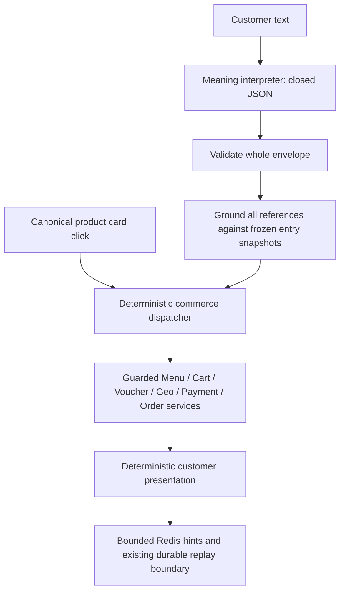

# Hybrid Commerce Agent migration

## 1. Starting state

`STARTING_HEAD = 3bb55d09fecbd2b251a0c03a608086ea866b0ed5` (`chiu roi`), branch `branch_thaian`.
The initial worktree was clean. Status, branch, HEAD, log, staged and unstaged
diffs were inspected before editing. Recovery branch:
`backup/semantic-first-3bb55d`. No reset, switch, historical rollback or autocommit.

## 2. Final HEAD and scope

HEAD remains the starting commit; this migration is an uncommitted, reviewable
worktree change. All edits are under `avengers-coffee-system/services/ai-service`.
DataPlatform, root Compose, unrelated services and volumes were not changed.
The architecture note was written before behavior code:
[HYBRID_CURRENT_PROBLEMS.md](HYBRID_CURRENT_PROBLEMS.md).

## 3. Why replace production semantic orchestration

The old production model chose semantic tools, prerequisite reads, repair roles,
progress ownership, interrupts and display completion. That made a simple
purchase depend on several model decisions about internal workflow. The new
model interprets customer meaning once. A server dispatcher performs the known
commerce sequence and renders the business result.

## 4. Architecture



Implementation:

| Module | Responsibility |
|---|---|
| `hybrid_command_schema.py` | Closed envelope and 31 customer intent argument schemas; structural normalization only |
| `hybrid_semantic_interpreter.py` | JSON interpretation, one format repair, two actual requests total |
| `hybrid_workflow.py` | Immutable domain snapshots, exact grounding, derived milestone |
| `hybrid_commerce_orchestrator.py` | Preflight, deterministic dispatch/prerequisites, ordered presentation and replay |
| `hybrid_location.py` | Already interpreted location literal/candidate business adapter |

There is no command/prerequisite graph, model judge, tool loop or progress-role
runtime in Hybrid. `GuardedToolGateway` is invoked only as a business adapter
with `deterministic_business=True`. Its semantic provider executors and repair
entry points are never called. The flag prevents construction of TurnContract
and TurnAuthorizations. Existing non-language schema/option normalizers are
reused, without semantic plans, authorization ledgers or provider surfaces.

## 5. Retained safety

Retained: ProductDisplaySnapshot; frozen product/cart/domain ordinals; canonical
IDs; Menu-specific option/default validation; price, stock, voucher and branch
authority; wallet availability; independent payment and fulfillment; confirmed
provider destination fingerprints; checkout action/fingerprint/expiry; later
confirmation; owned order policy and preview revisions; per-operation idempotency;
durable `client_message_id` replay/conflict handling; HTTP unknown-write
reconciliation; artifact quarantine; approved RAG evidence; provider timeout and
failover policy; Redis snapshots; deterministic cards.

`agent_memory.py`, ProductDisplaySnapshot, provider policy, underlying cart/order
validators and HTTP claim/reconciliation logic are reused without changing their
business contracts. The gateway, context builder, main startup/health and
location business adapter have narrowly scoped integration changes.

## 6. Historical reference 460e8ab

The historical order flow was read-only reference material. Borrowed: pending
product progression, cart review, voucher gate, independent fulfillment/location/
payment decisions, summary before confirmation and deterministic presentation.
The established deterministic voucher gate is reused; the old natural-language
router is not restored or invoked by Hybrid.

## 7. Friend archive reference

The requested name `ai-agent-service(1).zip` was unavailable at the provided
locations. The matching reference was found at
`/Users/thaian/Documents/ai-agent-service.zip`; inspected extracted orchestrator,
guardrails and SessionState were SHA256-matched against the archive.
Borrowed: compact session projection, bounded conversation history, deterministic
dispatch, guards before mutation, server-injected identity and idempotency.
No credential/config file was read or executed.

## 8. Unsafe ideas rejected

Rejected: unrestricted model financial tools, substring/keyword confirmation
(including `có`), silent COD, first/default saved address selection, invented
system IDs, fuzzy mutation targeting, provider retry lottery and business facts
from model prose. No raw-language intent regex was added. Structural identifier
matching and address syntax validation remain server utilities. Geo business
lookup accepts a server-owned semantic location kind so it does not reinterpret
the literal as a shopping/confirmation request.

## 9. Customer command catalog

| Domain | Commands |
|---|---|
| Shopping | DISCOVER_PRODUCTS, RECOMMEND_PRODUCTS, READ_PRODUCT_INFO, SELECT_PRODUCTS, CONFIGURE_PRODUCT, DISCARD_PENDING_PRODUCT |
| Cart | READ_CART, EDIT_CART, FINISH_CART |
| Voucher | LIST_VOUCHERS, CHOOSE_VOUCHER, SKIP_VOUCHER, REMOVE_VOUCHER |
| Fulfillment/location | SET_FULFILLMENT, PROVIDE_LOCATION, SELECT_LOCATION_CANDIDATE, SELECT_PROFILE_ADDRESS, SELECT_BRANCH |
| Payment | LIST_PAYMENT_OPTIONS, SET_PAYMENT |
| Checkout | PREPARE_CHECKOUT, CONFIRM_CHECKOUT |
| Existing orders | LIST_ORDERS, READ_ORDER, PREPARE_ORDER_CHANGE, CONFIRM_ORDER_CHANGE, DISCARD_ORDER_CHANGE, REORDER_ORDER |
| Knowledge | ASK_KNOWLEDGE, READ_STORE_INFO, COMPARE_BRANCH_REVIEWS |

Discovery retains requested scope, family/name, count, price bounds, sort and
sales period. Preferences retain all supplied concepts and an independent family
filter. Price bounds are customer constraints, never model-generated price facts.
Knowledge domains map to the existing approved static/slow domain vocabulary;
`policy` maps to `ordering_policy` and `branches` to `contact`.

## 10. Exact interpreter envelope

```json
{
  "kind": "commands",
  "commands": [
    {"intent": "SELECT_PRODUCTS", "args": {"mode": "ALL_VISIBLE"}}
  ],
  "message": null
}
```

Maximum four ordered commands. `kind` is `commands`, `clarification` or `social`.
Command turns require a null message. Noncommand turns require zero commands and
a short message. The server uses conservative social/clarification templates;
provider text cannot assert business success or monetary truth.

Unknown fields/intents, missing arguments, bad reference shapes, conflicting
choices, duplicate mutation targets and mixed final confirmations fail closed.
No fields are silently dropped. Normalization is limited to strict JSON object
decoding, canonical integer strings at integer schema fields and a documented
singleton command object becoming a one-item command array. Duplicate JSON keys,
NaN, invalid integers and semantic aliases are rejected.

## 11. ALL_VISIBLE

`ALL_VISIBLE` is a first-class selection meaning. References must be absent or
empty. The server expands the immutable entry product list, never a later catalog
read. Empty lists and lists outside the 1–16 bound are rejected. `EXPLICIT` uses
one or more exact references, optionally with per-product quantity. All products
are grounded before staging any draft. No hidden discovery occurs for ALL_VISIBLE.

## 12. Derived workflow state

`next_required_milestone(state)` derives SHOPPING, PRODUCT_CONFIGURATION,
CART_REVIEW, VOUCHER_DECISION, FULFILLMENT_SELECTION, LOCATION_REQUIRED,
BRANCH_SELECTION, PAYMENT_SELECTION, CHECKOUT_READY, CHECKOUT_CONFIRMATION or
ORDER_CHANGE_CONFIRMATION from existing authoritative cart/checkout state.
It is not another mutable state store and does not determine user intent.
Read-only commands are served immediately and retain prior obligations.

## 13. Server prerequisites

SELECT_PRODUCTS reads each selected product's Menu options and stages a draft.
CONFIGURE_PRODUCT validates that product's own labels, required fields, explicit
defaults, fresh price and sellability before adding. FINISH_CART opens the
authoritative voucher gate. CHOOSE_VOUCHER checks eligibility; `best` is chosen
by current estimated savings. SET_PAYMENT internally reads availability and
validates the selected method. Location literals invoke geo/inventory authority.
PREPARE_CHECKOUT checks all choices and delegates fresh totals/stock validation
to the retained checkout service. Missing customer choices produce prompts;
they never become server defaults. Business denials do not trigger inference
repair or legacy fallback.

## 14. Context lifecycle

One frozen TurnContext is captured at entry. Its canonical contents are stored
as immutable JSON; row/state access returns copies. Snapshots include products,
pending products, cart lines, vouchers, branches, geo candidates, saved addresses,
orders and payment options. Saved address identity is a structural digest.

Model projection contains labeled visible/pending/cart ordinals, names/options,
derived workflow and at most four recent exchanges. Canonical product IDs are
not required from the model. Historical tool transcripts are excluded. Oversize
protected context fails closed rather than deleting active reference identities.
Redis memory is bounded and authoritative state survives Redis failure through
the existing durable/session fallbacks.

## 15. Grounding and compound changes

Ordinals always bind the domain's entry snapshot. Fresh prerequisite results
can provide exact name/ID facts, never a new ordinal universe. Product names
match exactly after case folding; no nearest-name substitution. Canonical ID
references must occur literally in the user message and must match known/owned
authority. Existing order IDs also require literal presence when sent as names.

EDIT_CART grounds every original line ID before removal/update. Removing #2
does not shift #3. Repeated changes to one line are rejected. Multiple pending
products require a precise pending target; implicit singleton applies only when
unique. Explicit SELECT_PRODUCTS then CONFIGURE_PRODUCT is allowed when that
ordered selection gives one unambiguous target. Two independent configuration
commands are supported, but duplicate configuration of the same product in one
turn is rejected. Business failures stop later operations, retain known prior
successes, show the partial result and never replay an unknown write.

## 16. Checkout confirmation

PREPARE_CHECKOUT only creates/reviews a summary. The existing action ID,
fingerprint, expiry and pending confirmation guard remain. Hybrid records the
summary's creating `client_message_id` as confirmation metadata, not workflow
truth. CONFIRM_CHECKOUT must be standalone on a later turn, with the same action,
unchanged fresh business state and valid pending confirmation. Cart/payment/
destination changes invalidate summaries. Replay returns the saved result;
unknown writes escape to the durable HTTP reconciliation boundary.

## 17. Owned order management

READ_ORDER consults owned details. PREPARE_ORDER_CHANGE and REORDER_ORDER create
server-owned previews with revisions; no consequential mutation occurs. Order
line ordinals bind a scoped owned details read before any command writes.
CONFIRM_ORDER_CHANGE requires the unchanged prior preview on a later turn and
retains expected revision/total and idempotency checks. Reading details while a
preview is pending no longer clears that preview in Hybrid. Discard affects
only the pending preview. Order tools remain distinct from cart tools.

## 18. Provider request budget and measurements

Normal transactional text: one interpretation request. UI product click: zero.
Malformed envelope: one exact pointer/code format repair, at most two actual
requests in total including transport failover/compatibility retries. There is
no business tool inference, prerequisite inference or transactional synthesis.
Approved knowledge replies are extractive server presentation, also one request.

Measured offline: 31 intents; JSON contract **13,110 characters**; interpreter
system prefix including contract **14,877 characters**; retained full semantic
provider tool schemas **23,341 characters**. These are character counts, not
token or live latency claims. The 25-turn fixture asserts one request per turn;
UI fixtures assert zero; malformed/failover fixtures assert the two-request cap.

## 19. Retained/deprecated semantic modules

| Classification | Modules / behavior |
|---|---|
| Retained safety/business | product_snapshot, agent_memory, agent_context business_state, guarded gateway handlers, tool_artifacts, customer_flow_presentation, checkout/order validators, provider policy |
| Reused structural utilities | semantic_protocol strict parser/validator/digest; semantic_control canonical option/recommendation argument normalizers |
| Explicit semantic_legacy only | llm_tool_orchestrator, TurnContract, semantic_plan, semantic_progress, semantic_prerequisites, semantic_interrupt, semantic provider surfaces/authorizations |
| Legacy adapters retained for regression | legacy language routers and semantic compatibility fixtures |

Hybrid executes no TurnContract/semantic repair/progress/prerequisite runtime.
Tests replace those entry points with failures to prove the normal route does
not call them. Old files are retained for temporary emergency reference.
`AI_AGENT_ARCHITECTURE=hybrid` is the production default; `semantic_legacy` must
be chosen explicitly. One architecture per turn, with no failure-driven switch.

## 20. Test migration accounting

Fresh baseline: **5,514 passed, 1 pre-existing skipped, 2 warnings** (5,515 tests).
New Hybrid tests: **141**; no old test removed, replaced, newly skipped or hidden.
Existing suite fixtures explicitly set `AI_AGENT_ARCHITECTURE=semantic_legacy`
to characterize the retained architecture; Hybrid fixtures override/unset it and
exercise the real production `run_agent` route. This is documented in conftest.

| Existing test family | Classification and Hybrid equivalent |
|---|---|
| cart mutation reconciliation, checkout/stock, location checkout, order management | Business/safety retained; test_hybrid_commerce and test_hybrid_journeys exercise the same guarded boundaries through Hybrid |
| llm_tool_orchestrator, typed semantic journeys, product display snapshot | User behavior plus legacy internals retained; Hybrid equivalents cover customer commands and frozen refs |
| provider resilience/wait/retry/request-shape suites | Existing provider safety retained; test_hybrid_interpreter adds no-tools JSON/repair/failover budget |
| TurnContract/progress/prerequisite/repair internals | Explicit legacy characterization retained; Hybrid tests prove these runtimes are absent |

No replaced module list is needed: **zero modules replaced/deleted**.

Core 50-case coverage mapping (parameterized adversarial cases are additional):

| Requested cases | Hybrid test coverage |
|---|---|
| 1 greeting | interpreter social preservation |
| 2–4 generic/family/preference discovery | commerce discover/recommend tests; exact live coffee-milk family regression |
| 5 description | journeys RAG authority; long journey |
| 6–10 ordinal, #1+#3, all, name, focus | commerce explicit references / all-visible tests |
| 11–13 multiple configurable products, each pending target | independent pending configuration; ordered two-command configuration |
| 14–15 explicit Menu defaults / missing required options | defaults/reset and missing-required tests |
| 16–18 compound cart / frozen ordinal / read cart | original #2/#3, invalid target, cart-read preservation |
| 19–23 finish / list / choose / best / skip vouchers | voucher gate and selection tests; 25-turn journey |
| 24–29 delivery / literal / candidates / candidate / saved / pickup-dine-in | fulfillment tests and Hybrid geo journeys |
| 30–31 options / QR / COD / wallet | availability, ordinal ownership, unavailable wallet, compound choices |
| 32–35 summary / later confirm / replay / stale | complete journey and confirmation guards |
| 36–39 history / detail / preview / later change confirmation | owned order tests and complete journey |
| 40–42 product/checkout interruption / changed product choice | RAG state preservation, 25-turn journey, pending discard/change tests |
| 43–47 malformed JSON / schema / timeout / rate limit / no content | interpreter repair/resilience tests |
| 48–50 Redis failure / UI click / compounds | durable fallback, zero-inference UI, preground compound tests |

## 21. Focused qualification

`tests/run_hybrid_offline.py` runs the requested 25 ordered groups and stops on
failure. All provider transports are scripted, service responses are fake and
the container uses `--network none`. Only source, root Compose and `.env.example`
are mounted; no real credential file is mounted. The ordered runner includes
legacy safety regression, full Hybrid checkout/order journey and the 25-turn
interruption/summary-refresh journey before the complete suite.

Final ordered results: **all 25 groups passed**.
Log: `/private/tmp/hybrid-migration-ordered-final.log`.

| Group | Passed |
|---|---:|
| 1 command schema | 44 |
| 2 interpreter parsing | 5 |
| 3 interpreter repair | 5 |
| 4 ALL_VISIBLE | 4 |
| 5 explicit product refs | 10 |
| 6 frozen product snapshot | 2 |
| 7 pending configuration | 9 |
| 8 compound cart | 3 |
| 9 frozen cart snapshot | 3 |
| 10 voucher | 5 |
| 11 fulfillment | 4 |
| 12 location | 3 |
| 13 branch | 2 |
| 14 payment | 10 |
| 15 checkout | 9 |
| 16 confirmation | 8 |
| 17 order management | 4 |
| 18 interruptions | 3 |
| 19 UI fast path | 2 |
| 20 provider resilience | 5 |
| 21 RAG boundaries | 3 |
| 22 legacy safety regression | 302 |
| 23 complete Hybrid journey | 1 |
| 24 long 25-turn stability journey | 1 |
| 25 full suite | 5,655 |

Groups intentionally overlap; do not sum this table as a distinct test count.

## 22. Complete suite

Final complete suite: **5,655 passed, 0 failed, 1 pre-existing skipped,
2 warnings in 28.97 seconds**. Distinct collected tests: 5,656.
The one existing skip and two dependency deprecation warnings remain unchanged.

## 23. Docker build/restart

After offline green, run only:

```sh
docker compose build ai-service
docker compose up -d --no-deps ai-service
```

Build/restart result: **PASS**, both commands exited 0. Image
`cnm-avengers-coffee-microservices-ai-ai-service:latest` was rebuilt;
manifest digest `sha256:43257b7e1dd0cf22dc00e991b6f7a50efd691e71bb5464b54b7b445f1f34c1a4`.
Only `avengers_ai_service` was recreated/started on 2026-10-08 at 12:17 ICT.
Build log: `/private/tmp/hybrid-migration-build.log`.
No Compose down, orphan cleanup, volume removal or unrelated service restart.

## 24. Health/startup

Expected `GET /ai/health`: HTTP 200, `agent_architecture=hybrid`,
`chat_orchestrator_mode=hybrid_commerce`. Startup logs use the same mode.
Health checks availability only and do not perform inference.

Observed result: **HTTP 200** at `http://127.0.0.1:8009/ai/health`:

```json
{"status":"ok","agent_architecture":"hybrid","chat_orchestrator_mode":"hybrid_commerce","redis_available":true}
```

Startup at 05:17:42 UTC (12:17:42 ICT) logged
`[AIStartup] chat_orchestrator_mode=hybrid_commerce`; application startup
completed. Health payload: `/private/tmp/hybrid-migration-health.json`.

## 25. Human qualification matrix — not executed live

All text rows expect **1** provider request normally, **2 total maximum** on
format repair/failover. A canonical visible UI card click expects **0**.
Observe sanitized `HybridInterpretation`, `HybridGrounding`, `HybridDispatch`,
`WorkflowTransition`, `HybridTurn` and retained gateway/reconciliation logs.

| # | Human message/action | Expected meaning | Server state/workflow | Forbidden behavior | Key logs |
|---|---|---|---|---|---|
| 1 | tôi muốn cà phê sữa | DISCOVER_PRODUCTS drink / cà phê sữa | Authoritative Menu family cards; no pending draft | Menu-category diversion or adding an unspecified variant | Interpretation, Dispatch |
| 2 | cho tôi cả 2 món | SELECT_PRODUCTS ALL_VISIBLE | Exactly both entry product IDs staged with their own options | Hidden discovery or guessed ordinals | Grounding, Transition |
| 3 | cho tôi món số 1 và 2 | SELECT_PRODUCTS EXPLICIT | Entry #1/#2 bound before staging | Replacing recommendations before grounding | Grounding |
| 4 | cho tôi món đó | SELECT_PRODUCTS focus | Valid retained focus ID; otherwise clarification | Guessing among multiple products | Grounding |
| 5 | size lớn, topping hạt sen và vải, ít đá ít ngọt | CONFIGURE_PRODUCT | Unique selected pending product; Menu labels/options; fresh price | Dropping choices, selecting a category or copying another product's options | Interpretation, Dispatch |
| 6 | select two; configure each independently | SELECT_PRODUCTS then targeted CONFIGURE_PRODUCT | Stable pending indexes; only each chosen draft committed | Applying one configuration to both | Grounding, Transition |
| 7 | bỏ món số 2, món số 3 tăng lên 3 | One EDIT_CART / two changes | Original line #2 removed, original #3 quantity=3 | Ordinal shift after removal | Grounding, Dispatch |
| 8 | hoàn tất giỏ | FINISH_CART | Server quote/eligible voucher gate; decision still outstanding | Implicit voucher skip | Dispatch, Transition |
| 9 | ask voucher question | LIST_VOUCHERS or ASK_KNOWLEDGE for static policy | Answer current authority; prior pending decision retained | Applying/skipping a voucher from a question | Transition |
| 10 | chọn mã tốt nhất | CHOOSE_VOUCHER best | Greatest current authoritative saving | Model monetary ranking | Dispatch |
| 11 | giao tận nơi | SET_FULFILLMENT delivery | Delivery set; address/payment independently pending | COD/payment inference | Transition |
| 12 | provide a complete address | PROVIDE_LOCATION address | Geo authority/candidates; missing syntax asks precision | Selecting a saved/default address | Grounding, Dispatch |
| 13 | choose geo candidate number | SELECT_LOCATION_CANDIDATE | Exact frozen provider ID/coordinates; confirmed destination fingerprint | Candidate/profile drift or re-geocoding a selected candidate | Grounding, Transition |
| 14 | QR | SET_PAYMENT name QR | Availability read; only payment set | Fulfillment change | Dispatch, Transition |
| 15 | checkout | PREPARE_CHECKOUT | Fresh summary/action/fingerprint only | Creating an order | Dispatch |
| 16 | đổi sang COD | SET_PAYMENT name COD | Payment changes; previous summary invalidated | Confirming old summary | Transition |
| 17 | checkout again | PREPARE_CHECKOUT | New summary/action for current state | Reusing stale totals | Dispatch |
| 18 | later xác nhận | CONFIRM_CHECKOUT | Valid prior-turn fingerprint; exactly one order; replay stable | Same-turn creation, duplicate order or retrying unknown write | Dispatch, HTTP reconciliation |
| 19 | view an owned order | READ_ORDER | Owned current details; pending checkout/order preview survives | Reading another actor's order | Grounding, Dispatch |
| 20 | change/cancel that order | PREPARE_ORDER_CHANGE | Owned preview with revision; no consequential write | Immediate mutation | Dispatch, Transition |
| 21 | confirm change later | CONFIRM_ORDER_CHANGE | Exact unchanged prior preview/revision; idempotent mutation | Same-turn/mismatched preview confirmation | Dispatch, HTTP reconciliation |

Canonical state should be inspected through returned cards/cart/summary and
business-owned session data, not inferred from reply prose. These rows prepare
manual live qualification; no live interpretation success or latency is claimed.

## 26. Known limitations and mandatory audit answers

The model's actual Vietnamese interpretation still needs human qualification.
Structurally valid wrong meaning cannot always be detected algorithmically;
the server protects identity, ownership, required choices, business facts and
confirmation state, without introducing another language classifier. Social and
semantic ambiguity replies use conservative templates. Knowledge answers are
extractive rather than an additional synthesis call. Compound edits are fully
pre-grounded but use the existing sequential business API; a business failure
after a known write yields an explicit partial result, not an invented atomic
rollback. Delivery keeps the existing non-customer servicing-branch policy;
pickup/dine-in require an explicit displayed branch selection. Geo still performs
structural address/locality validation. No real provider latency/accuracy claim.

| Mandatory question | Answer |
|---|---|
| Production Hybrid LLM chooses business tools? | **NO** |
| LLM chooses prerequisites? | **NO** |
| LLM controls workflow stage? | **NO** |
| LLM still understands free-form customer language? | **YES** — via the meaning envelope; live quality not qualified |
| Take both has first-class ALL_VISIBLE meaning? | **YES** |
| Server expands ALL_VISIBLE against frozen entry? | **YES** |
| #1/#3 ground before any mutation? | **YES** |
| Read-only interruption destroys pending product/checkout state? | **NO** |
| Missing payment silently becomes COD? | **NO** |
| Missing address silently becomes default profile address? | **NO** |
| Checkout summary creates an order in the same turn? | **NO** |
| Final confirmation needs later turn and valid fingerprint? | **YES** |
| Hybrid runs without TurnContract repair machinery? | **YES** |
| Raw-language regexes authoritative for customer intent? | **NO** |
| Canonical visible UI product click needs interpretation? | **NO** |
| Normal text transactional provider requests? | **1** |
| Format repair / failover maximum? | **2 actual requests total** |
| Any live provider request made? | **NO** |

## 27. Provider quota

**LIVE_PROVIDER_REQUESTS = 0**

No Gemini, Google AI Studio, Groq, OpenAI, OpenRouter, Cerebras or other live
inference request was made. No UI/live qualification was run. Fake credentials
exist only inside monkeypatched offline fixtures. Build and health checks do not
invoke the semantic interpreter.
