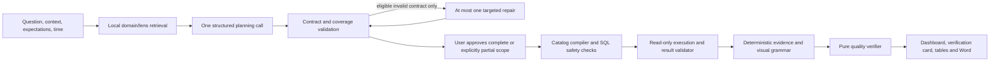

# Data Platform AI V2.7 — Verifiable Analyst

V2.7 adds explicit business-requirement coverage, deterministic report verification, stronger business metadata and an offline evaluation harness. It keeps the existing question → review plan → approve execution flow. A successful response is never promised when the data or provider cannot support it.

## Architecture and boundaries



The inherited V2.6 compiler owns identifiers, joins, aggregation, time, populations, SQL and privacy checks. The model selects catalog capabilities; it cannot submit executable SQL. `one_shot_planner.py` owns the request budget. `analytical_blueprint_service.py` materializes lenses. `analytical_query_service.py` and `analysis_query.py` compile and validate the algebra and results. `insight_service.py` produces numerical evidence and controlled narrative. `dashboard_planner_service.py` chooses and validates visualizations from actual result shape.

New `analysis_coverage_service.py` validates declared business components before execution. `analysis_quality_service.py` recomputes evidence, verifies charts and narrative, and returns `AnalysisQualityAssessment` version **2.7.1**. It performs no network, provider or SQL execution. The fresh execution path supplies internally validated artifacts; stored-report verification recompiles the logical operations with a forbidden executor and validates the stored rows again. Stored SQL is inert in this path.

## Outcomes and request coverage

The natural provider tool requires `analysis_components` (an empty list is permitted for a clarification/refusal). Each component has a stable ID, short business goal, optional known domain/lens, requested/supporting role, operation IDs, status and controlled unavailable reason. Planned components must reference operations of the correct role/domain/lens. Duplicate IDs, unknown references and unmapped requested operations are rejected. Known catalog domains may remain explicitly unavailable when their physical sources are absent.

An unavailable component has no executable operation IDs and must explain history, missing metric/definition or ambiguous criterion. The server preserves it as missing work. A partial proposal carries `outcome=PARTIAL_AVAILABLE`, names missing components and requires `accept_partial_scope=true` after the user approves the partial plan. The UI changes the approval button accordingly. It never silently removes requested work to fit a budget.

The repair must preserve the original declared requested identities and operation coverage. Legacy decisions without components receive execution-only mappings, rather than a false assertion that every natural-language requirement was understood. Such reports cannot receive the top verification status.

| Outcome | Meaning and next step |
|---|---|
| `SUCCESS` | Validated results for the declared executable scope. |
| `PARTIAL_AVAILABLE` | Missing requested parts remain visible; explicit approval is required before executing the available parts. |
| `NEEDS_INPUT` | A genuine criterion, filter, time or scope choice is needed. Existing catalog choices are shown when available. |
| `INSUFFICIENT_DATA` | No observations, all-null requested metrics, or unavailable historical capability. Adjust scope or provide the necessary history. |
| `UNSUPPORTED` | No supported business definition or method, for example net profit without cost data or forecast without a forecasting capability. |
| `SYSTEM_ERROR` | Provider, metadata, rejected contract, execution or validation failure. No successful verified report is manufactured. |

The component contract records what the planner declared. It does **not** independently prove that the model understood every phrase in a free-form question. That is measured separately against authored golden expectations.

## Exact runtime scoring

For eligible successful reports, compute:

`raw_score = Σ round(weight × verified_fraction)`

`score = min(raw_score, applicable_cap)`

Python rounding is used consistently in fresh and restored paths. Scores are integers from 0 to 100; they are not model probabilities.

| Component | Weight | Verified fraction |
|---|---:|---|
| Request coverage | 30 | Completed requested components / all declared requested components. Supports cannot replace requested parts. |
| Semantic consistency | 20 | Current catalog recompilation, role/scope/lens mappings and contracts pass; failures make the report unscored. |
| Result integrity | 20 | Current result validator and stored execution verdict pass for every artifact; invalid results make the report unscored. |
| Evidence grounding | 15 | Passed evidence, KPI values/labels/units/scopes, finding values/comments, insights, summary, conclusions and recommendations / checks performed. |
| Visualization appropriateness | 10 | Valid rendered charts plus covered requested chart-eligible metric scopes / charts plus eligible metric scopes. Scalar-only requests are not applicable and receive the full 10 without an invented chart. |
| Limitation disclosure | 5 | Correct structured disclosures / derived applicable limitations. No applicable limitation receives full credit. |

Derived limitations include snapshot-only data, distinct/average non-additivity, related populations, Top N, explicit row limits, partial time buckets, display subsets and omitted supporting work/table fallback. Returned limits remain visible even when the supplied disclosure was missing.

Caps apply after weighting:

* **74:** any missing requested component or invalid/duplicate/misleading chart.
* **89:** execution-only coverage, no grounded claims, failed claim checks, missing required visual coverage or missing applicable disclosure.
* **100:** no detected issue in these checks. This verifies internal consistency of the declared analysis, not business causality, source authenticity or universal model accuracy.

Grades: `excellent ≥90`, `good ≥75`, `partial ≥50`, otherwise `needs_attention`. Status is `verified` only when no cap applies, `partially_verified` otherwise. The exact integer may be below its cap.

`not_scored` uses `score=null`, never a fabricated 0, for errors, invalid or all-null/empty requested results, legacy metadata, changed catalog fingerprints, malformed logical plans and oversized stored-report payloads. Restored verification is bounded to 8 operations/results, 2,000 rows per result, 24 charts, 16 components and 4,000 evidence entries. These are verification ceilings, not permission to bypass stricter production chart/operation limits.

The card appears below analytical charts and above expandable tables on desktop and mobile. It shows completed, missing, unverified, limitations and next actions, with encoded evidence links and an accessible progress bar only for a real score. It explicitly says: **“Điểm này không phải xác suất AI trả lời đúng.”** Legacy renderers show “Chưa chấm”. Word contains the same compact assessment. Saved report load and export recompute; module reruns score the new results. Client-supplied score fields are ignored during rechecking.

## Business semantics and retrieval

The authored catalog contains **16 domains, 38 lenses/blueprints, 33 metrics, 26 dimensions and 35 business relationship hints**. Offline physical-fixture audit materializes all 38 lenses with no errors. A separate read-only metadata audit of the local running warehouse on 2026-10-07 also found all 16 domains/38 lenses physically available, with no audit errors. This checks metadata and compilation, not row completeness or live analysis accuracy; future runtime availability remains physically validated and fingerprinted.

All metrics now state business definitions, population, grain, aggregation behavior, additivity by grouping/time, historical capability, quality direction and invalid uses. Examples of important distinctions:

* Revenue and AOV have status-specific sale populations. `aov` and `store_aov` are averages, not sums of group AOVs.
* Purchasing customers are distinct buyers in the qualifying order population; registered customers are a different population. Distinct buyer counts cannot be summed over overlapping groups.
* Voucher usage, voucher revenue and discount totals may have different cancellation cohorts. They do not establish incremental profit or ROI.
* Payment transaction value is not automatically recognized sales revenue; transaction-status population is explicit.
* Current shipper totals/ratings, stock and lifetime customer spending are snapshots. They cannot become historical trends simply because the UI chooses a month.
* Signed cash differences can cancel; a net zero is not proof of no reconciliation issues.
* Review averages need counts/context. Survey response counts have no implied satisfaction denominator. Favorites reflect interest, not completed purchases.

Dimensions state grouping/filter meaning, hierarchies and cardinality hints. Unknown cardinality stays unknown until results arrive. Relationship hints explicitly mean related populations and list invalid uses. Physical directional joins and cohort/clock constraints remain authoritative; the hints never authorize a join or causal conclusion.

Each lens has two metadata examples for **local weak retrieval**. They are not all sent to the provider. Strong domain/entity/metric matches remain protected. Unknown vocabulary broadens weak candidates instead of locking onto the first domain. A global compact lens directory gives unselected lenses IDs, labels, default operation, default metric/grouping and capability flags. Selected packs retain blueprint and business semantics.

Wire compaction shares repeated blueprint values and removes subject metric/dimension lists already delivered in the authoritative manifest. Detailed diagnostics measure the actual native and compatibility provider request bodies, global directory, lens directory, selected packs, component schema and state. No embedding calls are introduced.

## Context and provider budget

Natural planning keeps the economical **24,000-character soft target** and the configured **48,000-character absolute maximum**. Mandatory multi-domain semantics can expand the allowance only after local compaction. An explicitly configured lower hard maximum remains authoritative. More than eight independent operations still needs an honest scope decision; context expansion does not remove execution limits.

Same Docker Python runtime, fixed reference date 2026-10-07 and scripted no-execution plan, archived V2.6 `592c9a2` compared with V2.7:

| Context scenario | V2.6 native / compatibility chars | V2.7 native / compatibility chars | V2.7 allowance |
|---|---:|---:|---:|
| Product analysis | 22,798 / 22,747 | 22,696 / 22,645 | 24,000 |
| Two-city, six-domain question | 22,900 / 22,849 | 29,165 / 29,114 | 31,000 |
| Unknown vocabulary | 22,053 / 22,002 | 22,604 / 22,553 | 24,000 |

The six-domain body is larger because it carries richer definitions, coverage and global capabilities. This is a measured size tradeoff, **not** a measured accuracy improvement. Character counts are not token counts. The context probe's scripted plan intentionally measures packing, not whether a model selected the correct analysis.

Production Compose retains one initial call plus at most one eligible targeted planning repair: `DATA_ANALYST_MAX_PROVIDER_CALLS_PER_TURN=2`, `DATA_ANALYST_ENABLE_CONTRACT_REPAIR=1`. A valid first response uses one call. Repair uses compact issues and delivered semantic context, preserves declared scope and does not redo full history. No provider fallback, model escalation, embedding retrieval or post-result AI synthesis is enabled.

Authentication, daily quota/rate limit, genuine ambiguity, unavailable history, unsupported definitions, SQL execution and result validation do not trigger automatic AI retries. A repeat click is a new user request; V2.7 does not claim the provider will always succeed on the first request. Local scoring and saved-report verification use **zero AI calls**.

## Reproduction without external calls

From `data-platform/analytics-api`, with project Python dependencies installed:

```bash
python -B tools/qualify_v26.py
python -B tools/audit_semantics_v27.py --output /tmp/v27-semantic-audit.json
python -B -m evals.run_eval --mode offline --output /tmp/v27-evaluation
python -B tools/profile_v27.py --output /tmp/v27-profile.json
```

For an environment without those host dependencies, use the built API image with `--network none`, `AI_OFFLINE=1`, read-only `/app` mount and an output directory under `/tmp`. The qualification, audit, evaluation and profile tools forbid HTTP and live `psycopg2.connect`; fixture SQL uses ephemeral SQLite under `query_only`.

From `data-platform/web-ui`:

```bash
node --test src/utils/*.test.mjs
npm run typecheck
npm run build
```

See [evaluation methodology](AI_V27_EVALUATION_METHODOLOGY.md), [manual live matrix](AI_V27_MANUAL_MATRIX.md) and [implementation report A–AN](AI_V27_IMPLEMENTATION_REPORT.md).

## Operational note

`ANALYTICS_INITIALIZE_WAREHOUSE_ON_STARTUP=false` is now the default and explicit in Compose. Starting or reloading the API serves existing warehouse schemas without startup DDL or bootstrap jobs. Fresh installations that require warehouse initialization must opt into the existing bootstrap deliberately. No warehouse bootstrap, live report generation or saved-report mutation was invoked during this implementation.

Stored-report verification checks algebra, rows and narrative consistency under the current metadata. It does not re-query the warehouse or cryptographically attest the origin of user-supplied rows. For independent data correctness, use the fixture oracle in evaluation, or explicitly rerun an approved live report. Historical/forecast/causal gaps cannot be filled by a high runtime score.
