# V2.8 Hybrid Analyst reliability and architecture

Qualified offline on 2026-10-08. **LIVE_PROVIDER_REQUESTS = 0.**

## Repository and scope

- STARTING_HEAD: `708a2f118ae91a8fa6bfd804e6b122af8ff851ef`.
- Latest DataPlatform commit at start: `460e8abd01f0c186ab98bee1c304b7f9e2dd288d`, verified ancestor of HEAD.
- Branch: `branch_thaian`. HEAD remains the starting commit; changes are uncommitted. No commit, push, reset, or merge was performed.
- Implementation scope: `data-platform/` and the analytics-api configuration in `docker-compose.data.yml`.
- The ten pre-existing modified customer-chatbot files and two pre-existing untracked chatbot files were left untouched. They remain visible in the shared worktree.
- Rebuilt/recreated services: **analytics-api and web-ui only**, using `--no-deps`. Warehouse startup initialization remains disabled. No warehouse DDL, DML, ingestion, or customer-service restart was performed.

The pre-implementation diagnosis and migration decision are retained in [MIGRATION_NOTE.md](evaluation/v28/MIGRATION_NOTE.md).

## Live failure diagnosis and ownership migration

The supplied failure was a local executable-contract failure after successful provider transport. The model combined `product_revenue` with an incompatible lens such as `item_sales`, even though the catalog admits a products revenue ranking. Repair regenerated a coupled graph and its component mappings; fixing the lens could then leave requested coverage invalid. Increasing retries alone could not remove those dependencies.

| Field or decision | Before | V2.8 |
|---|---|---|
| Business requirements, metric/dimension meaning, filters, time, ranking, requested features | Model | Model, validated against catalog/UI/request anchors |
| Lens | Model executable choice | Optional advisory hint; compatible server choice |
| Subject, operation decomposition, executable IDs, query roles | Model graph | Deterministic resolver |
| Component-to-operation coverage and denominator operations | Model mapping | Server derivation |
| Breadth and visual budget | Model label | Structured UI preference or server requirement complexity |
| SQL, security, rows, evidence and visuals | Server | Server, with independent provenance verification |

The public proposal and refinement routes use `HybridAnalystPlanner`. Historical coupled-graph planners remain explicit migration references; production routes never select their model-owned graph contract.

```mermaid
flowchart LR
  U[Business question and UI scope] --> I[One semantic interpretation]
  I --> A[Exact request coverage guards]
  A --> R[Catalog compatibility and minimal decomposition]
  R --> P[Proposal identities and approval]
  P --> C[Strict server SQL compiler]
  C --> V[Read-only execution and result validation]
  V --> E[Deterministic evidence and visuals]
  E --> Q[Independent quality and provenance verifier]
```

## Meaning contract and resolver

`AnalysisIntentEnvelope` has `decision`, bounded `requirements`, and a controlled clarification. A requirement contains a label ID and goal, optional domain/lens advice, semantic metric/dimension IDs, analysis kind, filters, time, ranking, granularity, derived features, and a controlled availability/reason. It contains **no SQL, executable operation IDs, parent links, query roles, component mappings, or chart graph**.

Refinement returns `AnalysisIntentDelta`: bounded add/remove/update changes to semantic requirements. Untouched meaning remains server state. Structured visual changes reuse the existing no-provider path.

The fingerprint-keyed compatibility index contains every physically verified catalog concept, metric-to-subject/dimension/lens/history/population relationships, reverse dimension relationships, domain blueprints, detail projections, and feature shapes. It is server data, independent of provider context limits. An incomplete index fails explicitly rather than silently withholding a legal metric.

For each requirement the resolver:

1. Canonicalizes semantic scope and enum aliases; structured UI time takes precedence.
2. Resolves lookup references before generating executable identities.
3. Finds common subjects, safe dimensions, compatible business populations and clocks.
4. Enumerates metric subsets (at most six metrics) and chooses a minimal compatible partition with deterministic tie-breaking.
5. Selects a compatible lens independently of the hint, or a canonical catalog subject without a lens. Strict blueprint validation is retained whenever a lens is selected.
6. Refuses unsafe ranking/distribution/relationship population splits, distinguishing missing business criteria, unsupported definitions, and unavailable history.
7. Creates operation IDs, coverage records, component mappings and feature bindings.
8. Passes every operation through the existing catalog grounding, plan checks, SQL compilation, AST/security checks and result validators.

Detail requests select only physically verified subject projections; sensitive fields cannot become projections. Per-group ranking adds the partition dimension to the executable grouping.

Fingerprints exclude incidental requirement IDs, prose goals and hints, while retaining executable meaning, catalog version, resolved periods and populations. Equivalent ordering/hints and duplicate semantic requirements produce the same canonical plan fingerprint. Coverage and binding order is stable after restoration.

## Derived analytical features and coverage

Supported feature intents include contribution share, leader, top gap, group gap, observed change/change percentage, concentration, selected total, and relationship strength. These are analytical requests, not additional invented base metrics.

A Top N contribution share generates an additional **mandatory requested denominator** for the same metric, subject, business population, time and filters. Per-group shares use a denominator for each partition. The denominator has no Top N restriction. Additivity, truncation, numeric values, positive denominator, compatible scope and numerator bounds are verified before evidence is emitted.

In the fixture warehouse, scenario A's full-population denominator is 600; the observed shares are 33⅓% and 66⅔%. The cancelled order is excluded by the catalog revenue population. The out-of-window order is excluded by the 30-day scope. Revenue and quantity remain one legal ranking operation, with one revenue denominator operation.

Exact metadata anchors independently track explicit metrics/dimensions, known values, requested features, numeric ranking, numeric rolling windows, two-date ISO ranges, structured UI scope and unavailable definitions. Longer qualified business phrases suppress contained generic aliases. Broad discovery aliases can be marked `non_anchor_aliases`; for example “đánh giá” alone does not assert driver ratings. This guard does not choose analytical routes or execute queries.

An omitted third explicit metric cannot become full-success A+B. Accepted A+B are frozen; only the omitted requirement is requested during repair. Availability remains visible as RESOLVED, NEEDS_INPUT, UNSUPPORTED or INSUFFICIENT_DATA. Partial proposals require current explicit approval before execution.

Accepted semantic deltas are retained in bounded history. The verifier independently replays initial meaning plus feedback/deltas, replaces changed exact facts, and retains untouched anchors. A Top 5 → Top 2 refinement is valid; that feedback cannot silently erase an explicit 30-day window.

## Provider transport, budget and frozen recovery

Normal interpretation uses **one provider call**. The turn budget is at most **three total attempts**, including transport retries. There is no result-synthesis call, provider fallback, or unbounded agent loop.

- First call: semantic interpretation.
- Second call when required: compact field/requirement-targeted repair.
- Final call when required: targeted resolution of the same rejected meaning.

Valid siblings and unaffected fields are frozen. Repairs cannot change unrelated time, filters, ranking, metrics or dimensions. A rejected repair does not expand the next call's authority. No deterministic compiler, SQL execution or result failure triggers provider replanning.

Timeouts, connection failures, selected transient 5xx responses and explicitly retryable short minute-quota 429 responses share this same budget, with bounded native-provider backoff/jitter. Authentication, access denial, daily quota and non-retryable rate limits stop immediately.

`DATA_ANALYST_RECOVERY_MODEL` is optional and only used for the final targeted semantic resolution. Default recovery stays on the same model. The mocked native transport test verifies primary/primary/configured-recovery selection and a total of three attempts.

Native Gemini uses one compact structured JSON schema (`responseMimeType` and `responseJsonSchema`). The OpenAI-compatible Gemini transport uses exactly one semantic function. Both normalize into the same intent parser. Native thought parts are excluded. Provider behavior was tested with mocked HTTP; no actual model availability or accuracy was measured.

Provider contract references: [Google structured output documentation](https://ai.google.dev/gemini-api/docs/structured-output) and [GenerateContent API](https://ai.google.dev/api/generate-content).

## Context and schema measurements

Matched archived/current packing for the exact three questions, using synthetic physical metadata:

| Scenario | Old body characters | V2.8 body characters | Reduction |
|---|---:|---:|---:|
| A | 22,812 | 11,657 | 48.90% |
| B | 22,902 | 11,605 | 49.33% |
| C | 22,905 | 11,928 | 47.92% |

The decision tool/schema envelope decreases from **6,405 to 2,702 characters (57.81%)**. Detailed executable blueprint packs and the coupled coverage/operation graph are absent from interpretation. Compact semantic definitions, populations, relevant dimensions, values, domain directory and global metric directory remain available. Repair sends affected meaning, fixed issue codes, frozen IDs and bounded relevant vocabulary.

These are serialized-context measurements, not live tokens, provider latency, pricing or model-accuracy claims. Final fixture timing distributions are in [acceptance_summary.json](evaluation/v28/acceptance_summary.json); matched bodies are in [context_profile.json](evaluation/v28/context_profile.json).

## Durable sessions and approval consistency

Production uses Redis; explicit memory storage is limited to development/offline mode. Session state is JSON, with typed artifacts restored on load. Locks, provider continuation and private reasoning are not serialized.

- Two-hour TTL; 500-session capacity; four-megabyte serialized session limit.
- Owner binding, logical revision, catalog/intent/plan identities.
- Atomic Lua compare-and-set with a separate storage version and immutable existing owner.
- Distributed per-session lease/lock; stale version checked again after acquisition.
- Request/proposal revision and all three approval fingerprints checked before SQL.
- Full executable query content checked against server-resolved operations, including time, filters, metric population, projection and ranking; matching IDs alone are insufficient.

Deployment uses existing Redis via `DATA_ANALYST_REDIS_URL` (compose default points to the existing host-exposed Redis, database 2). Other deployments must supply their reachable Redis URL. Browser owner binding is session ownership, not account authentication.

The real Redis integration used one temporary fixture session, separate store instances, atomic stale-update and stale-lock rejection, immutable owner, and TTL checks. The temporary session was deleted. [Redis verification](evaluation/v28/redis_verification.json).

## SQL boundaries and quality verification

AI analytical SQL remains compiler-generated, Silver-scoped and read-only. Existing guarded execution and result contracts remain mandatory.

Saved-report creation/export validates SQL against the current catalog, sensitive-field rules and AST policy. Analytical saved SQL must match recompilation of its query definitions. Preview and arbitrary saved-SQL execution are disabled by default. Enabling `trusted_admin` requires an explicit deployment policy and a configured bearer token of at least 32 characters, checked before any fetch/execution. Existing saved records remain readable/exportable; arbitrary client SQL cannot silently bypass the default policy.

V2.8 quality re-resolves intent, rebuilds exact anchors and accepted deltas, verifies server coverage/components/feature bindings, compares every executable field and query plan/SQL, and checks catalog, semantic/plan and result fingerprints. Evidence, charts and claims are recomputed against current validators. Fresh and restored assessments agree in tests.

As of verifier **2.8.2**, production V2.8 reports publish observed check counts and a disclosed engineering verification index (`verification_evidence_v1`). The eight internal groups share 90 points; 10 independent-reference points remain unearned when no trusted reference exists. Missing requested work/features, null metric observations, unsupported claims or wrong chart bindings reduce the score. This index is not empirical accuracy or calibrated probability; both remain explicitly unmeasured in runtime reports. Archived V2.7 API records retain their historical weighted rubric for compatibility; the UI hides that old number. A new V2.8 report failing provenance verification stops at QUALITY_VERIFICATION rather than becoming a successful report.

Provenance separates user request, semantic intent, initial meaning and delta history, resolved plan fingerprint, catalog fingerprint, resolver/verifier versions, query plans and result-set fingerprint. Historical records retain their older quality-context version and do not acquire the new independent request-anchor guarantees. Existing V2.6 reusable canonical modules remain a backward-compatible template path; a fresh V2.8 proposal is needed for the new meaning/provenance contract.

Diagnostics distinguish PROVIDER_TRANSPORT, PROVIDER_FORMAT, SEMANTIC_INTENT, SEMANTIC_COVERAGE, ANALYTICAL_RESOLUTION, PLAN_VALIDATION, SQL_COMPILATION, SQL_EXECUTION, RESULT_VALIDATION and QUALITY_VERIFICATION. System interpretation failures are not blamed on missing user business input. UI retry appears only when the backend offers it; successful/proposal responses have no retry loop.

## Qualification and test migration

| Check | Result |
|---|---|
| Complete backend unittest suite | **546 passed**, 118.467 seconds, offline |
| Focused V2.8 suite | **27 passed**, including mocked native JSON and full metric/dimension shape matrix |
| V2.8 evaluation | **110/110 passed** |
| Preserved archived V2.7 evaluation | **104/104 passed** |
| Catalog audit | 33 metrics, 26 dimensions, 16 domains, 38 lenses; **0 errors** |
| Frontend Node/SSR tests | **84/84 passed** |
| TypeScript typecheck | Passed |
| Vite production build | Passed |
| Docker builds | analytics-api and web-ui passed |
| Redis integration | Passed; fixture session removed |
| Health | Both services healthy; web proxy `/api/health` **HTTP 200** |
| Diff whitespace check | Passed |
| Live providers / embeddings / warehouse mutations | **0 / 0 / 0** |

The 110 new fixtures contain 20 compound, 15 multi-domain, 10 derived-feature, 10 lens-conflict, 10 omission, 10 frozen-repair, 10 structured-scope, 10 unavailable-data, 10 production refinement, and 5 malformed-envelope cases. Production never imports fixture sentences for routing.

New regression coverage includes equivalent hints/order/IDs, accepted sibling preservation, targeted field freezing, omitted third metrics, approval tampering and owner mismatch, true denominators, restored quality equality, semantic delta replay, detail privacy, per-group ranking, no SQL/result retry, transport/auth budgets, native structured output and configured third-call recovery, serialization and Redis concurrency, and SQL policy refusal.

Historical V2.4–V2.7 implementation tests explicitly instantiate `ArchivedGraphPipeline` for their retired model-graph invariants. No historical tests were deleted. Public V2.8 tests instantiate the production pipeline. Replaced assertions are documented:

- Rejecting a three-call allowance was obsolete; allowances above three are rejected, and normal one-call/total-budget invariants are tested.
- `PLAN_FAILED` graph taxonomy became `SEMANTIC_INTERPRETATION_ERROR`; invalid model interpretation is a system error with null quality and no user-blame edit action.
- Automatic/unconditional retry button expectations became backend-action-gated SSR assertions; internal bounded repairs do not trigger another UI request.

Artifacts: [acceptance summary](evaluation/v28/acceptance_summary.json), [golden cases](evaluation/v28/golden_cases.json), [V2.8 evaluation](evaluation/v28/evaluation_summary.json), [archived V2.7 evaluation](evaluation/v28/archived_v27_evaluation_summary.json), [semantic audit](evaluation/v28/semantic_audit.json).

Reproduction uses the existing analytics-api container with `AI_OFFLINE=1`, `DATA_ANALYST_ENV=development`, and `DATA_ANALYST_SESSION_STORE=memory`. The complete historical suite is launched with provider maximum 1/repair 0; V2.8 tests explicitly configure maximum 3/repair 1. Runners: `python -m unittest discover -s tests -q`, `python -m evals.run_eval_v28`, `python -m evals.run_eval --mode offline`, `python -m evals.manual_v28`, `python -m evals.profile_v28`, and `python -m tools.audit_semantics_v27`. Frontend checks: `node --test src/utils/*.test.mjs`, `npm run typecheck`, `npm run build`.

## Manual qualification matrix

Use the exact supplied questions in the DataPlatform AI Analyst with automatic UI time/scope. Live manual qualification remains the user's next step; the results below use scripted semantic interpretation and the local fixture warehouse.

| Scenario | Required behavior | Offline result |
|---|---|---|
| A: Top 5 product revenue, quantity, revenue contribution, leader/gap, 30 days | Legal revenue ranking despite wrong lens hints; complete denominator | One interpretation; 2 operations; SUCCESS; independently verified score 100 |
| B: TP.HCM vs Hà Nội, revenue/orders/AOV/completion, payment mix and Top 5 products per city, 90 days | Every requested component accounted for | One interpretation; 4 operations; PARTIAL_AVAILABLE; completion-rate definition unavailable; score 74 |
| C: voucher usage/revenue/discount/orders/contribution, 60 days, true ROI limitation | Supported populations and full voucher-revenue denominator; no invented costs | One interpretation; 3 operations; PARTIAL_AVAILABLE; true ROI unavailable; score 74 |

For B/C review the visible missing requirement and explicitly approve partial scope before generating. Verify each supported metric's population definition, cities/time, per-group ranking, shares and disclosures. Repeat A with identical UI settings; equivalent semantic meaning should produce identical plan fingerprints. Then refine Top 5 to Top 2 and confirm the time/scope persists. Exercise a structured chart change and confirm zero provider calls.

Detailed offline records: [manual_qualification.json](evaluation/v28/manual_qualification.json). Final deployed runtime and HTTP probes: [deployment_verification.json](evaluation/v28/deployment_verification.json).

## Acceptance gates and limits

All twelve hard gates are supported by the implementation and offline evidence: legal Top-5 revenue resolution; no model-owned component/operation coupling; frozen unrelated repairs; omission guards; minimal derived-feature operations; repeatable canonical meaning; one normal call; maximum three attempts; no unbounded loop; compiler-only/read-only analytical SQL; unchanged customer chatbot work; zero live provider requests.

Remaining limits:

- Scripted qualification measures server behavior and contract robustness. It does not establish live Gemini interpretation accuracy, availability, latency or cost. Exact A/B/C still need the requested manual live qualification.
- Exact anchors are conservative catalog/numeric/UI checks. They do not prove every paraphrase, negation or implicit goal was correctly interpreted. Ambiguous or unsupported meaning is not silently substituted.
- Completion-rate definition, true marketing ROI/costs, forecasts and unsupported historical snapshots remain unavailable. Voucher-order counts are catalog order-based observations, not an invented redemption-event or marketing-cost ledger.
- Operation/result/session limits remain bounded (8 executable operations; existing row/visual limits; 16 requirements; 20 semantic delta history entries). Unsafe population splits require clarification.
- Redis availability is required for production session workflows; there is no sticky-memory production fallback. Generic report SQL execution remains disabled unless an explicit trusted-admin deployment is configured.
- Native/compatible provider behavior was mocked. Current Google structured-output documentation was checked, but no real provider request was used to qualify a configured model.

**LIVE_PROVIDER_REQUESTS = 0. No commit or push performed.**

## Follow-up: live goal-field rejection, 2026-10-08

The first manual scenario exposed a gap in the original qualification. The supplied response and recent runtime logs show three successful Gemini OpenAI-compatible transports, followed by three SEMANTIC_INTENT rejections of `goal`, with zero SQL executed. The original logs retained no raw goal or Pydantic validation subtype, so the exact original value is unavailable. A valid descriptive goal longer than 120 characters deterministically reproduces this rejection; the full scenario A question is one example. The original scripted fixtures used short goals and missed it.

The goal is descriptive prose, not executable intent. It is now optional, with server defaults for absent/null/blank descriptions and bounded normalization (2,000 characters). Server component cards independently bound their display label to 120 characters. No metric, dimension, time, filter, ranking, feature binding, compiler or result guard was relaxed. The model schema describes the goal as optional concise prose; cosmetic length no longer consumes semantic repair attempts or changes plan fingerprints.

Remaining structural validation errors now include controlled Pydantic types/constraints instead of only `invalid_intent_shape`. Targeted recovery includes valid fields from a malformed requirement, preserving all supplied valid semantic fields even when no sibling parsed successfully. ID-only outputs still require interpretation; a default display description cannot turn them into accepted analytical meaning.

The UI no longer repeats the system error under “Cần bổ sung”; system details use “Thông tin”, while genuine user clarification retains its existing behavior.

Qualification for this correction:

- Full backend suite: **550/550**, 119.243 seconds; V2.8 focused suite now 31 cases.
- Frontend SSR/utilities: **85/85**; typecheck and Vite build passed.
- V2.8 offline evaluation: **110/110**, including ID-only malformed-envelope recovery.
- Both native JSON and OpenAI-compatible transports tested with mocked HTTP and long descriptive goals: first attempt succeeds, no repair.
- Full/long/blank/null/missing goal descriptions preserve the same plan fingerprint; valid scopes remain frozen across malformed-field repair.
- Deployed catalog + production Redis + actual read-only warehouse smoke for scenario A, using scripted interpretation: proposal_ready, one interpretation, zero repairs, two SQL queries, SUCCESS, verified quality 100. Temporary Redis session removed. This verifies the deployed data/compiler path, not live model interpretation accuracy.
- Docker images rebuilt and services recreated for analytics-api/web-ui only; both healthy, web proxy `/api/health` HTTP 200. **LIVE_PROVIDER_REQUESTS for this correction = 0; warehouse mutations = 0.**

The earlier zero-live-provider count describes agent work; the user's submitted failure contains their separate live manual attempts. This correction does not relabel those attempts as offline tests.

Artifacts are under [goal-fix-20261008](evaluation/v28/goal-fix-20261008/), including the controlled reported-failure summary, updated 110-case evaluation, deployed warehouse smoke and verification summary.

## Follow-up: refinement and accuracy measurements, verifier 2.8.1

The next supplied manual response reports primary `duplicate_delta` on `req_1.changes`, followed by `metric_required` during recovery, with three successful provider responses and zero queries. The actual delta is not retained in the submitted response. The code rejected every repeated update ID, even identical/disjoint patches; recovery then switched from delta to full intent without retaining the complete baseline. A partial requirement therefore lost its metrics. These code paths are reproduced by offline regressions; the precise original patch values remain unknown.

Repeated updates now merge atomically when their fields agree or are disjoint. Conflicting values and incompatible add/remove/update combinations remain rejected. A nested ranking patch inherits the unchanged metric, direction and grouping. Recovery stays on `submit_analysis_delta`, carries the full stored intent and original request, and freezes accepted fields outside the repair target. Scope/history/SQL/result validation and the three-call bound are unchanged. The current report remains intact on rejected refinement. Titles use current meaning after a successful refinement, and failed-refinement banners identify the displayed report as the prior version.

The former 30/20/20/15/10/5 weighted rubric measured internal consistency, not empirical accuracy. It could award 100 to a self-consistent report with unverified source truth or an interpretation error. Production V2.8 now returns `score: null`, `measurement_mode: evidence_checks`, no weighted components, and eight groups of observed checks: request completion, semantic/plan consistency, result validation, observed non-null metric cells, requested derived calculations, evidence recomputation, chart/data binding, and limitation disclosure. Each group publishes actual passed/total counts and its verification boundary. There is no aggregate percentage. Null observations, missing features, unsupported claims and incorrect chart ranking metadata are adversarially tested. Current business metric population definitions are disclosed, including the HOAN_THANH/DANG_GIAO product revenue population.

Accuracy is a separate reference measurement: **matched named assertions / independent reference assertions**, with exact categorical/shape/order checks and explicit numeric absolute/relative tolerances. Missing/extra fields, wrong row order, wrong scope, non-finite values and wrong types fail. The verifier never accepts client-supplied accuracy, never uses its own results as independent ground truth, and never converts check pass rates into a probability. Runtime reports explicitly state accuracy `not_measured` and confidence uncalibrated unless a trusted independent evaluation exists. A controlled regression with two correct and two incorrect assertions measures 50%, not a self-assessed perfect result. Word export follows the same distinction.

`python -m tools.verify_refinement_v281 --output <path>` is an explicit read-only audit tool. It exercises proposal → generation → repeated-patch Top 2 refinement on the deployed catalog, actual warehouse and production Redis, with scripted interpretation and all HTTP forbidden. Reference SQL is hand-authored against orders/menu source tables and independently recomputes line revenue from unit price × quantity. It does not use compiler SQL or the Silver computed revenue column. It always removes its temporary session and retains failed audit artifacts too.

For the supplied scenario/window (2026-09-09 through 2026-10-08), **22/22 independent numerical/scope assertions matched** for Top 5 and Top 2. Top 5 is Matcha mooncake 7,920,000 / 80; 1 Lít Matcha Latte Tây Bắc 7,885,000 / 83; green bean mooncake 7,326,000 / 74; mixed mooncake 6,902,000 / 58; Mocha Frappe 6,764,000 / 76. Total full-population product revenue is 362,895,000; selected quantity 371; leader gap 35,000. The quantity companion chart keeps revenue ordering and now says so explicitly. This audits these facts and code paths, not live model accuracy or upstream transaction truth.

Qualification: **566/566 backend**, **89/89 frontend**, **67/67 focused hybrid/refinement/legacy-verifier**, **110/110 offline evaluation**, TypeScript and production Docker builds passed. Live provider requests and warehouse mutations remain zero. Current artifacts: [refinement-quality-20261008](evaluation/v28/refinement-quality-20261008/).

## Follow-up: city comparison, contribution chart and overall index, verifier 2.8.2

The supplied failure stops before SQL with `req_1.dimension_ids: two_dimensions_required`, then exhausts semantic repair. Its raw provider envelope was not supplied. The new reproduction supplies a one-axis `cross_tab` city comparison; this now canonicalizes to `aggregate`, preserving every city filter, metric and 90-day window. The semantic grammar also explicitly accepts `comparison` and explains the distinction between two city values and two independent grouping axes. Genuine two-axis cross-tabs stay cross-tabs; absent axes still fail rather than being invented. Diagnostics record bounded known interpretation IDs and axis counts to make future failures diagnosable without raw provider text.

Revenue and average order value have the same currency unit but different scales/aggregation meanings. Default views separate sums from averages; the reported city comparison now produces three individual metric charts while retaining two SQL populations (valid-order revenue/AOV and all-order count). Same-unit sums can still share a grouped chart. Requested contribution shares get an additional horizontal percentage chart, sourced from canonical numerator/full-population denominator evidence already computed. Top N shares are never renormalized to 100%; no chart-only query is added. Restored verification detects changed percentages, denominators, evidence references, duplicates and missing requested contribution charts. UI shows two decimal places for shares and links to both operands.

`verification_evidence_v1` is an explicit product-policy engineering index, **not a fitted accuracy algorithm**. Let `w` be the eight budgets: scope 20, semantics 15, result integrity 15, observed values 10, requested calculations 10, evidence 10, visualizations 5, disclosed limitations 5. Internal score = `90 × Σ(w × passed/total) / Σ(applicable w)`. Independent-reference score = `10 × matched/reference`; when unknown it remains unearned and disclosed. N/A checks redistribute only the internal budget. Repeating claims cannot change a group's budget. One unsupported claim out of 47 lowers a perfect internal report to 89.8; failed scope with every other group passing yields 70. Runtime cannot trust saved/client accuracy, so complete runtime reports currently earn 90/100 while independent accuracy and calibrated probability remain unknown. The UI and Word export include the formula; old rubric scores stay hidden.

Read-only audits reproduce generation and refinement using scripted meaning and production Redis; HTTP is forbidden, warehouse writes are absent and temporary sessions are deleted. Top 5/Top 2 numerical facts, full denominators and all three charts matched **26/26** independent source-SQL assertions. The 90-day city comparison and one-city refinement matched **7/7** assertions. Source results: Hà Nội 271,938,000 VND / 2,516 all-status orders / 112,324.6592 VND valid-order AOV; Hồ Chí Minh 454,128,000 VND / 4,244 all-status orders / 111,634.2183 VND valid-order AOV. These audits verify the recorded facts/code paths, not live provider interpretation accuracy or upstream transaction truth.

Artifacts: [comparison-score-20261008](evaluation/v28/comparison-score-20261008/). Runners: `python -m tools.verify_refinement_v281 --output <path>` and `python -m tools.verify_comparison_v282 --output <path>`, both explicitly read-only and zero-provider. Newly generated reports include the added contribution chart; stored reports retain their saved visuals.

Final qualification: **580/580 backend** (124.042s), **30/30 focused comparison/refinement/score**, **92/92 frontend**, **110/110 offline evaluation**, TypeScript and both Docker builds passed. Complete and partial A/B/C reports scored 90, 84.4 and 83.3 respectively, with unavailable definitions still disclosed. Both rebuilt services are healthy; the web proxy returns HTTP 200 and serves bundle `index-CJbarMlB.js` with the new score method and contribution view. The comparison audit was repeated after restart and matched 7/7 again. Provider requests and warehouse mutations remain zero.

## Follow-up: inconsistent overview attempts, verifier 2.8.3

For the user's identical 90-day overview question, logs show three different interpretations:

- 08:33:39 UTC: `revenue_by_store` lacked grouping (`grouping_required`); targeted recovery later changed a frozen metric and was correctly rejected as `untargeted_field_changed`. No raw first interpretation was retained, so regression reconstructs the missing-axis condition rather than claiming to replay that unavailable payload.
- 08:35:21 UTC: generation failed with `population_limit` (2,001 fetched, 2,000 allowed). The retained Redis intent reveals a weekly trend additionally grouped by raw `order_created`, plus scalar KPIs incorrectly annotated `selected_total`. This was a planner shape error, not evidence that the business question required splitting.
- 08:35:55 UTC: a different interpretation grouped the trend by week alone and completed. The supplied proposal/report are from this successful attempt.

The resolver now removes a trend grouping only when its expression is exactly the metrics' shared observation-clock expression: the compiler already buckets that clock as `period`. Independent city/store axes, `EXTRACT(HOUR...)`, other observation clocks and timestamp filters stay intact. Scalar aggregates carrying `selected_total` normalize to the existing whole-scope `scalar` evidence, including AOV on its own authoritative valid-order population. No metric, date range, ranking limit or warehouse guard is weakened. Raw known-ID shapes and catalog normalizations are separately recorded; failed-result diagnostics now include controlled dimension IDs and granularity.

One missing required grouping can be completed only from a unique, unrepresented dimension explicitly anchored in the original question, compatible with every selected metric. Requirement IDs, prose goals and advisory lens hints cannot choose an axis. Multiple missing requirements, multiple possible axes, incompatible/unknown metrics and absent explicit anchors remain unresolved. This prevents the observed missing-store case from wasting recovery calls without inventing business scope. Refinement still preserves frozen fields and accepted history. Fresh provenance records the actual verifier version.

Ten regressions cover both retained interpretations, a reconstructed missing-store variant, five repeated identical bad-shape proposals, 2,010 distinct order instants, clock/filter/expression preservation, scalar populations, ambiguity rejection, unchanged real 2,000-row overflow enforcement, and subsequent Top 2 refinement. The bulk-order fixture produces five weekly buckets with all 201,000 revenue and 2,010 orders retained. There is no increased row limit, implicit result truncation or external user retry in these reproductions.

A read-only source audit finds **11,408 valid-order instants versus 13 weekly buckets** for 2026-07-11 through 2026-10-08. Both recorded interpretations now generate `SUCCESS` with one scripted interpretation, all requested components resolved, and **28/28** independent source assertions matched. Source totals are 1,283,914,000 VND, 11,925 all-status orders, and 112,456.3370 VND valid-order AOV. Full city totals and Top 10 store rankings also match. Group totals are compared under a common key ordering so PostgreSQL locale and Python Unicode collation do not create false data mismatches; revenue-ranked order remains checked.

Artifacts: [overview-reliability-20261008](evaluation/v28/overview-reliability-20261008/). Source audit runner: `python -m tools.verify_overview_v283 --output <path>`. It forbids live provider HTTP, uses read-only database sessions and deletes its temporary Redis sessions. These are execution/interpretation-replay checks; live model reliability has not been measured.

Final qualification: **590/590 backend** (130.481s), **10/10 overview regressions**, **61/61 hybrid/refinement/comparison regressions**, **92/92 frontend**, **110/110 offline evaluation** and both Docker builds passed. Analytics API was replaced; unchanged web assets were retained. Both services are healthy and `/api/health` returns HTTP 200 through the web proxy. Source audit repeated on the replacement container and matched **28/28** again. Live provider calls and warehouse mutations remain zero.

## Follow-up: product interpretation and recovery, verifier 2.8.4

The new failures at 08:56–08:58 UTC concern the **60-day product analysis**, not the previously audited 90-day overview. Logs show successful primary interpretation followed by `explicit_metrics_missing`/`explicit_features_missing`, rejected repairs (`accepted_requirement_changed`), a missing ranking criterion, and a missing weekly cadence. One third-attempt provider request hit the old 25-second socket timeout. The submitted failure payloads retained interpreted shapes and controlled issues, but not full raw intent envelopes; the new test fixtures therefore explicitly distinguish recorded diagnostics from reconstructed fields.

Changes:

- Metadata declares `item_revenue`/`product_revenue` as equivalent for request coverage only. Equivalence requires identical expression, source, grain, clock, unit, business filters, null policy, aggregation semantics, additivity and historical capability. Executable subject/dimension compatibility remains compiler-validated. Order-level revenue never satisfies a qualified product-revenue request.
- AI vocabulary now supplies compatible dimensions per metric, checked equivalent IDs and concise ranking/trend/derived-feature rules. No executable SQL, graph identities or coverage mappings are added to model ownership.
- Recovery schemas expose only authorized fields and requirement IDs when existing targets can be repaired. Partial semantic objects merge into server-owned baselines before validation, including nested ranking patches. Missing fields never erase filters, time or previously accepted metrics. Ambiguous feature placement can target compatible existing rankings without rewriting them; global feature additions are monotonic. Existing full-object responses still pass the same immutable-field guards.
- A valid patch advances the recovery target to any **new** validator issue in the same user request. A rejected patch cannot unlock frozen fields. The original root issues and bounded recovery history remain in diagnostics, rather than being overwritten by a secondary repair error.
- A uniquely explicit metadata cadence such as “theo tuần” fills missing trend cadence. Explicit cadence survives unrelated refinements; a user-requested cadence change replaces that anchor. Missing axes/criteria with no unique request fact still need a targeted interpretation, never a guessed default.
- Failure cards show catalog-owned identified metrics/axes/time, specific missing calculations/criteria/cadence, the reason an unsafe repair was blocked, actual internal call count and a concrete system action. They do not blame users for a model-contract failure or expose raw provider prose/SQL. Browser transport failure is also displayed on the page, rather than only as a toast.
- Interpretation uses an 8-second connection timeout and a configurable 25–60-second read timeout (default 60). Maximum three provider calls remains unchanged. Nginx waits 240 seconds, and the pending UI explains that internal checking/recovery may take a few minutes. This is bounded recovery, not a promise that an unavailable external provider can always succeed.

The source audit independently computes line revenue as **price × quantity** from raw `orders`/`menu` tables over **2026-08-10 → 2026-10-08**, without borrowing compiler expressions. Both reconstructed diagnostic variants complete using one primary interpretation plus one partial feature repair. Top 10, quantities, category totals, complete denominators, contribution percentages, leader gap and all **944 product/week facts** match the independent reference. No raw HTTP/AI requests or warehouse mutations occur; temporary owned Redis sessions are deleted.

The real report retains **89.5/100**, not an inflated 90/100: its chart checks pass 9/10 because the product trend exceeds the renderer's 16-series limit. All trend rows remain in the data table; five supported charts are rendered. The standalone audit's matched assertions measure this specific source comparison, not live-model accuracy or a calibrated confidence probability. Runtime reports still disclose independent accuracy as unmeasured.

Artifacts: [semantic-recovery-20261008](evaluation/v28/semantic-recovery-20261008/). Reproduction: `python -m unittest tests.test_semantic_recovery_v284`, `python tools/verify_product_recovery_v284.py --output /app/evals/v28-artifacts/product-recovery-v284-audit.json`, and the full offline/frontend runners documented above. The audit uses production Redis and read-only source SQL; scripted providers and mocked native/OpenAI-compatible HTTP cover successful recovery, timeout, immutable-scope attacks, malformed repair objects and newly discovered errors.

Final V2.8.4 qualification: **604/604 backend** (149.003s), **14/14 focused recovery**, **93/93 frontend**, **110/110 offline evaluation**, TypeScript and both Docker builds passed. The independent product audit matched **80/80** before and **80/80** after replacement. Only analytics-api/web-ui were rebuilt and recreated; both are healthy and the UI proxy returns `status: ok`. The running API reports verifier `2.8.4`, provider budget 3 and read timeout 60 seconds. No live AI/provider requests, warehouse writes or customer-chatbot edits/restarts occurred.

## Follow-up: voucher scope and actionable clarification, verifier 2.8.5

The 09:26 UTC voucher failure first reports `detail_aggregate_conflict`, then `unsupported_definition_omitted`, and finally a blocked change to an accepted requirement. The original raw provider envelopes were not retained: regressions reconstruct fresh meanings from controlled diagnostic codes, rather than claiming an exact replay. The request explicitly prohibits concluding ROI without costs/control data; the old anchor guard interpreted that prohibition as a positive ROI calculation request.

Catalog metric IDs are authoritative aggregate definitions. A table containing SUM/COUNT/AVG now normalizes from detail to aggregate without changing metrics, filters, grouping or time. Pure raw projections remain on the strict detail path. Optional finite `feature_metrics` binds a derived calculation to requested metrics: revenue contribution can coexist with displayed count, discount and AOV. Invalid or nonadditive explicit share targets are rejected, not silently substituted. Defaults never sum averages; ranking leaders/gaps target the ranking criterion. Frozen repair fields and unrelated refinement scope remain protected.

Conservative exact negated-verb anchors separate conclusion constraints from positively requested unavailable definitions. Positive ROI requests still require an explicit limitation. Voucher metadata provides missing business aliases, each program name's code identity, aggregate-only non-null voucher population and a catalog-owned fanout-safe LEFT lookup with a code fallback for missing labels. Raw promotion detail stays on its snapshot table. Duplicate names cannot merge distinct voucher codes in SQL, chart data or conclusions. Shared display helpers append identities when names collide; voucher displays always show their code.

The source investigation initially found two codes absent from `identity.khuyen_mai`. Inspection of `silver.khuyen_mai` establishes that it combines `orders.voucher` and `identity.khuyen_mai`, so those two codes are already mapped through the second source. There is **no observed lost-order claim** for this dataset. A synthetic orphan-code regression confirms that a truly unmatched code is retained for counts, money, AOV and the complete denominator. The independent oracle therefore reads **all three raw tables**, verifies lookup keys, and does not reuse compiler expressions or Silver results as ground truth.

Over 2026-08-10 through 2026-10-08, there are 1,839 voucher orders across 39 codes; 35 codes have valid-order revenue totaling 170,733,000 VND. Counts deliberately include all states; revenue/discount/AOV use HOAN_THANH/DANG_GIAO. Per-code values, both leader rankings, complete revenue shares, chart identities and saved-report verification match **206/206 independent assertions**, for fresh aggregate and reconstructed detail shapes, each with one scripted interpretation and six charts. Runtime reports remain 90/100 on this fully verified internal case; the standalone oracle does not turn its result into a claim about live-model accuracy.

Scoring remains a disclosed engineering index: 90 × weighted internal check ratios + 10 × independently matched reference ratio. Internal weights are coverage 20, semantic consistency 15, result integrity 15, observed values 10, requested derived calculations 10, evidence 10, charts 5 and limitation disclosure 5. N/A internal groups redistribute the 90-point budget. No independent reference means the last 10 points are unearned. Per-feature checks now require evidence for each targeted metric, and revenue shares additionally require every returned entity. Client-provided accuracy cannot increase runtime scores. Accuracy is named-assertion match rate with finite numeric tolerance (absolute 0.01, relative 1e-9); future-answer confidence remains uncalibrated. Voucher cost/control and distinct status populations are explicit scored disclosures.

Controlled clarification fields now produce specific missing-goal/metric/group/time/filter information. Nonanalytical input (e.g. a greeting) has a dedicated controlled reason and a concrete example. Older generic responses also receive safe business guidance. System errors describe aggregate/detail, feature-target and unavailable-definition conflicts plus blocked recovery; arbitrary provider prose is not displayed.

Qualification: **615/615 backend** (145.107s), **94/94 frontend**, TypeScript and both analytics Docker builds passed. Live AI/provider requests and warehouse writes remain zero. Final offline evaluation and deployment evidence are recorded in [voucher-scope-20261008](evaluation/v28/voucher-scope-20261008/). Reproduction: `python -m unittest tests.test_voucher_scope_v285` and `python -m tools.verify_voucher_scope_v285 --output <path>`.

Final V2.8.5 qualification: **615/615 backend**, **94/94 frontend**, **110/110 offline evaluation**, TypeScript and both builds passed. The independent source oracle matched **206/206 before deployment and 206/206 afterward**. Runtime API verifier is 2.8.5, budget 3, read timeout 60 seconds; API and existing cached web container are healthy, and `/api/health` returns `status: ok` through the web proxy. Only analytics-api was recreated because web application assets were unchanged; both analytics images were built. Failed legacy audit attempts' owned sessions were explicitly cleaned; no user sessions, warehouse data, customer-chatbot files or containers were changed. Live-model request success remains unmeasured because all provider interpretations in qualification are scripted.
