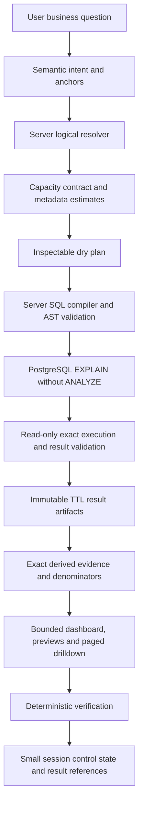

# V2.9 capacity-aware governed GenBI

Implementation and qualification date: 2026-10-08 (Asia/Ho_Chi_Minh).

Original V2.9 `STARTING_HEAD = 354e3aad443f546b7fa97b234904d15b48cc0da2`.
`V2.9 IMPLEMENTATION COMMIT = 830470c5ff5a375b6ebd12c9af000667cb539276`
(`feat: cap nhat ai data`), branch `branch_thaian`.
The original final-review pass started from that implementation HEAD with a clean
worktree/index. Those review fixes are now committed as
`FINAL_FIX_COMMIT = 19ac766666e89fa76c33195527cdefab8c811667`
(`chua xong data AI`), observed while handling the new overview failure.
Verified current HEAD is that commit. The subsequent overview repair changes are
uncommitted; this agent performed no commit, push, reset, customer chatbot
edit, credential rotation, or warehouse write.

## Audit and migration

The existing semantic control plane is `AnalysisIntentEnvelope` →
`HybridAnalystPlanner` → `AnalyticalResolver`. Anchors independently check explicit
requirements; accepted requirements freeze during targeted recovery. The resolver
owns operation IDs, population decomposition, supporting denominator queries,
coverage, derived-feature bindings, and semantic/plan/catalog fingerprints.

The old capacity failure started in `analysis_query.build_plans`: every unranked
grouped population received `MAX_ANALYTICAL_ROWS = 2000`. Compilation emitted a
2,001-row sentinel limit, execution fetched bounded rows, and `validate_results`
rejected the overflow. That protected completeness but conflated computation,
transport, and visualization capacity. Raising a number alone would leave the
session and browser cliffs intact.

The old persistence failure started in `session_service.encode_session`: it
serialized full `agent_artifacts.result`, plus `report_response.result_sets`,
`table_data.rows`, chart points, derived evidence and repeated evidence references.
The same facts occupied multiple representations before the 4,000,000-byte check.
Reports could pass SQL/result validation and then fail session serialization.

The old presentation plane already supported category previews and table
fallbacks. V2.9 preserves that grammar and adds bounded time-series selection,
chart point/byte budgets, preview counts, and artifact pagination. Exact evidence
and quality verification always use the full result; no display subset becomes an
analytical population.

The security plane remains the existing catalog table/column allowlists,
sensitive-column rejection, strict SQL AST equality, server compiler,
read-only transaction and timeout. No executable tool graph or SQL is added to
the model contract. Existing V2.8/V2.8.5 contract/version names remain compatible;
runtime health separately identifies final-review release 2.9.6.

Migration changes the storage representation around these existing foundations.
Old inline artifacts externalize on their next session save. New artifacts are
immutable references from their first execution. New sessions contain no full
raw analytical result. Redis revision/CAS, distributed locking, browser ownership,
approval identities, stale approval checks, voucher code identity, optional voucher
joins, metric populations, negation anchors and ROI guardrails are retained.

## Architecture after the change

`DryAnalysisPlan` is a server dictionary in `diagnostics.dry_plan`: requirement
IDs, subjects, metrics, dimensions, resolved time, filters, rankings, estimated
rows/periods/series/bytes, strategies, warnings, query count, expected features and
resolved fingerprint. Normal UI does not require SQL to inspect meaning.

The PostgreSQL dry run reuses `dry_run_sql`, after compilation/AST checks and
before result fetching. It executes `EXPLAIN`, without `ANALYZE`, in a read-only
transaction with a four-second timeout. PostgreSQL describes this as planning
the statement; execution is requested separately by `ANALYZE`.
[PostgreSQL EXPLAIN documentation](https://www.postgresql.org/docs/16/sql-explain.html).
Dry-run failure consumes zero additional provider calls. Offline/custom executors
may expose an explicit `dry_run` adapter; production always performs the DB preflight
on fresh queries. A fresh validated cache hit does not execute a redundant query.

## Capacity contract and cardinality

`AnalyticalCapacityContract` is immutable server configuration. Environment keys
are `DATA_ANALYST_CAPACITY_<UPPERCASE_FIELD>`. Invalid/nonpositive values fail closed.

| Concern | Default |
| --- | ---: |
| Complete grouped execution rows per operation | 50,000 |
| Immutable artifact bytes per artifact | 64,000,000 |
| Session control JSON bytes | 1,000,000 |
| Browser report response bytes | 1,000,000 |
| Chart points | 500 |
| Operations | 8 |
| Dimensions including server identity fields | 6 |
| Periods | 4,000 |
| Visible series | 16 |
| Drilldown rows per page | 200 |
| Initial result preview rows | 50 |
| Initial derived evidence preview facts | 100 |
| Immutable artifact retention | 7,200 seconds |
| Validated result reuse freshness | 300 seconds |

Execution capacity bounds **returned groups**, not scanned fact rows. A scalar
SUM/COUNT/AVG can therefore compute over millions of source records while
returning one row. User Top N and detail limits retain their independent semantics.
An overflow sentinel still prevents an incomplete population from being treated
as complete. Validators still reject bad projections, sensitive fields, invalid
metrics, ordering, duplicate grain, wrong filters/time and real execution overflow.

`AnalyticalCapacityPlanner` combines physical safe values, bounded catalog enums,
identity metadata, supplied distinct upper bounds, explicit filters, ranking limits
and calendar bucket counts. A label and its identity are one axis, not two factors.
90 days × week × 350 branches is approximately 14 × 350 groups. Unknown cardinality
is explicitly `null` with `CARDINALITY_UNKNOWN`; it is never disguised as zero.
Expected row, period, dimension, series, chart point, persisted-byte and query
counts are inspectable before full execution. Report-wide row counts are the sum
of operation result rows, **not** a claim that these overlapping populations are
distinct source entities.

`value_profile_service` caches bounded `pg_stats` estimates for ten minutes, with
at most 32 schema entries and 4,096 statistics rows per query. It reads no sensitive
values and performs no full COUNT/DISTINCT scan. Profiles expose safe enum values,
null fractions when measured, canonical identity, distinct hints and supplied
date-bound/duplicate-label metadata. Statistical estimates are approximate and
cannot themselves cause a definitive rejection. Missing warehouse statistics
degrade to catalog metadata. Exact arbitrary value profiling/date-range scans are
not automatically enabled; unavailable fields remain unmeasured.

An omitted trend cadence has a deterministic server policy: week, then month,
quarter or year when available metadata shows the finer cadence exceeds execution
capacity. Explicit cadence is completed/checked through the existing anchors and
never changed by this policy. Explicit oversize requests receive a concrete capacity
choice and estimated groups when available. Unknown estimates execute safely under
the independent runtime bound. This is bounded domain support, not universal success.

## Exact computation and bounded presentation

Current strategies are `FULL_RESULT`, `SUMMARY_PLUS_DRILLDOWN`, paged tables,
full-query denominator scalars, server-derived facts and exact selected-series
presentation. Semantic decomposition already provides multi-query composites.
These are server policies; the model selects none of them.

All metrics, full-population comparisons, peer baselines, shares and extrema are
computed before presentation selection. Top N contribution uses the resolver's
separate full-population denominator. AOV and other non-additive metrics are never
summed to produce a whole-business total. Order and payment populations remain
separate and are not asserted equal.

Trend presentation can rank **additive** series from their complete validated
results, retain every period for the selected series, and label the display subset.
It does not sum averages or silently change explicit cadence. Shapes that cannot
fit safely use paged tables. Dense scatter plots are not silently sampled. A series,
point or payload limit does not invalidate the complete analytical result.

Category and contribution previews preserve full denominators and label both
`population_count` and `displayed_count`. Per-row contribution and peer facts can
be larger than the result: they receive a separate immutable evidence artifact,
with a bounded browser preview. Long evidence-ID lists and repeated comparison
baselines are also bounded. Verification indexes row feature evidence rather than
performing a quadratic search at high cardinality.

`capacity` diagnostics report estimated/actual rows, execution/presentation
strategies, full population/displayed counts, artifact bytes and measured response
bytes. The byte measurement uses compact UTF-8 JSON. A result preview is reduced by
transport bytes independently of row count. Oversized charts become table views;
business values and denominators are unchanged. Oversized control metadata still
has a real bound and can require a smaller scope.

## Artifacts, cache, sessions and drilldown

`ResultArtifactStore` uses existing Redis in production. It introduces no new DB
or MinIO dependency. Development memory storage is explicit, capped at 128 MB and
5,000 expiring objects. Production refuses the memory backend.

Each immutable artifact has a UUID, canonical query/plan/schema fingerprints,
creation/expiry timestamps, columns, row count, byte size, content hash, backend
and provenance. Redis writes use `SET NX EX`; a changed plan/result produces a new
reference. Reads compare all metadata and hash the content. Session storage
contains artifact references, approved meaning and a report summary; chart points,
result rows and full evidence are omitted from persisted report state.

The exact query signature includes catalog fingerprint, time, filters, metric
population and canonical query meaning. A Redis freshness index is a hint only;
reuse still validates content, schema, result contract and original observation
age. Source CDC freshness markers are not available, so freshness is bounded by
300 seconds rather than claimed instantaneous. `refresh: true` on an approved
generation request bypasses result reuse without another semantic interpretation.
Expiry/unavailable storage is explicit; there is no huge inline session fallback.

`GET /api/ai/sessions/{session_id}/results/{query_id}` pages only an owned,
approved session's result reference. It accepts bounded offset/limit and optional
approved dimension/value selection, never SQL or an arbitrary artifact ID. It
returns revision, plan/catalog identities, total rows and next offset. Drilldown
filters the immutable approved result and does not silently become a new analysis.
The UI displays 50-row previews, supports further pages and segment selection, and
labels CSV downloads as the **displayed portion** when a full result is larger.
Saved module resume rebuilds bounded presentation from existing artifacts without
provider calls or analytical query execution. Expired artifacts require refresh.

Failures expose stage, code, user impact, controlled observations of what is known,
what failed, whether retry helps, whether input is needed, and a recommended server
action. Missing caller diagnostics cannot erase the fallback stage. Capacity choice,
dry-run, artifact persistence, response serialization and session persistence have
distinct classes. Artifact outage recommends restoring storage without semantic
retry; expired artifacts recommend refreshing the approved query. No error response
invents a successful execution or contains raw SQL/provider error prose.

## Verification and empirical reliability

V2.9 reports use `verification_evidence_v2`. The fixed internal budgets below total
90, with a separate ten-point independent-reference reserve. Applicable internal
groups share the 90 points proportionately; genuinely non-applicable groups do not
earn invented observations. Independent references remain `NOT_MEASURED` until an
authoritative oracle supplies them. Normal internal-only complete reports score
90/100. This is a disclosed product weighting policy, not a probability estimate.

| Measured criterion | Internal weight | Evidence |
| --- | ---: | --- |
| Request coverage | 10 | Resolved requirements vs executed operations |
| Semantic consistency | 15 | Anchors, semantic history and current resolver replay |
| Result integrity | 15 | Current result/projection/grain/filter/time/order validator |
| Observed values | 10 | Non-null metric cells; null is not fabricated zero |
| Derived features | 10 | Current deterministic features and required bindings |
| Evidence grounding | 10 | Recomputed values, narrative and KPI evidence references |
| Population/denominator correctness | 5 | Full artifact rows, no truncation, bound previews, complete same-scope denominator |
| Visualization appropriateness | 5 | Renderer grammar, exact data and capacity-backed table fallback |
| Limitation disclosure | 5 | Expected catalog/population limitations vs disclosed items |
| Provenance completeness | 5 | Content/query/plan/catalog fingerprints vs full artifact |
| Independent reference reserve | 10 | Authoritative matched/total reference assertions only |

Checks do not establish arbitrary natural-language interpretation accuracy, causal
claims, source data correctness, future forecasts or probabilistic confidence.
The UI exposes check counts, failures, unmeasured reference work and limitations,
and explicitly says the score is not the chance that AI is correct. Existing
legacy score contracts remain readable. No fake calibration was introduced.

`evals.run_eval_v29` measures first-click success over supported labeled scripted
requests: one proposal request reaches a valid outcome within at most three internal
provider calls. It reports primary success, repair/third-call recovery and stage
failures separately. It deliberately reports live semantic intent accuracy as
unmeasured. The inherited 110-case golden corpus covers compound requests,
ambiguity, unsupported/insufficient data, identity, denominators, refinement and
approval safety. Confirmed examples are a small version-controlled semantic hint
library, rechecked against the current compatibility index. They never supply SQL
or bypass the resolver.

## WrenAI reference

Borrowed: versioned business semantics, relevant-context retrieval, bounded value
metadata, first-class ambiguity, dry-plan/dry-run validation, structured failure
classes, confirmed examples and golden qualification. Wren documents these context,
planning and execution responsibilities in its [architecture](https://docs.getwren.ai/oss/reference/architecture)
and [context layer](https://docs.getwren.ai/oss/concepts/what_is_context).

Intentionally rejected: model-authored SQL, a model-authored executable graph,
memory as authority, a new semantic engine dependency and unbounded self-retry.
Avengers continues semantic intent → current server resolver → server compiler.

## Security and deployment assumptions

Production CORS now accepts only configured `DATA_ANALYST_ALLOWED_ORIGINS`; there
is no wildcard-with-credentials default. Same-origin nginx proxy use works without
cross-origin configuration. Browser owner cookies scope sessions and artifacts but
are **not authentication**. There is no invented RBAC.

Saved-report CRUD/export logs remain trusted-network administrative surfaces;
network/reverse-proxy access control is required before exposing them publicly.
Admin SQL preview/execution remains disabled unless explicitly configured with the
existing server token policy. This change does not claim account-level isolation
for legacy report CRUD. Raw storage credentials/internal Redis keys are not exposed
by the pagination API. Logs contain controlled IDs/counts/stages, not private
reasoning or raw report rows.

Both committed source DB password fallbacks were removed from Compose and now
require `DB_PASSWORD` from the environment. A previously committed credential must
be rotated by its owner, including any reused copies, and historical exposure
handled separately. No password is reproduced here and no remote rotation occurred.
Local infrastructure development defaults remain documented deployment assumptions.

Only `analytics-api` and `web-ui` are eligible for rebuild/recreate. Warehouse
bootstrap remains disabled. MinIO, Redis, ETL and customer microservices are not
restarted as part of this upgrade.

## Qualification evidence

See `evaluation/v29/acceptance_summary.json`, `source_reference.json` and
`deployment_verification.json`. Generated full result data is deliberately absent.
Existing V2.8 audit artifacts are retained for regression history; no duplicated
multi-megabyte new result dumps are added.

Offline load shapes: 1, 10, 100, 1,999, 2,000, 2,001, 5,000 and 20,000 groups.
The 5,000-row valid report has more than 4 MB of raw result bytes, passes full
verification, and stores references in a small session. Separate session
roundtrips externalize 1, 3, 4, 5 and 10 MB results. Immutability, expiration,
tampering, store failure, pagination and owner checks are exercised.

Five large scenarios use 350 stores, 2,500 products, 2,500 voucher codes, 4,550
orders/items/payments and thirteen weekly branch populations: business overview,
product portfolio, voucher use, store performance and order/payment reconciliation.
Independent Python checks confirm revenue/order/AOV arithmetic; artifact-backed
shares retain complete denominators. Order and payment values deliberately differ.
All fixtures forbid provider HTTP and live warehouse transports.

The final independent warehouse voucher oracle, using deployed Redis sessions and
artifacts, matched **206/206 assertions** on raw
read-only `orders.don_hang`, `orders.voucher` and `identity.khuyen_mai`. Its numerical
checks read full artifacts; saved verification checks the original transported
preview. The oracle covers these assertions and does not establish universal AI
accuracy. It created only audit-owned development sessions and no warehouse writes.

Current qualification passed **666/666 backend tests**, **98/98 frontend tests**,
TypeScript checks, Vite production build, and both Docker builds. Only
`analytics-api` and `web-ui` were explicitly recreated; both are healthy at version
2.9.6. The current API/UI follow-up preserved all nineteen other container start times.
During the initial review, eighteen of nineteen other start times remained unchanged; Redis automatically
restarted twice (background save, then the large synthetic probe);
it was not stopped or restarted by an agent command. Its normal readiness is now
restored. Redis's 128 MiB container limit versus about 153 MB logical used memory
suggests resource pressure; an OOM cause is not established by the available logs.

The bounded real Redis runtime probe from the initial review retained **200 rows / 17,353 artifact
bytes**, with **146,256 session bytes** and **217,548 response bytes**. Full saved-report
verification, approved-result pagination, dimension drilldown, cross-owner denial,
stale Redis CAS denial, decoded-cache reuse, and fail-closed behavior during an
isolated client outage passed. A 5,000-row real Redis stress probe failed when
Redis closed connections and restarted; this deployment is not qualified for that
live stress load. Large artifact verification remains covered by passing offline
fixtures. The API and web proxy report ready, Redis for both stores and a three-call
provider ceiling; frontend HTTP returned 200.
The probe used scripted meaning and synthetic results, blocked provider/warehouse
transports, and deleted its own session afterward.

Optional value profiles and confirmed examples are trimmed, in that order, when
refinement context would exceed the existing 24,000-character provider-body
budget. Approved meaning, anchors and current intent remain required. The
normalization/refinement regression confirms the original weekly cadence and
unchanged requirements survive a ranking delta.

Reproduce the backend qualification with `python -m tools.run_tests_v29` and
`python -m evals.run_eval_v29 --output /tmp/v29-qualification` inside the API
container. Run the source oracle with `AI_OFFLINE=1 python -m
tools.verify_voucher_scope_v285 --output /tmp/v29-source-reference.json`; it
explicitly forbids provider HTTP and uses read-only warehouse transactions.
Frontend validation uses `npm run typecheck`, `node --test src/utils/*.test.mjs`
and `npm run build` in `data-platform/web-ui`.

Final suite/build/health numbers are recorded in the acceptance/deployment files.
The complete-suite runner isolates offline artifact/session stores per test and
lets retired graph fixtures select their documented historical one-call policy;
hybrid fixtures explicitly select the production three-call ceiling. Historical
tests now assert artifact population counts, capacity table/series presentation,
strict tamper rejection and the current independent execution bound.

## V2.9 Final Review Fixes

1. **Starting history:** original V2.9 STARTING_HEAD is
   `354e3aad443f546b7fa97b234904d15b48cc0da2`; implementation commit and this
   final-review STARTING_HEAD are `830470c5ff5a375b6ebd12c9af000667cb539276`.
2. **Verified current HEAD:** `19ac766666e89fa76c33195527cdefab8c811667`,
   the user's committed initial review fixes. The subsequent overview follow-up is
   uncommitted; no agent commit/push occurred.
3. **Capacity cleanup:** the import-time integer was removed in favor of
   `max_analytical_rows()` reading `from_env()`. Repository search found no Python
   callers of `MAX_ANALYTICAL_ROWS`; its remaining occurrence describes historical
   behavior above. The old alias was a latent risk, not the active planner's source.
4. **Runtime consistency:** regression cases independently set 20,000, 50,000 and
   100,000 execution rows and assert accessor, capacity planner, query row limit and
   compiled `LIMIT cap + 1` overflow sentinel agree.
5. **Calendar quarters:** `end.year*4 + (end.month-1)//3 -
   (start.year*4 + (start.month-1)//3) + 1`. Reversed ranges raise `ValueError`.
   Q1, Q4, boundaries, cross-year, two full years and a single day pass;
   existing valid day/week/month/year counts are preserved.
6. **Readiness:** `/health`, `/api/health` and `/liveness` are process checks with
   no dependency I/O. `/api/readiness` validates both backend modes and capacity
   configuration, checks Redis when required, and initializes/validates the catalog.
   Production also checks required warehouse connectivity using read-only `SELECT 1`.
   Warehouse connect timeout is two seconds and statement timeout one second;
   successful physical catalog initialization is cached for sixty seconds.
   Development memory mode does not require Redis or warehouse. MinIO is optional
   for this full-blob implementation. Compose API health now uses readiness.
7. **Redis failure:** one-second connect/socket timeouts bound PING. Required
   Redis down yields HTTP 503 / `not_ready`; process liveness remains `ok`.
   Unit tests and an isolated process pointed at a closed Redis port prove this
   without intentionally stopping the running Redis service.
8. **Pagination choice: Option A.** Immutable full Redis blobs remain authoritative;
   default result capacity is 64,000,000 bytes per artifact. Pages disclose
   `artifact_bytes` and `pagination_strategy=VERIFIED_FULL_BLOB`. Each read still
   fetches and SHA-256 hashes the complete wire blob: network/integrity cost is
   O(blob bytes), not O(page size). A process-local LRU avoids repeated JSON decode
   for eligible blobs: eight entries, thirty-two-million-byte estimated accounting
   budget, sixty-second maximum lifetime bounded by artifact expiry. Accounting is
   `4*serialized_bytes + 512*row_count`, not an exact Python RSS guarantee. Oversize
   entries bypass the cache. Decode is serialized; cached data is private and public
   results are copied. Every hit requires current storage bytes and matching metadata;
   outage, eviction, expiry and mutation cannot be hidden. Filters still scan O(rows).
   Chunked/indexed storage is a V3 limitation, not a claimed current capability.
9. **Recovery cohorts:** primary successes use all supported cases; second-call
   successes use cases that reached call 2; third-call successes use cases that
   reached call 3. An empty cohort is `not_exercised`, 0/0, `rate=null`.
   First-click means one user submission with up to three internal provider calls.
   The current 110-case scripted evaluation passes: 100/100 supported first-click,
   75/100 primary, 25/25 second, and third not exercised. Separate tests exercise
   third-call success and failure. Live semantic accuracy remains unmeasured.
10. **Current tests:** 666/666 backend (231.259 seconds), 98/98 frontend,
    110/110 golden cases and eight capacity cases; typecheck passes. Tests retain
    strict approval/owner/metric/feature/integrity/score regressions. Expected chart
    presentation assertions were migrated for the intentional dashboard change.
11. **Build:** Vite and Docker builds pass; the initial review explicitly recreated
    Analytics API and UI. The current 2.9.6 follow-up rebuilds/recreates API and UI only. Customer chatbot files and processes are untouched by this agent.
12. **Runtime verification:** API and web proxy liveness HTTP 200 / version 2.9.6;
    readiness HTTP 200 with Redis, catalog and warehouse true; UI HTTP 200;
    both analytics containers healthy. Real Redis pagination/owner/CAS/cache checks
    pass for 200 synthetic rows. Independent read-only voucher oracle retained from 2.9.5: 206/206 (not rerun in 2.9.6).
    The larger live Redis probe failed; see the deployment resource limitation above.
13. **LIVE_PROVIDER_REQUESTS = 0.** Scripted providers only; no measured live-model
    one-shot guarantee is inferred from fixture success.
14. **WAREHOUSE_WRITES = 0.** No bootstrap, reset, ETL sync or analytical mutation.
15. **Remaining limits:** full-blob reads/filter scans and temporary decoded memory
    remain bounded, not streaming. Redis deployment memory needs separate review.
    Verification score remains deterministic checks, not AI correctness probability;
    UI retains “Điểm kiểm chứng tổng” and “Xác suất trả lời đúng: Chưa hiệu chuẩn”.

### Observed scenario 3/4 and dashboard follow-up

Store logs at 11:55:21 UTC selected `store_aov`, whereas request anchors required
`aov`. Their formulas retain different NULL semantics (`AVG(tong_tien)` versus
`SUM(tong_tien)/COUNT(*)`); they are not execution equivalents. The former global
missing-metric issue left the requirements frozen and rejected the model's attempted
fix. Catalog concept groups now identify targeted repair fields and protect all
other accepted metrics. The scripted reproduction succeeds on internal call 2.

Voucher logs at 11:54:29 and 11:54:43 UTC returned `unsupported_metric` after one
call, before SQL. The pasted result shows available voucher metrics and a single
aggregate-shaped requirement. A misplaced derived feature is a plausible cause,
but the raw failed model intent was not captured, so this cause is an inference.
Feature-shape conflicts now trigger structured bounded repair instead of claiming
the metrics are unavailable. Valid accepted features/bindings stay protected;
genuinely unsupported/non-additive shares still fail closed. A malformed voucher
aggregate-plus-leader fixture repairs into separate valid requirements on call 2.
Prompt guidance uses catalog IDs and valid feature shapes; no sentence-specific
routing, model SQL or increase to the three-call budget was introduced.

Comparisons render as columns/bars; composition uses donut only with a complete
valid population (two through eight groups), and trends retain line/area views.
Semantic chart deduplication remains active. The initial dashboard selects up to
six existing validated views with different chart families first; “Xem thêm” exposes
the remaining distinct views. Chart types/data are not invented for visual variety.

Retest on `http://localhost:8501`: hard-refresh, start a new question using the
original scenario 3 or 4 text, submit once and wait for bounded internal recovery.
Inspect `diagnostics.provider_call_count` (at most 3), requirement coverage and the
proposal metrics before approving the report. Check the initial chart mix, expand
the remaining views and verify shares use full denominators. Existing approvals
bind catalog fingerprints; create a new proposal after this catalog update.

### Follow-up: failed 45-day overview (2.9.3)

The user's exact 45-day question failed before SQL. Logs at 12:35 UTC showed
scalar-on-trend, then late coverage gaps and a rejected frozen rewrite. The first
follow-up batched independent resolver/coverage issues and exposed addition-only
repair IDs. Later logs at 12:51–12:52 UTC exposed the remaining causes: a revenue
share attached to the wrong metric, a population-definition phrase incorrectly
required as a grouping axis, and repeated additions overflowing eight operations.
The raw failed model envelopes were not captured; reconstructed tests use the
recorded shapes/issues, not a claimed exact copy of provider wire responses.

Primary drafts now separate an explicitly declared whole-scope scalar into an
aggregate preserving its metrics, filters and time. A contribution-share binding
is completed only when a catalog feature phrase names an additive metric and
exactly one compatible grouped requirement exists. Ambiguous targets and average
shares remain unresolved/unsupported. Neither rule applies to frozen repairs or
approved refinements. The finite catalog scope-qualifier vocabulary applies to all
dimension aliases: “phạm vi trạng thái đơn” requests available population
information; an independent status mention or explicit “theo” grouping remains
an axis requirement. Missing catalog definitions still fail validation.

The resolver reuses exact executable-query identities before applying the existing
eight-operation ceiling. All requirement coverage and feature denominator IDs are
remapped. Different metrics (including AOV variants), populations, filters and time
remain distinct. Nine semantic requirements sharing the same query use two physical
queries, while nine genuinely different scopes still fail closed. Duplicate share
evidence from identical bindings is emitted once. No larger query/provider budget,
model SQL, warehouse writes or weakened frozen-scope rule was introduced.

The exact-question fixtures complete four reconstructed missing/wrong/empty binding
variants on the primary scripted call. Scalar decomposition also completes on the
primary call. Full saved verification passes; accepted axis/time attacks still
exhaust the three-call ceiling without SQL. The two historical overview query-count
assertions now verify shared denominator coverage and its independently expected
value, rather than expecting duplicate executions.

Final qualification: 648/648 backend tests (205.469 seconds), 110 golden cases,
eight capacity cases, and 206/206 independent read-only voucher assertions. The
unchanged frontend retains its prior 96 tests/typecheck/build. After the API-only
2.9.3 rebuild, the exact 45-day question also produced SUCCESS with four real
read-only warehouse queries and Redis artifacts, one scripted interpretation,
bar/donut/multi-line charts, and matching saved-report verification. Its audit-owned
session was deleted. The score of 90 is deterministic verification, not a probability
of correct AI interpretation.

API and web proxy liveness/readiness return HTTP 200 / 2.9.3; both analytics
containers are healthy. All twenty other container start times, including UI,
Redis and customer chatbot, are unchanged in this follow-up. LIVE_PROVIDER_REQUESTS
= 0 and WAREHOUSE_WRITES = 0. Live-model first-call accuracy remains unmeasured.
Refresh the UI and create a new proposal using the original question; existing
approvals are bound to the earlier catalog fingerprint.

### Follow-up: first submission reliability and response deadline (2.9.4)

The failed submission at 13:36 UTC consumed three provider calls in 6,230.51 ms:
invalid feature targets were discovered before incompatible feature shapes. Its
13:36:52 rejection was semantic, not evidence of absent warehouse data. The later
15:13 UTC submission succeeded on its primary call in 2,346.49 ms. Identical
language can yield different model envelopes; waiting alone cannot fix this.

The resolver now collects binding errors and every incompatible feature shape in
one validation pass. Shape repairs protect compatible sibling features, rather
than freezing another feature already known to have an invalid shape. Repairs
must clear removed feature-map entries, preserve valid bindings, and move
incompatible work into separate requirements without changing accepted filters,
time, grouping or cadence. Context supplies valid metric/additive target options.
This is general contract recovery; no question-specific SQL or language route is
introduced. The provider ceiling stays three and rejected patches gain no scope.

Each hybrid planning turn shares 27 seconds across context, interpretation and
preflight, reserving three seconds for deterministic planning. Provider transport
gets at most eight seconds per attempt (two for connect, remaining read), reduced
when the shared allowance runs low. A retry/reset does not reset this deadline.
The async propose-plan HTTP boundary returns within a 29-second timeout even when
catalog/provider I/O stalls. Context propagates to the worker: expired work cannot
start another provider attempt or create a proposal after it returns. In-flight
blocking I/O may finish after the response; it cannot be forcibly interrupted by
cancelling the Python await. Analytical result execution remains a separate,
explicitly approved generation request. Browser/network delay is outside this
server response bound; successful live-model completion is not guaranteed.

Deadline failures are SYSTEM_ERROR, explicitly explaining the 30-second processing
limit and retaining the question. They are not presented as missing user input or
insufficient source data. A real blocked-worker probe measured 29,090.97 ms and
confirmed late work is rejected, without any provider or warehouse request.

All 655 backend regressions pass (218.089 seconds), with 110 golden and eight
capacity cases. Seven new tests cover combined binding/shape recovery, valid
sibling protection, frozen scope, shrinking transport timeouts, slow native
responses, the HTTP timeout and expired request entry. The reconstructed combined
shape finishes in one submission with two scripted calls; the separate valid shape
uses one. After the API-only 2.9.4 build/recreate, both also pass against the real
read-only warehouse and Redis: four/six queries, saved verification score 90 and
bar/donut/multi-line charts. Recorded 808/775 ms totals exclude real provider latency
because meaning is scripted; these are not live-AI latency claims.

The fresh independent voucher oracle passes 206/206 assertions. API/proxy readiness
and liveness are HTTP 200 / 2.9.4; both analytics containers are healthy, and all
twenty other container start times are unchanged. Frontend code retains its prior
96 tests/typecheck/build. No customer chatbot files were modified by this follow-up;
other work already present in that directory is preserved. LIVE_PROVIDER_REQUESTS
= 0; WAREHOUSE_WRITES = 0. No agent commit or push occurred.

### Follow-up: inactive feature binding canonicalization (2.9.5)

At 15:29 UTC the valid comparison resolved on every attempt, while
sales_summary_trend_type repeatedly failed contribution_share binding validation.
Three calls finished in 5,264.36 ms without analytical execution. The raw failed
envelope was not retained. Its recorded trend/comparison shapes and issue identify
a remaining canonicalization gap: an inactive feature-map entry can be repeated
by the model even when the requested share already belongs to the comparison.
Tests reconstruct this class with six target variants; they do not claim exact
provider-wire replay or a measured live-model success rate.

In the contract, derived_features declares calculations and feature_metrics only
narrows targets of those declared calculations. Primary drafts now discard map
entries whose feature is absent from that requirement's derived_features. No
calculation is declared or executed by such an entry. Active entries (including
empty, unknown or non-additive targets) remain untouched for strict validation.
Request anchors still require all explicit calculations: an orphan hint alone
cannot satisfy a missing share. Repairs and approved/saved-report verification do
not apply this cleanup, so it cannot authorize frozen changes or conceal tampering.
The rule is feature-generic and preserves every metric, grouping, time and filter.

Binding errors now distinguish inactive_feature, empty_targets and
targets_outside_requirement for future diagnostics; arbitrary model prose is not
logged. Schema guidance explicitly limits overrides to active features and stays
within the existing compact-schema budget. Initial qualification caught an overly
long description; it was shortened, the threshold was preserved, and the final
complete suite passed 661/661 tests (225.336 seconds). The focused suite passed
37/37; the six inactive target variants all finish on the primary scripted call
with the same plan fingerprint. Native JSON and OpenAI-compatible adapters also
pass with strictly mocked HTTP. The 110 golden and eight capacity cases pass.

After the API-only 2.9.5 rebuild/recreate, valid baseline and two orphan-binding
variants pass using real read-only warehouse queries and Redis, one scripted
interpretation and five queries each. Their plan fingerprints match; revenue
shares total 100%, saved verification passes, and score is 90. Charts include
bar, donut, multi-line and scatter. Recorded 857/618/613 ms totals use scripted
meaning and do not measure real AI latency. All audit-owned sessions were deleted.
The independent source oracle passes 206/206 assertions again.

API/proxy liveness/readiness return HTTP 200 / 2.9.5; both analytics containers are
healthy. All twenty other container start times are unchanged. The prior 27-second
planning / 29-second proposal-response deadline is retained. Frontend code and
customer chatbot work are untouched by this follow-up. LIVE_PROVIDER_REQUESTS = 0;
WAREHOUSE_WRITES = 0. These changes remain uncommitted on the verified HEAD above.

## Remaining limits and manual qualification

The system remains bounded: 50,000 returned groups and 64 MB per Redis artifact
by default. It does not stream unbounded populations into MinIO, invent approximate
business analytics or implement every strategy enum as a separate subsystem.
PostgreSQL estimates for ordinary views can be unavailable; statistics are hints.
Large artifacts/derived facts occupy transient process memory during validation;
Redis should have adequate capacity and a monitored expiry/eviction policy. There
is no hidden durable fallback when Redis is unavailable.

Expiry-based artifacts do not make saved reports permanent historical data stores.
Saved reports past retention must rerun/refresh before complete verification.
Very large semantic history/control metadata still has its own bound. Current
manual-live model accuracy, provider latency and probability calibration are
unmeasured. User confirmation/qualification is still required before claiming
reliability for a real provider beyond this scripted corpus.

| Manual qualification | Expected behavior |
| --- | --- |
| The five supplied Vietnamese business questions | Valid proposal/report, exact populations, bounded views |
| Explicit daily × many branches | Preserve daily; exact execution/table or precise capacity choice |
| Broad trend with omitted cadence | Disclosed deterministic week/coarser policy |
| Duplicate product/store/voucher labels | Distinct canonical IDs remain distinct |
| Unknown optional voucher metadata | Fact code retained, correct full denominator |
| “Do not conclude ROI/causality” | Prohibition/limitation, no invented requested calculation |
| “hihi” | Needs analytical goal, examples, no SQL or unnecessary repair |
| Visual-only refinement | Zero provider calls; existing full population preserved |
| Semantic refinement | Delta and accepted scope retained; capacity recomputed |
| Page and select a segment | Owned approved artifact, same time/filter/identity provenance |
| Refresh approved report | New observation without semantic provider replan |
| Stale approval/catalog change | Reject execution until current approval |
| Artifact expiry/outage | Precise technical/refresh explanation, no huge inline session |
| Independently checked source assertions | Matched/total shown separately from verification score |

## Mandatory architecture answers

| Question | Answer |
| --- | --- |
| Does the LLM write SQL? | NO |
| Does the LLM choose database execution strategy? | NO |
| Does the LLM decide row/cardinality limits? | NO |
| Does the server own semantic compatibility? | YES |
| Does the server own capacity planning? | YES |
| Does the server own SQL? | YES |
| Can full computation display a bounded subset? | YES |
| Can presentation limits alter denominators? | NO |
| Are large raw results stored directly in sessions? | NO |
| Can large results use an artifact store? | YES |
| Can the system paginate/drill down? | YES |
| Can a valid request fail merely because it has 2,001 rows? | NO |
| Can raw result JSON over 4 MB alone overflow sessions? | NO, when within artifact storage capacity |
| Is verification score a probability of correctness? | NO |
| Are first-click reliability and semantic accuracy separate? | YES; live semantic accuracy remains unmeasured |
| Was a live LLM provider called? | NO |

`LIVE_PROVIDER_REQUESTS = 0`

`WAREHOUSE_WRITES = 0`

### Follow-up: primary latency and analyst dashboard (2.9.6)

Qualification date: 2026-10-09 (Asia/Ho_Chi_Minh). The user's new failure was
transport latency, not the earlier inactive feature binding. Recorded API logs
at 00:24 show three provider timeouts of 6156.8 / 6139.55 / 6193.31 ms and a
19144.24 ms failed planning turn. At 00:25, the manual retry encountered HTTP
503, another timeout, then completed in 13896.29 ms with the same requested
meaning. No failed raw model envelope was available; the successful user-pasted
semantic intent is retained as the regression fixture.

The primary HTTP allowance is now 18 seconds (up to 16 seconds read + 2 seconds
connect), while recovery is capped at 8 seconds and shrinks with the same
monotonic deadline. The shared provider allowance remains at most 24 seconds,
reserving three seconds within the 27-second planner allowance. The HTTP
proposal boundary remains 29 seconds. The maximum remains three calls and no
new model/provider fallback was enabled. A scripted 12-second primary response
now produces a proposal on the first call; a 16-second timeout followed by a
five-second response completes within the same request budget. These are
transport mocks, not measurements of live provider success or latency.

Optional related meaning is represented by `supporting_for`, which references
a requested requirement label. The model may suggest two or three useful related
views for overview/deep work in the same interpretation. The server still owns
all executable IDs, SQL, operation roles, parents, scope checks and fingerprints.
Requested work resolves first; optional views cannot satisfy request anchors.
Supports require a real requested parent, catalog-verified related population,
identical filters/time, and fit at most three additional operations and eight
total operations. Invalid optional proposals are disclosed as unavailable and
do not cause another provider request or discard the requested plan. They are
included in the proposal before the user approves execution. No automatic
post-approval exploration or post-result model synthesis was introduced.

The dashboard now starts with verified whole-scope KPIs, avoids duplicate revenue
cards from equivalent scalar queries, and preserves distinct population filters.
A partial/channel trend cannot become a whole-scope change KPI. A complete
primary-metric concentration can supply the fourth card. It uses a wide trend
beside a compact composition chart, a responsive grid for additional validated
views, labels supporting views, and exposes a tabbed detailed result table with
Vietnamese business labels and full numeric values. Long question titles are
shortened using validated domain labels; the full question remains accessible.

Final offline qualification: 666/666 backend tests (231.259 s), 98/98 frontend
tests, typecheck and production build, 110/110 golden cases plus eight capacity
cases. Existing context/schema limits remained unchanged; an initially overlong
schema description was shortened until both limits passed. A separate fixture
probe confirmed an unknown optional filter is omitted while the requested
five-query report completes and saved verification passes.

Read-only warehouse/Redis qualification: recorded intent produced five queries
and three charts; explicitly scripted related views produced eight queries and
seven charts (bar, donut, multi_line, scatter), both SUCCESS, score 90 and exact
saved-report re-verification. Score 90 is internal verification, not measured
semantic or reference accuracy. Audit-owned sessions were removed. Live AI HTTP
calls and warehouse writes performed by this follow-up: zero. Model suggestion
quality and real provider latency remain unmeasured. Browser visual inspection
was attempted but the computer-use surface denied Chrome access; no screenshot
QA is claimed. Rendered component checks, typecheck and builds passed.

After the 2.9.6 rebuild/recreate, API/proxy liveness and readiness return HTTP 200
with version 2.9.6; both containers are healthy. The served web bundle contains
the updated dashboard, and all nineteen other container start times are unchanged.
The recorded and expanded read-only warehouse/Redis probes passed again after
deployment (five/three and eight/seven queries/charts respectively). No agent
commit, customer-service restart or warehouse write was performed.
