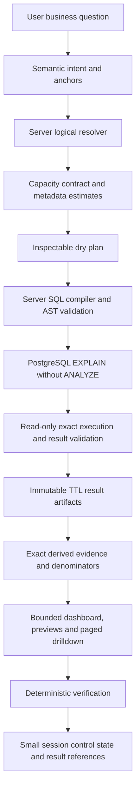

# V2.9 capacity-aware governed GenBI

Implementation and qualification date: 2026-10-08 (Asia/Ho_Chi_Minh).

`STARTING_HEAD = 354e3aad443f546b7fa97b234904d15b48cc0da2`, branch
`branch_thaian`. Initial worktree and index were clean. No reset, checkout,
commit, customer chatbot edit, source credential rotation, or warehouse write
was performed. The final worktree contains this uncommitted Data Platform upgrade.

## Audit and migration

The existing semantic control plane is `AnalysisIntentEnvelope` →
`HybridAnalystPlanner` → `AnalyticalResolver`. Anchors independently check explicit
requirements; accepted requirements freeze during targeted recovery. The resolver
owns operation IDs, population decomposition, supporting denominator queries,
coverage, derived-feature bindings, and semantic/plan/catalog fingerprints.

The old capacity failure started in `analysis_query.build_plans`: every unranked
grouped population received `MAX_ANALYTICAL_ROWS = 2000`. Compilation emitted a
2,001-row sentinel limit, execution fetched bounded rows, and `validate_results`
rejected the overflow. That protected completeness but conflated computation,
transport, and visualization capacity. Raising a number alone would leave the
session and browser cliffs intact.

The old persistence failure started in `session_service.encode_session`: it
serialized full `agent_artifacts.result`, plus `report_response.result_sets`,
`table_data.rows`, chart points, derived evidence and repeated evidence references.
The same facts occupied multiple representations before the 4,000,000-byte check.
Reports could pass SQL/result validation and then fail session serialization.

The old presentation plane already supported category previews and table
fallbacks. V2.9 preserves that grammar and adds bounded time-series selection,
chart point/byte budgets, preview counts, and artifact pagination. Exact evidence
and quality verification always use the full result; no display subset becomes an
analytical population.

The security plane remains the existing catalog table/column allowlists,
sensitive-column rejection, strict SQL AST equality, server compiler,
read-only transaction and timeout. No executable tool graph or SQL is added to
the model contract. Existing V2.8/V2.8.5 contract/version names remain compatible;
runtime health separately identifies capacity release 2.9.0.

Migration changes the storage representation around these existing foundations.
Old inline artifacts externalize on their next session save. New artifacts are
immutable references from their first execution. New sessions contain no full
raw analytical result. Redis revision/CAS, distributed locking, browser ownership,
approval identities, stale approval checks, voucher code identity, optional voucher
joins, metric populations, negation anchors and ROI guardrails are retained.

## Architecture after the change

`DryAnalysisPlan` is a server dictionary in `diagnostics.dry_plan`: requirement
IDs, subjects, metrics, dimensions, resolved time, filters, rankings, estimated
rows/periods/series/bytes, strategies, warnings, query count, expected features and
resolved fingerprint. Normal UI does not require SQL to inspect meaning.

The PostgreSQL dry run reuses `dry_run_sql`, after compilation/AST checks and
before result fetching. It executes `EXPLAIN`, without `ANALYZE`, in a read-only
transaction with a four-second timeout. PostgreSQL describes this as planning
the statement; execution is requested separately by `ANALYZE`.
[PostgreSQL EXPLAIN documentation](https://www.postgresql.org/docs/16/sql-explain.html).
Dry-run failure consumes zero additional provider calls. Offline/custom executors
may expose an explicit `dry_run` adapter; production always performs the DB preflight
on fresh queries. A fresh validated cache hit does not execute a redundant query.

## Capacity contract and cardinality

`AnalyticalCapacityContract` is immutable server configuration. Environment keys
are `DATA_ANALYST_CAPACITY_<UPPERCASE_FIELD>`. Invalid/nonpositive values fail closed.

| Concern | Default |
| --- | ---: |
| Complete grouped execution rows per operation | 50,000 |
| Immutable artifact bytes per artifact | 64,000,000 |
| Session control JSON bytes | 1,000,000 |
| Browser report response bytes | 1,000,000 |
| Chart points | 500 |
| Operations | 8 |
| Dimensions including server identity fields | 6 |
| Periods | 4,000 |
| Visible series | 16 |
| Drilldown rows per page | 200 |
| Initial result preview rows | 50 |
| Initial derived evidence preview facts | 100 |
| Immutable artifact retention | 7,200 seconds |
| Validated result reuse freshness | 300 seconds |

Execution capacity bounds **returned groups**, not scanned fact rows. A scalar
SUM/COUNT/AVG can therefore compute over millions of source records while
returning one row. User Top N and detail limits retain their independent semantics.
An overflow sentinel still prevents an incomplete population from being treated
as complete. Validators still reject bad projections, sensitive fields, invalid
metrics, ordering, duplicate grain, wrong filters/time and real execution overflow.

`AnalyticalCapacityPlanner` combines physical safe values, bounded catalog enums,
identity metadata, supplied distinct upper bounds, explicit filters, ranking limits
and calendar bucket counts. A label and its identity are one axis, not two factors.
90 days × week × 350 branches is approximately 14 × 350 groups. Unknown cardinality
is explicitly `null` with `CARDINALITY_UNKNOWN`; it is never disguised as zero.
Expected row, period, dimension, series, chart point, persisted-byte and query
counts are inspectable before full execution. Report-wide row counts are the sum
of operation result rows, **not** a claim that these overlapping populations are
distinct source entities.

`value_profile_service` caches bounded `pg_stats` estimates for ten minutes, with
at most 32 schema entries and 4,096 statistics rows per query. It reads no sensitive
values and performs no full COUNT/DISTINCT scan. Profiles expose safe enum values,
null fractions when measured, canonical identity, distinct hints and supplied
date-bound/duplicate-label metadata. Statistical estimates are approximate and
cannot themselves cause a definitive rejection. Missing warehouse statistics
degrade to catalog metadata. Exact arbitrary value profiling/date-range scans are
not automatically enabled; unavailable fields remain unmeasured.

An omitted trend cadence has a deterministic server policy: week, then month,
quarter or year when available metadata shows the finer cadence exceeds execution
capacity. Explicit cadence is completed/checked through the existing anchors and
never changed by this policy. Explicit oversize requests receive a concrete capacity
choice and estimated groups when available. Unknown estimates execute safely under
the independent runtime bound. This is bounded domain support, not universal success.

## Exact computation and bounded presentation

Current strategies are `FULL_RESULT`, `SUMMARY_PLUS_DRILLDOWN`, paged tables,
full-query denominator scalars, server-derived facts and exact selected-series
presentation. Semantic decomposition already provides multi-query composites.
These are server policies; the model selects none of them.

All metrics, full-population comparisons, peer baselines, shares and extrema are
computed before presentation selection. Top N contribution uses the resolver's
separate full-population denominator. AOV and other non-additive metrics are never
summed to produce a whole-business total. Order and payment populations remain
separate and are not asserted equal.

Trend presentation can rank **additive** series from their complete validated
results, retain every period for the selected series, and label the display subset.
It does not sum averages or silently change explicit cadence. Shapes that cannot
fit safely use paged tables. Dense scatter plots are not silently sampled. A series,
point or payload limit does not invalidate the complete analytical result.

Category and contribution previews preserve full denominators and label both
`population_count` and `displayed_count`. Per-row contribution and peer facts can
be larger than the result: they receive a separate immutable evidence artifact,
with a bounded browser preview. Long evidence-ID lists and repeated comparison
baselines are also bounded. Verification indexes row feature evidence rather than
performing a quadratic search at high cardinality.

`capacity` diagnostics report estimated/actual rows, execution/presentation
strategies, full population/displayed counts, artifact bytes and measured response
bytes. The byte measurement uses compact UTF-8 JSON. A result preview is reduced by
transport bytes independently of row count. Oversized charts become table views;
business values and denominators are unchanged. Oversized control metadata still
has a real bound and can require a smaller scope.

## Artifacts, cache, sessions and drilldown

`ResultArtifactStore` uses existing Redis in production. It introduces no new DB
or MinIO dependency. Development memory storage is explicit, capped at 128 MB and
5,000 expiring objects. Production refuses the memory backend.

Each immutable artifact has a UUID, canonical query/plan/schema fingerprints,
creation/expiry timestamps, columns, row count, byte size, content hash, backend
and provenance. Redis writes use `SET NX EX`; a changed plan/result produces a new
reference. Reads compare all metadata and hash the content. Session storage
contains artifact references, approved meaning and a report summary; chart points,
result rows and full evidence are omitted from persisted report state.

The exact query signature includes catalog fingerprint, time, filters, metric
population and canonical query meaning. A Redis freshness index is a hint only;
reuse still validates content, schema, result contract and original observation
age. Source CDC freshness markers are not available, so freshness is bounded by
300 seconds rather than claimed instantaneous. `refresh: true` on an approved
generation request bypasses result reuse without another semantic interpretation.
Expiry/unavailable storage is explicit; there is no huge inline session fallback.

`GET /api/ai/sessions/{session_id}/results/{query_id}` pages only an owned,
approved session's result reference. It accepts bounded offset/limit and optional
approved dimension/value selection, never SQL or an arbitrary artifact ID. It
returns revision, plan/catalog identities, total rows and next offset. Drilldown
filters the immutable approved result and does not silently become a new analysis.
The UI displays 50-row previews, supports further pages and segment selection, and
labels CSV downloads as the **displayed portion** when a full result is larger.
Saved module resume rebuilds bounded presentation from existing artifacts without
provider calls or analytical query execution. Expired artifacts require refresh.

Failures expose stage, code, user impact, controlled observations of what is known,
what failed, whether retry helps, whether input is needed, and a recommended server
action. Missing caller diagnostics cannot erase the fallback stage. Capacity choice,
dry-run, artifact persistence, response serialization and session persistence have
distinct classes. Artifact outage recommends restoring storage without semantic
retry; expired artifacts recommend refreshing the approved query. No error response
invents a successful execution or contains raw SQL/provider error prose.

## Verification and empirical reliability

V2.9 reports use `verification_evidence_v2`. The fixed internal budgets below total
90, with a separate ten-point independent-reference reserve. Applicable internal
groups share the 90 points proportionately; genuinely non-applicable groups do not
earn invented observations. Independent references remain `NOT_MEASURED` until an
authoritative oracle supplies them. Normal internal-only complete reports score
90/100. This is a disclosed product weighting policy, not a probability estimate.

| Measured criterion | Internal weight | Evidence |
| --- | ---: | --- |
| Request coverage | 10 | Resolved requirements vs executed operations |
| Semantic consistency | 15 | Anchors, semantic history and current resolver replay |
| Result integrity | 15 | Current result/projection/grain/filter/time/order validator |
| Observed values | 10 | Non-null metric cells; null is not fabricated zero |
| Derived features | 10 | Current deterministic features and required bindings |
| Evidence grounding | 10 | Recomputed values, narrative and KPI evidence references |
| Population/denominator correctness | 5 | Full artifact rows, no truncation, bound previews, complete same-scope denominator |
| Visualization appropriateness | 5 | Renderer grammar, exact data and capacity-backed table fallback |
| Limitation disclosure | 5 | Expected catalog/population limitations vs disclosed items |
| Provenance completeness | 5 | Content/query/plan/catalog fingerprints vs full artifact |
| Independent reference reserve | 10 | Authoritative matched/total reference assertions only |

Checks do not establish arbitrary natural-language interpretation accuracy, causal
claims, source data correctness, future forecasts or probabilistic confidence.
The UI exposes check counts, failures, unmeasured reference work and limitations,
and explicitly says the score is not the chance that AI is correct. Existing
legacy score contracts remain readable. No fake calibration was introduced.

`evals.run_eval_v29` measures first-click success over supported labeled scripted
requests: one proposal request reaches a valid outcome within at most three internal
provider calls. It reports primary success, repair/third-call recovery and stage
failures separately. It deliberately reports live semantic intent accuracy as
unmeasured. The inherited 110-case golden corpus covers compound requests,
ambiguity, unsupported/insufficient data, identity, denominators, refinement and
approval safety. Confirmed examples are a small version-controlled semantic hint
library, rechecked against the current compatibility index. They never supply SQL
or bypass the resolver.

## WrenAI reference

Borrowed: versioned business semantics, relevant-context retrieval, bounded value
metadata, first-class ambiguity, dry-plan/dry-run validation, structured failure
classes, confirmed examples and golden qualification. Wren documents these context,
planning and execution responsibilities in its [architecture](https://docs.getwren.ai/oss/reference/architecture)
and [context layer](https://docs.getwren.ai/oss/concepts/what_is_context).

Intentionally rejected: model-authored SQL, a model-authored executable graph,
memory as authority, a new semantic engine dependency and unbounded self-retry.
Avengers continues semantic intent → current server resolver → server compiler.

## Security and deployment assumptions

Production CORS now accepts only configured `DATA_ANALYST_ALLOWED_ORIGINS`; there
is no wildcard-with-credentials default. Same-origin nginx proxy use works without
cross-origin configuration. Browser owner cookies scope sessions and artifacts but
are **not authentication**. There is no invented RBAC.

Saved-report CRUD/export logs remain trusted-network administrative surfaces;
network/reverse-proxy access control is required before exposing them publicly.
Admin SQL preview/execution remains disabled unless explicitly configured with the
existing server token policy. This change does not claim account-level isolation
for legacy report CRUD. Raw storage credentials/internal Redis keys are not exposed
by the pagination API. Logs contain controlled IDs/counts/stages, not private
reasoning or raw report rows.

Both committed source DB password fallbacks were removed from Compose and now
require `DB_PASSWORD` from the environment. A previously committed credential must
be rotated by its owner, including any reused copies, and historical exposure
handled separately. No password is reproduced here and no remote rotation occurred.
Local infrastructure development defaults remain documented deployment assumptions.

Only `analytics-api` and `web-ui` are eligible for rebuild/recreate. Warehouse
bootstrap remains disabled. MinIO, Redis, ETL and customer microservices are not
restarted as part of this upgrade.

## Qualification evidence

See `evaluation/v29/acceptance_summary.json`, `source_reference.json` and
`deployment_verification.json`. Generated full result data is deliberately absent.
Existing V2.8 audit artifacts are retained for regression history; no duplicated
multi-megabyte new result dumps are added.

Offline load shapes: 1, 10, 100, 1,999, 2,000, 2,001, 5,000 and 20,000 groups.
The 5,000-row valid report has more than 4 MB of raw result bytes, passes full
verification, and stores references in a small session. Separate session
roundtrips externalize 1, 3, 4, 5 and 10 MB results. Immutability, expiration,
tampering, store failure, pagination and owner checks are exercised.

Five large scenarios use 350 stores, 2,500 products, 2,500 voucher codes, 4,550
orders/items/payments and thirteen weekly branch populations: business overview,
product portfolio, voucher use, store performance and order/payment reconciliation.
Independent Python checks confirm revenue/order/AOV arithmetic; artifact-backed
shares retain complete denominators. Order and payment values deliberately differ.
All fixtures forbid provider HTTP and live warehouse transports.

The final independent warehouse voucher oracle, using deployed Redis sessions and
artifacts, matched **206/206 assertions** on raw
read-only `orders.don_hang`, `orders.voucher` and `identity.khuyen_mai`. Its numerical
checks read full artifacts; saved verification checks the original transported
preview. The oracle covers these assertions and does not establish universal AI
accuracy. It created only audit-owned development sessions and no warehouse writes.

Final qualification passed **623/623 backend tests**, **94/94 frontend tests**,
TypeScript checks, Vite production build, and both Docker builds. Only
`analytics-api` and `web-ui` were recreated; both are healthy at version 2.9.0.
Start times of all nineteen other containers remained unchanged.

The real Redis runtime probe retained **5,000 rows / 7,351,754 artifact bytes**
with **232,185 session bytes** and **835,815 response bytes**. Full saved-report
verification, approved-result pagination, dimension drilldown, cross-owner denial,
and stale Redis CAS denial passed. The API and web proxy report Redis for both
stores and a three-call provider ceiling; frontend HTTP returned 200.
The probe used scripted meaning and synthetic results, blocked provider/warehouse
transports, and deleted its own session afterward.

Optional value profiles and confirmed examples are trimmed, in that order, when
refinement context would exceed the existing 24,000-character provider-body
budget. Approved meaning, anchors and current intent remain required. The
normalization/refinement regression confirms the original weekly cadence and
unchanged requirements survive a ranking delta.

Reproduce the backend qualification with `python -m tools.run_tests_v29` and
`python -m evals.run_eval_v29 --output /tmp/v29-qualification` inside the API
container. Run the source oracle with `AI_OFFLINE=1 python -m
tools.verify_voucher_scope_v285 --output /tmp/v29-source-reference.json`; it
explicitly forbids provider HTTP and uses read-only warehouse transactions.
Frontend validation uses `npm run typecheck`, `node --test src/utils/*.test.mjs`
and `npm run build` in `data-platform/web-ui`.

Final suite/build/health numbers are recorded in the acceptance/deployment files.
The complete-suite runner isolates offline artifact/session stores per test and
lets retired graph fixtures select their documented historical one-call policy;
hybrid fixtures explicitly select the production three-call ceiling. Historical
tests now assert artifact population counts, capacity table/series presentation,
strict tamper rejection and the current independent execution bound.

## Remaining limits and manual qualification

The system remains bounded: 50,000 returned groups and 64 MB per Redis artifact
by default. It does not stream unbounded populations into MinIO, invent approximate
business analytics or implement every strategy enum as a separate subsystem.
PostgreSQL estimates for ordinary views can be unavailable; statistics are hints.
Large artifacts/derived facts occupy transient process memory during validation;
Redis should have adequate capacity and a monitored expiry/eviction policy. There
is no hidden durable fallback when Redis is unavailable.

Expiry-based artifacts do not make saved reports permanent historical data stores.
Saved reports past retention must rerun/refresh before complete verification.
Very large semantic history/control metadata still has its own bound. Current
manual-live model accuracy, provider latency and probability calibration are
unmeasured. User confirmation/qualification is still required before claiming
reliability for a real provider beyond this scripted corpus.

| Manual qualification | Expected behavior |
| --- | --- |
| The five supplied Vietnamese business questions | Valid proposal/report, exact populations, bounded views |
| Explicit daily × many branches | Preserve daily; exact execution/table or precise capacity choice |
| Broad trend with omitted cadence | Disclosed deterministic week/coarser policy |
| Duplicate product/store/voucher labels | Distinct canonical IDs remain distinct |
| Unknown optional voucher metadata | Fact code retained, correct full denominator |
| “Do not conclude ROI/causality” | Prohibition/limitation, no invented requested calculation |
| “hihi” | Needs analytical goal, examples, no SQL or unnecessary repair |
| Visual-only refinement | Zero provider calls; existing full population preserved |
| Semantic refinement | Delta and accepted scope retained; capacity recomputed |
| Page and select a segment | Owned approved artifact, same time/filter/identity provenance |
| Refresh approved report | New observation without semantic provider replan |
| Stale approval/catalog change | Reject execution until current approval |
| Artifact expiry/outage | Precise technical/refresh explanation, no huge inline session |
| Independently checked source assertions | Matched/total shown separately from verification score |

## Mandatory architecture answers

| Question | Answer |
| --- | --- |
| Does the LLM write SQL? | NO |
| Does the LLM choose database execution strategy? | NO |
| Does the LLM decide row/cardinality limits? | NO |
| Does the server own semantic compatibility? | YES |
| Does the server own capacity planning? | YES |
| Does the server own SQL? | YES |
| Can full computation display a bounded subset? | YES |
| Can presentation limits alter denominators? | NO |
| Are large raw results stored directly in sessions? | NO |
| Can large results use an artifact store? | YES |
| Can the system paginate/drill down? | YES |
| Can a valid request fail merely because it has 2,001 rows? | NO |
| Can raw result JSON over 4 MB alone overflow sessions? | NO, when within artifact storage capacity |
| Is verification score a probability of correctness? | NO |
| Are first-click reliability and semantic accuracy separate? | YES; live semantic accuracy remains unmeasured |
| Was a live LLM provider called? | NO |

`LIVE_PROVIDER_REQUESTS = 0`

`WAREHOUSE_WRITES = 0`
