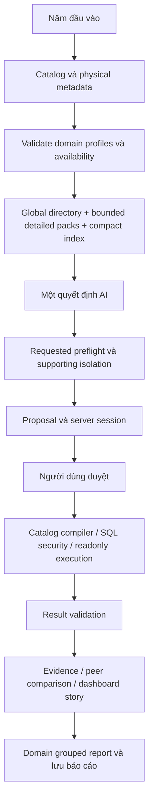

# V2.5.1 reliability addendum (2026-10-06)

The real V2.5 comprehensive retry succeeded at transport (one call, 6,568 input
tokens, 931 output tokens) but rejected `filters.field` instead of `dimension`.
Its body was 23,451/24,000 characters and detailed products/promotions/payments
packs were omitted despite explicit user requests. V2.5.1 adds a local bounded
filter-key normalizer, strict conflict rejection and protected full/compact
metadata packs, preserving the one-call policy and strict semantic/SQL contracts.
The equivalent offline fixture now reaches `proposal_ready`, retains all five
domains and uses 21,727 characters with 2,273 headroom. These are fixture sizes,
not a claim about unexecuted live provider accuracy or token usage.

See [the complete V2.5.1 report](AI_V251_IMPLEMENTATION.md),
[offline qualification](V251_QUALIFICATION.json), and
[five manual live retests](MANUAL_EVALUATION_V251.md).
The original V2.5 report below records its historical qualification.

# Data Platform AI V2.5 — implementation report A–AL

V2.5 bổ sung Domain Intelligence bằng metadata, năm đầu vào đơn giản và ba mức độ sâu, giữ kiến trúc một lượt AI. Kết quả offline chứng minh hợp đồng và orchestration; chưa xác nhận chất lượng hiểu ngôn ngữ hoặc chi phí token live. Số đo compact nằm trong [V25_QUALIFICATION.json](V25_QUALIFICATION.json); ma trận cho người dùng ở [MANUAL_EVALUATION_V25.md](MANUAL_EVALUATION_V25.md).

## A. Starting branch / HEAD / status

Branch `branch_thaian`, HEAD `86e599a10727ad4ebede505d50d590196d58e134`, working tree sạch trước khi sửa. Không có diff người dùng cần hợp nhất. Chỉ sửa `data-platform/**`; `docker-compose.data.yml` được dùng để build và giữ nguyên nội dung.

## B. Kiến trúc V2.4 đã kiểm tra

Production dùng `AnalysisPipeline` → `OneShotPlanner` → một `submit_analyst_decision`. `ProviderBudget` tiêu thụ allowance trước transport; không sửa hợp đồng bằng lượt AI tiếp theo. Requested phải hợp lệ; supporting không hợp lệ được bỏ độc lập. Proposal compile/validate nhưng không chạy analytical SQL. Session lưu logical meaning, fingerprint, revision và artifacts. Approval chạy compiler/SQL/security/result validators rồi dashboard/insight/explanation deterministic, không gọi provider. Structured visual refinement dùng cache. Legacy agent còn phục vụ regression, không được router production chọn tự động.

Baseline: 387 backend tests qua; frontend typecheck có sẵn sáu lỗi TS2305 về các DTO thiếu. Schema wire V2.4 9.837 ký tự, semantic manifest 8.996, body fixture ranking 22.825 ký tự, theo artifact V2.4 đã commit.

## C. Kiến trúc V2.5



Module `domain_intelligence_service.py` kiểm tra schema/references, lọc theo physical schema, xây capabilities/directory/packs và kiểm chứng `lens_id`. Lexical retrieval dùng tên, ID và aliases **trong metadata** để xếp candidate packs; nó không chọn metric, operation, period hoặc population. Model vẫn quyết định ý nghĩa. Không có switch theo tên domain hoặc regex route câu hỏi nghiệp vụ.

## D. Năm đầu vào người dùng

| Đầu vào | Hành vi |
| --- | --- |
| Câu hỏi phân tích | Trường duy nhất bắt buộc. |
| Miền dữ liệu | Tự động, nhiều miền, hoặc domain đang khả dụng từ `/api/ai/capabilities`; không còn enum domain cố định trong request/UI. |
| Thời gian | Auto, hôm nay, 7d, 30d, tháng này/trước, quý này/trước, all_time, custom. Custom date controls nằm trong trường thời gian. Server kiểm tra ngày và pin reference/timezone. |
| Phạm vi phân tích | Auto, toàn hệ thống, hoặc bộ lọc semantic được chọn. Loại scope/enum từ catalog; tên/ID khác qua picker và bounded readonly lookup. Có thể thêm nhiều giá trị hoặc nhiều dimension; không nhập SQL. |
| Độ sâu | Focused, deep mặc định, comprehensive. Không có input metric/chart/granularity/query builder trong form ban đầu. |

Domain/time/scope có cấu trúc là hard constraints. Scope `all` không cho model âm thầm thêm user filter. Filter đã chọn phải còn trong operation, time phải khớp ngày thực tế. Session giữ constraints cho approval/refinement; UI duyệt dùng lại payload đã gửi, không lấy các lựa chọn có thể đã đổi sau đó. Chỉ controls chính và nested scope/date controls; toàn form bị khóa trong lượt lập kế hoạch.

## E. Domain profile schema

`domain_intelligence.version=1`; từng profile là strict Pydantic contract: `domain_id`, business label/purpose, bounded aliases, primary subjects/entities, metric/dimension refs, lenses, health signals, diagnostic dimensions, drilldown paths, comparison semantics, related domains, supporting lens refs và business caveat refs. Caveat labels nằm trong metadata, được trình bày bằng ngôn ngữ nghiệp vụ. Unknown refs/lens duplicates/invalid directions/snapshot time lens/non-additive distribution bị từ chối. Schema/fingerprint đổi khi đổi bất kỳ metadata này; cache dùng fingerprint và reference/budget projection.

## F–G. Domain và analytical lenses hiện có

Catalog có **16 subject/domain, 33 metric, 26 dimension, 38 lens** trước projection physical. Capabilities chỉ công bố phần thực sự khả dụng; ví dụ xóa `silver.shipper` thì delivery biến mất. Tên UI lấy từ metadata.

| Domain | Business label | Lenses |
| --- | --- | --- |
| orders | Đơn hàng và doanh thu | sales_overview, order_volume, sales_trend, buying_customers, channel_mix |
| order_items | Dòng món trong đơn | item_volume, item_sales |
| products | Sản phẩm | product_volume, product_sales, product_trend, category_mix |
| stores | Chi nhánh và điểm bán | store_performance, store_volume, store_trend |
| customers | Khách đăng ký và hội viên | registrations, registration_trend, spend_snapshot |
| promotions | Khuyến mãi và voucher | voucher_usage, voucher_revenue, discount_amount, voucher_trend |
| payments | Giao dịch thanh toán | payment_mix, payment_value, payment_trend |
| delivery | Giao hàng và shipper | delivery_volume, shipper_rating, shipper_relationship |
| inventory | Tồn kho | inventory_positions, inventory_alerts |
| product_reviews | Đánh giá sản phẩm | product_feedback |
| store_reviews | Đánh giá chi nhánh | store_feedback |
| staff_shifts | Ca làm và chấm công | shift_volume, attendance |
| cashier_reconciliation | Đối soát thu ngân | cash_difference, cash_activity |
| customer_surveys | Khảo sát khách hàng | survey_volume |
| wishlist_favorites | Sản phẩm yêu thích | favorite_interest |
| hourly | Khung giờ bán hàng | hourly_load |

Lens khai báo business question, metric/dimension refs, trend/ranking/comparison/distribution capability, recommended drilldowns và related lenses. Metric của một lens phải khả dụng đầy đủ; không âm thầm thay lens bằng một subset metric. Dimension/lens/drilldown/scope thiếu hoặc nhạy cảm bị loại. Model có thể cung cấp `lens_id`; legacy decisions thiếu field này vẫn hợp lệ. Lens ID sai không thể vượt compiler: requested dừng, supporting bị bỏ độc lập.

## H. Metric semantics

Giữ nguyên source/expression/grain/unit/business filters/non-null requirements trong server registry. Bổ sung `quality_direction`, `aggregation_semantics`, `business_meaning`, `historical_capability`, `population_definition`, `recommended_uses`; giữ `additive` và `time_column`. Wire index dùng mã aggregation/direction có legend để tránh lặp văn bản; grain và membership ngược metric→subject được bỏ khỏi wire vì compiler/subject rows đã giữ chúng.

Ví dụ: `purchasing_customer_count` là distinct khách mua trong cohort và kỳ đơn hàng, không phải registered `customer_count`; không cộng giữa tháng/chi nhánh. `total_spent` là snapshot tích lũy. Voucher usage gồm mọi trạng thái; voucher revenue/discount chỉ dùng trạng thái catalog và voucher không null. Driver total deliveries/rating là snapshot, không phải số chuyến/điểm riêng tháng.

## I. Health signals

Signal khai báo metric, direction (`higher_better`, `lower_better`, `neutral`, `contextual`), peer average/median, peer dimensions, minimum peers ≥3, optional observation metric/minimum observations và `comparable_exposure`. Các profile hiện tại đặt comparable exposure **false**: doanh thu/volume/điểm chưa tự chứng minh tốt/xấu. Directional good/bad chỉ được tạo khi metadata cho phép exposure tương đương và các preconditions quan sát qua kiểm chứng.

Peer evidence từ **một validated operation**: actual, baseline, absolute/relative gap, direction, peer groups, judgment và evidence ID. Không dùng Top N, explicit limit, truncated/incomplete/null groups, khác group dimensions hoặc thiếu sample. Identity dimension do compiler thêm không làm nhầm peer grain; evidence giữ cả identity trong partition. Baseline zero không tạo phần trăm. Không có synthetic overall score hoặc kết luận nhân quả.

## J. Diagnostic dimensions

Metadata khai báo các chiều phù hợp: orders có store/city/channel/status; products có product/category/store/city; promotions có voucher/store/city; payments gateway/status; delivery driver ID; inventory product/category/store/city; reviews entity/category/city; shifts tên ca/chi nhánh/trạng thái chấm công. Chúng được intersect với dimension compatibility và physical availability. Không tự thêm chiều không có trong registry.

## K. Drilldown hierarchies

Ordered semantic paths như city→store và category→product; không có drilldown lịch sử bịa cho snapshot. Schema kiểm tra độ dài, duplicate và refs. Availability giữ path khi các dimension tồn tại và có ít nhất một metric tương thích toàn path. Profile và domain có thể thêm path bằng metadata; không phải router câu hỏi.

## L. Comparison semantics

Profiles khai báo previous period, same period previous year, peer average/median hoặc between-selected-groups. Historical baseline bị loại khỏi profile hoàn toàn snapshot. Đây là knowledge/capability hints, không tự tạo query hoặc cho phép tự suy ra kỳ dữ liệu thiếu. Period comparisons dùng operations do model đề xuất và compiler kiểm chứng; peer feature hiện được tính deterministic trên nhóm cùng operation. Không tuyên bố đã triển khai bộ tự động sinh period-over-period ngoài các query/validators hiện có.

## M. Related-domain graph

Edges khai báo trong metadata rồi lọc bằng directional child→parent physical paths. Đây là gợi ý context, không phải join hoặc cohort equivalence. Candidate có tín hiệu lexical/structured được ưu tiên; khi đã có anchor, không nhét domain zero-score không liên quan để đủ packs. Deep/comprehensive có thể thêm related packs. Model vẫn phải tuân thủ population và clock links riêng trong compact manifest.

## N. Cross-domain population safety

`population_relation=same` dùng cohort compatibility; `related` phải có purpose=context, path được kiểm chứng, clocks khớp và cùng UI filters/period. Voucher context và revenue có thể khác metric-owned predicates: report ghi quan hệ related, không tạo tỷ trọng hoặc nguyên nhân giữa populations. Registration clock khác order clock; payment clock không tự đồng nhất order clock; delivery/inventory snapshot không kế thừa kỳ lịch sử. Compiler/security/result validators V2.4 vẫn là boundary cuối.

## O. One-shot context

Payload gồm question/reference/timezone, authoritative UI constraints, compact semantic index, global directory, bounded detailed packs và compact server state. Pack gửi lenses/entities/diagnostics/drilldowns/health/comparisons/related refs; chỉ bổ sung metric meaning không trùng label/unit/aggregation đã có. Health configs giống nhau được gộp metric refs. Whole-pack pruning rồi whole-subject projection khi cần; không cắt JSON giữa field, không bỏ stored scope để giảm body. Cache fingerprint-aware, bounded, không LLM/embedding/SQL.

Default total body bound **24.000 ký tự**, kiểm tra cả native Gemini và compatibility serialization trước invocation. Native transport kiểm tra actual body lại trước HTTP và tiêu thụ một allowance. Context quá lớn dừng trước provider, không retry. Global directory vẫn đầy đủ cho mọi domain khả dụng; diagnostic cho biết manifest có complete và packs nào bị bỏ. Với catalog lớn/refinement dài, detailed packs hoặc subject metadata có thể phải giảm; không hứa toàn bộ semantic detail luôn vừa budget.

## P. Global directory size

Fixture physical schema: **16 entries, 1.579 ký tự JSON compact**. Directory mang ID, business label, aliases, primary subjects và caveat flags cần cho snapshot/sample. Không có expression/table SQL, rows hoặc secrets.

## Q. Detailed pack sizes

Số đo trong qualification sau cache/projection:

| Pack | Ký tự compact |
| --- | ---: |
| products | 865 |
| order_items | 655 |
| orders | 1.317 |
| stores | 1.006 |
| payments | 788 |
| inventory | 747 |
| customers | 866 |

Focused fixture chỉ gửi products; deep sales gửi orders/stores; comprehensive gửi products/order_items/orders. Các domain khác vẫn có trong global directory/index. Pack count là giới hạn context, không phải số domain được phép phân tích hoặc quota chart.

## R. Decision schema before / after

V2.4 **9.837** → V2.5 **6.366** ký tự serialized wire tool schema cho new planning, giảm **3.471 (~35,3%)**. Loại model-facing `visuals`; supporting không lặp time/filters, required parent ID. Server chọn chart sau result. Requested time có đầy đủ executable branches; clarification dùng partial known-time grammar và kiểm tra thời gian cục bộ. Compatibility parser vẫn nhận/kiểm tra explicit supporting scope và legacy visual decisions. Refinement có thêm replaces/changed_fields, được đo trong total bound riêng.

## S. Serialized provider bodies

Đo từ chính `_gemini_body` và `_gemini_compat_body`; fixture compat model=`configured_model`. Đây là **ký tự JSON**, không phải token ước lượng. Provider-reported token fields của scripted fixtures là null. Native boundary dùng actual configured body khi thực thi thật.

| Fixture | Native | Compat | Manifest | Directory | Packs |
| --- | ---: | ---: | ---: | ---: | --- |
| focused_products | 21.420 | 21.364 | 8.384 | 1.579 | products |
| deep_sales | 23.033 | 22.977 | 8.384 | 1.579 | orders, stores |
| comprehensive_business | 23.748 | 23.692 | 8.384 | 1.579 | products, order_items, orders |

Manifest complete trong các fixture này. Focused body thấp hơn baseline V2.4 22.825; deep/comprehensive thêm knowledge nhưng vẫn trong 24.000. Đây là các fixture khác câu hỏi/constraints, không dùng tỷ lệ này làm tuyên bố tiết kiệm token live.

## T. Provider guarantees

Production router chỉ dùng one_shot. One request/refinement ngôn ngữ tối đa một provider invocation/transport attempt. Guard chặn re-entry, retries, fallback, escalation, repair và post-result synthesis. Approval/structured visual edits bằng **0 provider**. Một user retry chủ động là lượt mới. Embedding bằng 0; semantic lookup local và scope lookup readonly không phải lượt AI.

## U. Requested / supporting isolation

Preflight toàn bộ requested trước analytical execution; requested lỗi không thành report thiếu phần. Từ chối >8 requested bằng thông báo chia yêu cầu. Mọi explicit requested vẫn được giữ ở focused. Supporting validate riêng, thừa budget/không phù hợp bị bỏ và ghi limitations; requested vẫn còn. Metric khác unit tách view, tất cả validated metrics/results vẫn có bảng ngay cả khi chart budget hết. Không sinh thêm SQL để có chart mới.

## V. Depth budgets

| Depth | Optional supports / parent | Detailed pack cap | Pack char cap | Target views |
| --- | ---: | ---: | ---: | --- |
| focused | 1 | 1 | 1.800 | 1–3 |
| deep | 6 | 2 | 3.500 | 4–6; thường 5–6 khi hữu ích |
| comprehensive | 7 | 8 | 8.000 | 6–8 |

Global bounds: 8 operations, 12 SQL queries, tối đa 8 charts; existing bounded categories/series/lookup policies giữ nguyên. Deep supports có thể cấu hình thấp hơn qua `DATA_ANALYST_DEEP_SUPPORTING_OPERATIONS`, không vượt 6. Targets không phải quotas và không cắt requested. `depth_coverage` nêu actual count/limited, không tự tạo filler.

## W. Dashboard story

Deterministic defaults chọn từ operation, units, additivity, selection và actual rows. Requested trước hỗ trợ. Metadata thêm domain/lens labels và business purpose; chart được phân section ranking/comparison/trend/composition/cross-diagnostic/relationship. `domain_groups`, `story_sections`, `domain_summary` và evidence refs theo query phục vụ UI/saved report. Frontend nhóm domain/section/role, giữ label nghiệp vụ; old report thiếu metadata dùng grouping V2.4. Scalar/detail giữ KPI/table, không bị ép thành chart.

## X. Chart families

11 chart families hiện có: bar, horizontal_bar, line, area, multi_line, donut, heatmap, grouped_bar, stacked_bar, stacked_100, scatter; thêm table. Ranking mặc định horizontal bar, trend line/multi-line, complete additive nonnegative composition có thể donut, two-dimensional grid heatmap, relationship scatter. Các family khác vẫn qua existing contracts/structured edits. Không bắt mỗi report dùng đủ family. Top N không thành whole-population pie/share; averages/distinct customer counts không thành cộng dồn cơ cấu. Signed values, null/missing buckets và identity keys giữ nguyên guards.

## Y. Representative chart counts

| Fixture | Requested / supports | SQL sau duyệt | Charts | Domains |
| --- | --- | ---: | ---: | ---: |
| focused products | 1 / 0 | 1 | 1 | 1 |
| deep sales | 1 / 5 | 6 | 6 | 3 |
| comprehensive business | 3 / 5 | 8 | 8 | 5 |
| deep payments | 1 / 4 | 5 | 6 | 1 |
| deep inventory | 1 / 3 | 4 | 6 | 1 |
| deep customers | 1 / 5 | 6 | 6 | 1 |
| focused peer sales | 1 / 0 | 1 | 1 | 1 |

Fixture requested delivery lịch sử trả needs_clarification, analytical SQL bằng 0. Các số này từ synthetic rows, không phải kết quả live hoặc report template bắt buộc.

## Z. Insights / performance semantics

Ranking gaps, scalar values, observed trend change/extrema/volatility, complete composition concentration, validated comparisons và Pearson từ paired observations giữ guards V2.4. Peer features bổ sung baseline/gap/direction và cautious review recommendation có evidence ID, không nâng numerical “above/below peer” thành tốt/xấu khi exposure chưa được kiểm chứng. Null/zero/sample limitations và snapshot caveats hiện trong explanation. Narrative không chép private reasoning/provider prose; không có forecast/cause/composite health score.

## AA. Files changed

Backend contracts/catalog: `common.py`, `metadata/semantic_catalog.json`, `routers/ai.py`, `analysis_catalog.py`, `analyst_contract.py`, `analyst_decision.py`, `analytical_tool_contract.py`, `analytical_query_service.py`. Planning/session: `domain_intelligence_service.py` (new), `one_shot_planner.py`, `semantic_manifest_service.py`, `agent_pipeline.py`, `analysis_pipeline.py`, `session_service.py`. Presentation/evidence: `dashboard_planner_service.py`, `insight_service.py`, `explanation_service.py`.

Backend qualification: `tests/test_domain_v25.py` (new), four expectation updates in `tests/test_one_shot_v24.py` for the intentional focused/inherited-scope contract, `tools/domain_matrix_v25.py` (new), this report/manual matrix/compact JSON.

Frontend: `AnalysisInputForm.tsx` (new), `analysisInput.mjs/.d.ts/.test.mjs` (new), `AnalyticsView.tsx`, `AnalysisMeaning.tsx`, `AnalystDashboardSummary.tsx`, `analysisPresentation.mjs`, `analystDashboard.test.mjs`, `types/index.ts`, `package.json`. Existing line endings preserved on unchanged AnalyticsView lines. No chatbot/service outside Data Platform changes; no generated build files added.

## AB. Tests added

21 backend tests cover dynamic capabilities, metadata errors/fingerprint, physical/sensitive projection, snapshot/non-additive lens validation, metadata-only new energy domain/metric, all input defaults/time/scope validation, hard selections, bounded scope lookup, new-domain/context discovery, both serialized transports and depth progression, invalid requested/supporting lenses, focused requested preservation, >8 requested clarification, comprehensive 8 views, actual peer math/direction/sample/Top N/null/limit guards, stale contract version, failed refinement preservation and provider-free capability/picker endpoints. Requests and DB connect are patched to forbid external calls.

12 frontend tests cover exactly five conceptual inputs, question-only required/default deep, metadata-driven domain additions, three depths, nested custom dates/scopes, unavailable capabilities, unchanged structured serialization/frozen approval, invalid submissions, domain-story priority, business labels without raw semantic IDs and limited coverage copy. Existing 41 frontend tests retained; two assertions adapt to the shared payload/form component.

## AC–AF. Exact validation

Final numbers and build/audit status are recorded in the validation ledger below. Commands run offline from `analytics-api` using the existing `/private/tmp/data-platform-v24-venv/bin/python`; frontend uses existing node_modules. Docker only builds the two specified services, does not execute startup hooks or start/restart containers.

| Mục | Lệnh / kiểm tra | Kết quả |
| --- | --- | --- |
| AC — Backend | `AI_OFFLINE=1 PYTHONDONTWRITEBYTECODE=1 /private/tmp/data-platform-v24-venv/bin/python -m unittest discover -s tests` | **408/408 passed; 69.926 s**; baseline 387, thêm 21. |
| AC — V2.4 one-shot qualification | `python tools/one_shot_matrix.py --output /private/tmp/v25-one-shot-qualification.json` | **68/68**; 24,722 s; artifacts lớn giữ ở /private/tmp. |
| AC — Legacy analytical matrix | `python tools/analysis_matrix.py --output /private/tmp/v25-legacy-matrix.json` | **86/86**. |
| AC — V2.5 qualification | `python tools/domain_matrix_v25.py` | **8/8 scenarios**; artifact compact trong docs, không có full result fixtures. |
| AC — Python syntax | AST parse mọi Python source Data Platform, bỏ môi trường/node_modules/cache | **73 files parsed**. |
| AD — Frontend charts | `npm run test:ai-charts` | **8/8**. |
| AD — Frontend understanding | `npm run test:ai-understanding` | **2/2**. |
| AD — Frontend dashboard | `npm run test:ai-agent` | **31/31**. |
| AD — Frontend five-input/domain | `npm run test:ai-input` | **12/12**; tổng frontend **53/53**. |
| AD — Frontend build | `npm run build` | **Passed**, Vite 64 modules. |
| AE — TypeScript | `npm run typecheck` | **Passed**, 0 errors. Sáu TS2305 baseline đã sửa bằng DTO đúng shape API/UI hiện có: PipelinesData, RealtimeEvent, SystemUser, SystemRole, SystemLog. |
| AF — Docker | `docker compose -f docker-compose.data.yml build analytics-api web-ui` | **Passed**, cả hai image built; không start/restart service. |
| Audit trong phạm vi | `git diff --check -- data-platform docker-compose.data.yml` | **Passed**. |
| Audit toàn repo | `git diff --check` | Báo một dòng trống EOF trong diff chatbot xuất hiện đồng thời; không chỉnh ngoài phạm vi để sửa lỗi này. |


## AG. Real provider calls

**0**. All decision fixtures scripted; transport tests mocked. Live token/latency/NLP quality not measured.

## AH. Real embedding calls

**0**.

## AI. Live DB mutations

**0**. No live analytical warehouse queries either. Capability/scope endpoint tests use mocks; build did not launch the application or initialize views.

## AJ. Manual live matrix

[MANUAL_EVALUATION_V25.md](MANUAL_EVALUATION_V25.md) contains A–L, expected behavior and a blank recording table for calls/tokens/context/packs/operations/omissions/DB/chart/latency. Not executed with Gemini or live warehouse. E and the delivery part of I explicitly require clarification with the current snapshot-only catalog.

## AK. Remaining limitations

Live model decision quality, semantic coverage, latency and token usage remain unverified. Detailed packs can be pruned within budget; the directory always preserves domain discoverability but does not promise every domain's detailed lenses are supplied in every request. A new or very large catalog may need smaller questions or context configuration; transport fails closed rather than making extra calls.

Delivery has no historical trip log, SLA, success/failure/delay duration or rating observation count in the actual catalog. Inventory/customer lifetime spend are snapshots. Registered customer and buying-customer cohorts/clocks differ. Existing metrics do not support actual profit after depreciation, voucher ROI/redemption rate, causal attribution or forecast. Peer conclusions need a complete comparable cohort/sample; current curated exposure flags prevent unjustified good/bad judgments. Previous-period capabilities are metadata hints and validated explicit operations, not a new automatic comparison engine. Session storage remains process-local with existing TTL; deployment/restart invalidates in-memory state. Earlier V2.4 docs/JSON remain historical rather than being overwritten with V2.5 results.

## AL. Final git status

Branch/HEAD vẫn `branch_thaian` / `86e599a10727ad4ebede505d50d590196d58e134`. Phần tác vụ: 34 file Data Platform modified/new, chưa stage/commit. Compose không đổi. Trong lúc tác vụ chạy, xuất hiện 7 diff ngoài phạm vi do người dùng đang tự chỉnh (đã xác nhận trong hội thoại); tác vụ này không chỉnh, revert hoặc stage các file đó. Snapshot status khi chốt tài liệu:

```text
M avengers-coffee-system/services/ai-service/src/agents/option_state.py
 M avengers-coffee-system/services/ai-service/src/agents/product_option_scope.py
 M avengers-coffee-system/services/ai-service/src/agents/shopping_turn_control.py
 M avengers-coffee-system/services/ai-service/src/agents/tool_artifacts.py
 M avengers-coffee-system/services/ai-service/src/agents/tool_policy.py
 M avengers-coffee-system/services/ai-service/src/function_calling/tools/product_tools.py
 M avengers-coffee-system/services/ai-service/tests/test_product_option_state.py
 M data-platform/analytics-api/common.py
 M data-platform/analytics-api/metadata/semantic_catalog.json
 M data-platform/analytics-api/routers/ai.py
 M data-platform/analytics-api/services/agent_pipeline.py
 M data-platform/analytics-api/services/analysis_catalog.py
 M data-platform/analytics-api/services/analysis_pipeline.py
 M data-platform/analytics-api/services/analyst_contract.py
 M data-platform/analytics-api/services/analyst_decision.py
 M data-platform/analytics-api/services/analytical_query_service.py
 M data-platform/analytics-api/services/analytical_tool_contract.py
 M data-platform/analytics-api/services/dashboard_planner_service.py
 M data-platform/analytics-api/services/explanation_service.py
 M data-platform/analytics-api/services/insight_service.py
 M data-platform/analytics-api/services/one_shot_planner.py
 M data-platform/analytics-api/services/semantic_manifest_service.py
 M data-platform/analytics-api/services/session_service.py
 M data-platform/analytics-api/tests/test_one_shot_v24.py
 M data-platform/web-ui/package.json
 M data-platform/web-ui/src/components/AnalysisMeaning.tsx
 M data-platform/web-ui/src/components/AnalystDashboardSummary.tsx
 M data-platform/web-ui/src/types/index.ts
 M data-platform/web-ui/src/utils/analysisPresentation.mjs
 M data-platform/web-ui/src/utils/analystDashboard.test.mjs
 M data-platform/web-ui/src/views/AnalyticsView.tsx
?? data-platform/analytics-api/docs/AI_V25_IMPLEMENTATION.md
?? data-platform/analytics-api/docs/MANUAL_EVALUATION_V25.md
?? data-platform/analytics-api/docs/V25_QUALIFICATION.json
?? data-platform/analytics-api/services/domain_intelligence_service.py
?? data-platform/analytics-api/tests/test_domain_v25.py
?? data-platform/analytics-api/tools/domain_matrix_v25.py
?? data-platform/web-ui/src/components/AnalysisInputForm.tsx
?? data-platform/web-ui/src/utils/analysisInput.d.ts
?? data-platform/web-ui/src/utils/analysisInput.mjs
?? data-platform/web-ui/src/utils/analysisInput.test.mjs
```


**NO COMMIT PERFORMED. NO PUSH PERFORMED.**
